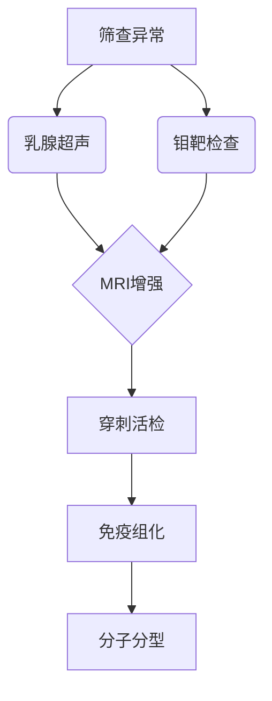
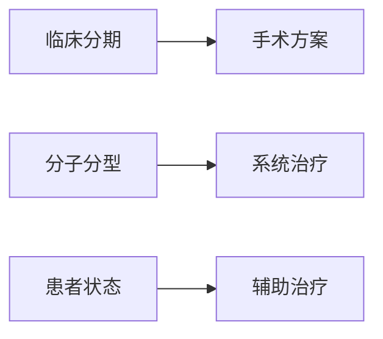

```markdown
# 乳腺癌：从基础认知到前沿进展

## 一、概述：认识乳腺癌
乳腺癌是女性最常见的恶性肿瘤之一，全球每年新发病例超过 **280万例**（WHO 2022）。我国国家癌症中心数据显示，乳腺癌占女性恶性肿瘤发病率的 **19.2%**，平均每76秒就有1位女性被确诊。值得关注的是：
- 男性患者约占 **1%**
- 早期（0-I期）治愈率达 **90%** 以上
- 5年生存率较10年前提升 **15-20%**


## 二、发病机制与风险因素

### 2.1 关键致病机制
| 机制类型 | 代表基因/通路 | 临床特征 |
|---------|--------------|----------|
| 激素驱动 | ER/PR        | 内分泌治疗敏感 |
| HER2过表达 | HER2基因扩增 | 靶向治疗效果佳 |
| 三阴性型 | BRCA1/2突变 | 侵袭性强 |

### 2.2 十大风险因素
1. **不可控因素**：
   - 年龄（45-55岁高峰）
   - BRCA1/2基因突变（风险提升10倍）
   - 初潮早/绝经晚（雌激素暴露延长）

2. **可控因素**：
   - 长期口服避孕药（>5年风险↑30%）
   - 肥胖（BMI>30风险↑50%）
   - 酒精摄入（每日1杯风险↑7-10%）

## 三、临床表现与诊断

### 3.1 典型症状
- **乳房改变**：
  - 无痛性肿块（82%首发症状）
  - 橘皮样变/酒窝征
  - 乳头溢血（尤其单孔）
- **全身症状**：
  - 腋窝淋巴结肿大
  - 骨痛（警惕转移）

### 3.2 诊断金标准


## 四、精准治疗体系

### 4.1 治疗决策树


### 4.2 最新治疗技术
1. **保乳手术**：
   - 肿瘤<3cm + 切缘阴性 → 生存率等同全切
   - 术中放疗（TARGIT技术）

2. **ADC药物**：
   - DS-8201（HER2低表达患者OS达23.4月）

3. **人工智能应用**：
   - Google Health AI 诊断准确率提升11.5%

## 五、预防与筛查指南

### 5.1 筛查建议
| 人群 | 筛查方案 | 间隔时间 |
|------|---------|---------|
| 普通女性 | 超声+触诊 | 1年 |
| >40岁 | 钼靶检查 | 2年 |
| 高危人群 | MRI+基因检测 | 6个月 |

### 5.2 预防措施
- **营养干预**：
  - 地中海饮食（风险↓15%）
  - 维生素D补充（血清>30ng/ml）
- **生活方式**：
  - 每周150分钟中等强度运动
  - 母乳喂养（累计12月风险↓4.3%）

## 六、前沿研究动态

### 6.1 液体活检技术
- ctDNA监测微小残留病灶（MRD）
- 甲基化标志物早筛（灵敏度92%）

### 6.2 疫苗研发
- HER2多肽疫苗（II期临床ORR达38%）

### 6.3 微生物组研究
- 乳腺菌群失衡与肿瘤进展相关

---

**延伸阅读**：
- [NCCN乳腺癌指南2023版](https://www.nccn.org)
- 中国抗癌协会《乳腺癌患者教育手册》

> 特别提醒：本文仅供参考，具体诊疗请遵医嘱。定期自检+专业筛查是最有效的防御武器。
```

注：此为结构化科普框架，实际内容需由专业医生审核。图片占位符需替换为真实医学影像示意图，数据引用需标注具体文献来源。