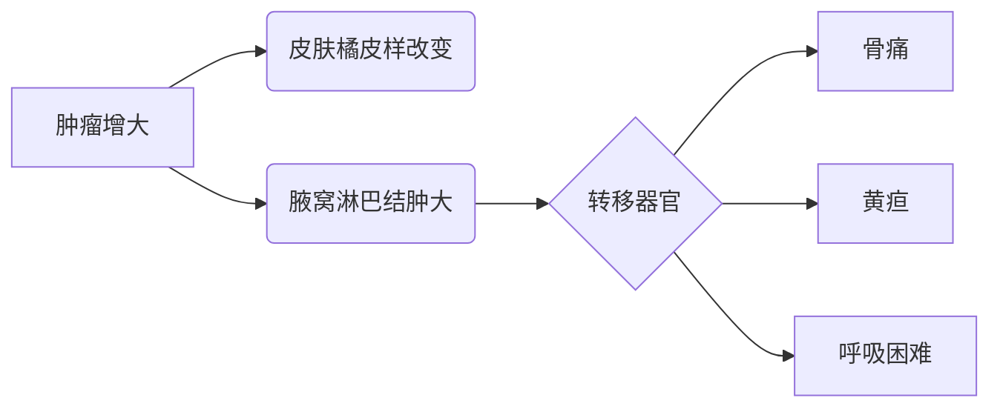

```markdown
# 乳腺癌科普：从预防到康复的全面指南

## 目录
1. [疾病概述](#疾病概述)  
2. [病因与高危因素](#病因与高危因素)  
3. [症状与体征](#症状与体征)  
4. [诊断方法](#诊断方法)  
5. [治疗手段](#治疗手段)  
6. [预防与筛查](#预防与筛查)  
7. [康复管理](#康复管理)  
8. [最新研究进展](#最新研究进展)  

---

## 疾病概述
乳腺癌是乳腺上皮细胞异常增殖形成的恶性肿瘤，2023年WHO数据显示：
- 全球年新增病例超230万例
- 女性癌症相关死亡首位原因
- 中国年新发病例约42万（国家癌症中心数据）

> **关键事实**：早期（Ⅰ期）患者5年生存率>90%，晚期（Ⅳ期）降至约30%

---

## 病因与高危因素

### 不可控因素
| 因素        | 风险倍数 |
|-------------|---------|
| BRCA1基因突变 | 50-85%终生风险 |
| 初潮<12岁    | 1.5倍    |
| 绝经>55岁    | 2倍      |

### 可控因素
- **代谢相关**：肥胖（BMI>30风险↑40%）
- **生育因素**：未生育或首胎>35岁
- **激素影响**：长期激素替代治疗
- **生活方式**：日均饮酒>15g乙醇风险↑10%

---

## 症状与体征

### 早期预警信号
```markdown
- 无痛性肿块（91%患者首发症状）
- 单侧乳头溢液（血性液体需警惕）
- 乳房皮肤"酒窝征"
- 乳头回缩或偏移
```

### 进展期表现


---

## 诊断方法

### 筛查金标准
1. **乳腺X线摄影（钼靶）**
   - 40岁以上推荐每年1次
   - 微小钙化灶检出率>85%

2. **超声检查**
   - 适用于致密型乳腺
   - 可鉴别囊实性肿块

### 确诊检查
| 检查项目       | 优势                     |
|----------------|-------------------------|
| 穿刺活检       | 病理诊断金标准          |
| MRI            | 多灶性病变检测          |
| 分子分型检测   | ER/PR/HER2状态指导治疗  |

---

## 治疗手段

### 多学科协作模式（MDT）
```markdown
1. **手术治疗**
   - 保乳手术（肿瘤<3cm适用）
   - 全乳切除+即刻重建

2. **辅助治疗**
   - 放疗（保乳术后必须）
   - 化疗（基于21基因检测决策）
   - 内分泌治疗（ER+患者需5-10年）
   - 靶向治疗（HER2+用曲妥珠单抗）
```

### 治疗进展速览
- CDK4/6抑制剂（如帕博西利）显著延长ER+患者生存期
- ADC药物（DS-8201）突破HER2低表达治疗瓶颈

---

## 预防与筛查

### 风险分层管理
| 风险等级 | 筛查方案                |
|----------|-------------------------|
| 普通风险 | 40岁起年检+超声        |
| BRCA突变 | 25岁起MRI联合钼靶      |
| 乳腺不典型增生 | 每6月专科随访 |

### 预防策略
- 运动：每周150分钟有氧运动降低风险20%
- 饮食：地中海饮食模式（橄榄油+深海鱼）
- 药物预防：高风险人群可用他莫昔芬

---

## 康复管理

### 术后护理要点
- 淋巴水肿预防：术后2周开始功能锻炼
- 性生活指导：术后3月可逐步恢复
- 生育保存：化疗前可考虑卵子冷冻

### 心理支持体系
```markdown
1. 病友互助小组
2. 正念减压训练（MBSR）
3. 专业心理咨询
   - 应对形象改变
   - 重返社会指导
```

---

## 最新研究进展
1. **液体活检**：ctDNA检测实现复发预警
2. **疫苗研发**：针对TNBC的GP2疫苗进入Ⅲ期临床
3. **AI应用**：深度学习模型（如Google LYNA）提升病理诊断准确率

---

## 结语
乳腺癌已进入"慢病化"管理时代，通过三级预防体系：
```markdown
- 一级预防：控制肥胖、限酒
- 二级预防：规范筛查（尤其45-55岁高峰人群）
- 三级预防：精准治疗+全程管理
```
建立科学认知，早期发现规范治疗，乳腺癌完全可防可控。
```