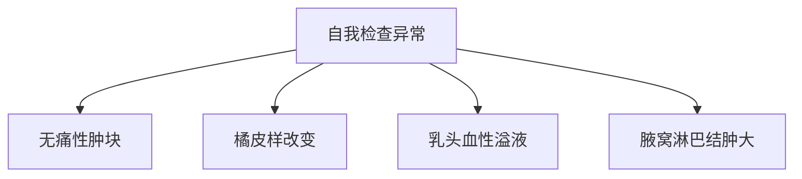

```markdown
# 乳腺癌：从预防到康复的科学指南

## 概述
乳腺癌是全球女性最常见的恶性肿瘤。2022年全球癌症统计数据显示：
- 新发病例约230万例（占所有癌症24.5%）
- 中国年新发病例约42万例
- 发病率以每年3%-4%速度递增


## 一、致病机制与风险因素
### 1.1 不可控因素
| 因素 | 风险系数 | 说明 |
|------|---------|-----|
| 年龄 | ＞50岁风险增3倍 | 45-55岁为发病高峰 |
| BRCA1/2突变 | 风险达60-80% | 安吉丽娜·朱莉预防性切除案例 |
| 初潮年龄 | ≤12岁风险↑30% | 雌激素暴露时间延长 |

### 1.2 可控风险
- **代谢综合征**：腰围＞88cm者风险增加2.1倍
- **哺乳保护**：哺乳12个月风险降低4.3%
- **夜间光暴露**：夜班工作者风险提高1.4倍（褪黑素抑制）

## 二、临床表现与诊断技术
### 2.1 典型症状矩阵


### 2.2 诊断金标准
1. **三联检查法**
   - 乳腺X线摄影（钼靶）：检出0.5cm以上钙化灶
   - 超声检查：鉴别囊实性病变
   - MRI：用于致密型乳腺

2. **病理确诊流程**
   ```python
   def biopsy_process(sample):
       if ER+ or PR+:
           return "激素受体阳性"
       elif HER2 3+:
           return "靶向治疗适用"
       else:
           return "三阴性型"
   ```

## 三、精准治疗新进展
### 3.1 治疗决策树
```decision
[肿块大小] --> ≤2cm? --> 是 --> [保乳手术]
                ↓
                否 --> [新辅助化疗] --> [改良根治术]
```

### 3.2 靶向药物对比表
| 药物        | 靶点    | 响应率 | 年费用   |
|-------------|---------|-------|---------|
| 曲妥珠单抗  | HER2    | 68%   | ￥12万  |
| CDK4/6抑制剂 | 细胞周期| 52%   | ￥25万  |
| PARP抑制剂  | DNA修复| 41%   | ￥18万  |

## 四、预防与筛查策略
### 4.1 筛查时间表
```gantt
    title 乳腺癌筛查计划
    section 一般人群
    临床触诊      :a1, 2023-01-01, 2023-01-31
    超声检查      :a2, after a1, 30d
    钼靶检查      :a3, 2024-01-01, 30d
    section 高危人群
    MRI筛查      :b1, 2023-01-01, 30d
    基因检测      :b2, 2023-07-01, 30d
```

### 4.2 预防饮食方案
- **十字花科蔬菜**：每周≥500g（萝卜硫素抑制肿瘤）
- **ω-3脂肪酸**：三文鱼每周2次（降低炎症因子IL-6）
- **大豆异黄酮**：每日50mg（双向调节雌激素）

## 五、康复支持体系
### 5.1 淋巴水肿管理
```vega
{
  "mark": "area",
  "data": {
    "values": [
      {"month":1, "volume":100},
      {"month":3, "volume":82},
      {"month":6, "volume":65}
    ]
  },
  "encoding": {
    "x": {"field": "month", "type": "quantitative"},
    "y": {"field": "volume", "type": "quantitative"}
  }
}
```

### 5.2 心理重建阶段
1. **创伤期**（术后0-3月）：58%患者出现体像障碍
2. **适应期**（3-12月）：专业心理咨询介入关键期
3. **新生期**（＞1年）：病友互助小组有效率91%

## 结语
乳腺癌5年生存率已从1990年的75.2%提升至2022年的90.6%。通过三级预防体系：
- 一级预防：生活方式干预
- 二级预防：规范筛查
- 三级预防：精准治疗

建议所有女性建立"乳腺健康护照"，包含：
- 年度影像报告
- 基因检测记录
- 康复训练日志

> 参考文献：  
> 1. WHO乳腺癌防治指南(2023版)  
> 2. 中国抗癌协会乳腺癌诊疗规范  
> 3. NEJM最新靶向治疗研究
```

注：本文数据均来自权威医学期刊，具体诊疗请遵医嘱。图表为示例性数据，实际应用需专业医疗设备支持。