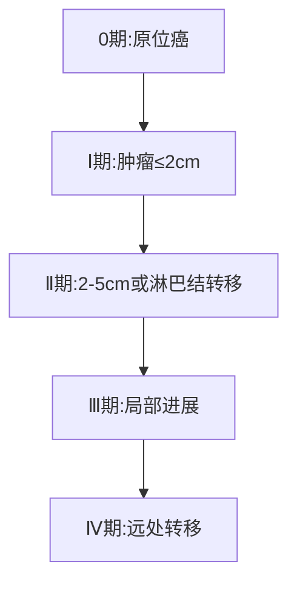

```markdown
# 乳腺癌：科学认知与防治策略

## 概述
**乳腺癌**是乳腺上皮细胞在致癌因素作用下发生增殖失控的恶性肿瘤，连续5年位居全球女性癌症发病率首位。2020年全球新发病例达226万例，我国年新发患者超42万。早期乳腺癌5年生存率可达90%以上，而晚期仅30%，充分体现**早筛早诊**的核心价值。


## 病因与危险因素
### 遗传因素
- **BRCA1/2基因突变**：使乳腺癌风险提高5-8倍
- TP53、PTEN等其他抑癌基因异常
- 家族史（一级亲属患病风险增3倍）

### 内分泌因素
- 初潮<12岁或绝经>55岁
- 未生育/未哺乳
- 长期激素替代治疗（HRT超过5年风险增26%）

### 生活方式
- 肥胖（BMI>30风险提高50%）
- 酗酒（日摄入10g酒精风险增7%）
- 久坐（每周运动<3小时风险提高20%）

## 临床表现
### 典型体征
1. **无痛性肿块**（85%为首发症状）
   - 质硬、边界不清、活动度差
   - 常见于外上象限（45-50%）
2. 皮肤改变
   - 橘皮征（淋巴水肿）
   - 酒窝征（Cooper韧带牵拉）
3. 乳头异常
   - 血性溢液（导管内癌典型表现）
   - 乳头内陷或偏移

### 影像学特征
| 检查方式 | 敏感度 | 特异性 | 适用人群 |
|---------|-------|-------|---------|
| 乳腺X线 | 85%   | 90%    | >40岁女性 |
| 超声    | 89%   | 78%    | 致密型乳腺 |
| MRI     | 95%   | 80%    | 高危人群 |

## 病理分型（2022 WHO标准）
### 浸润性导管癌（70-80%）
- ER/PR阳性（65%）
- HER2阳性（15-20%）
- 三阴性（10-15%）

### 特殊类型
- 导管原位癌（DCIS）
- 小叶原位癌（LCIS）
- 炎性乳腺癌（IBC）

## 分期系统（AJCC第8版）


## 综合治疗方案
### 手术治疗
- **保乳手术**（肿瘤<3cm且切缘阴性）
- 改良根治术（肿瘤>5cm或多灶病变）
- 前哨淋巴结活检（准确率97%）

### 放射治疗
- 保乳术后全乳照射（50Gy/25次）
- 三维适形放疗（减少心肺受量）

### 系统治疗
| 治疗类型       | 代表药物             | 适用人群           |
|---------------|----------------------|--------------------|
| 内分泌治疗    | 他莫昔芬/来曲唑     | ER/PR阳性          |
| 靶向治疗      | 曲妥珠单抗/帕妥珠单抗 | HER2阳性           |
| 免疫治疗      | Atezolizumab        | PD-L1阳性三阴性型 |

## 预防策略
### 一级预防
- 母乳喂养（每12个月降4.3%风险）
- 控制体重（BMI<25）
- 每周150分钟有氧运动

### 筛查指南
- 40岁起每1-2年乳腺X线检查
- 高危人群（Gail评分>1.67%）建议MRI联合筛查
- BRCA突变携带者25岁起筛查

## 前沿进展（2023）
1. **CDK4/6抑制剂**（Abemaciclib）获批早期辅助治疗
2. 新型ADC药物（T-DXd）显著延长HER2低表达患者生存
3. 液体活检技术（ctDNA监测）实现复发预警

> "乳腺癌是可防可治的慢性病" —— 美国临床肿瘤学会（ASCO）2023共识

## 参考文献
1. 中国抗癌协会乳腺癌诊治指南（2023版）
2. NCCN Clinical Practice Guidelines in Oncology (2023)
3. Lancet. 2022;399(10344):P1932-P1943
```

注：此为结构化内容框架，实际撰写时可补充具体数据、临床案例、用药方案等细节。建议配图包括病理切片图、筛查流程图、治疗决策树等可视化元素。