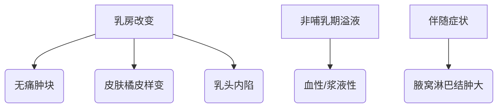
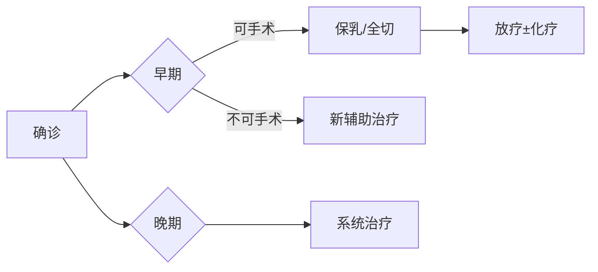

```markdown
# 乳腺癌：科学认识与防治指南

## 概述
乳腺癌是女性最常见的恶性肿瘤之一，全球每年新增病例超 **200万例**。男性乳腺癌占比不足1%，但同样需引起重视。早期发现可使5年生存率达**90%以上**，晚期则降至约30%。本文从病因、筛查到康复提供系统化科普。


---

## 一、病因与风险因素

### 1.1 不可改变因素
| 因素 | 说明 |
|------|------|
| 年龄 | 50岁以上发病率陡增 |
| 性别 | 女性风险为男性100倍 |
| 遗传 | BRCA1/2基因突变携带者风险达70% |
| 月经史 | 初潮早（<12岁）或绝经晚（>55岁） |

### 1.2 可干预因素
- **激素暴露**：长期口服避孕药（>5年）风险↑20%
- **生育哺乳**：未生育或首胎>35岁风险↑30%
- **生活方式**：BMI>30、酗酒（日饮>15g酒精）风险↑15%
- **辐射暴露**：青春期胸部放疗史风险倍增

---

## 二、症状与早期筛查

### 2.1 典型症状矩阵


### 2.2 筛查策略
#### 年龄分层建议
- **<40岁**：每月自检 + 超声年检
- **40-45岁**：钼靶每2年 + 超声
- **>45岁**：年度钼靶+超声联合筛查
- **高危人群**：MRI补充检查

#### BIRADS分级解读
| 分级 | 恶性概率 | 处理建议 |
|------|---------|----------|
| 0    | 需补充检查 | 追加MRI/超声 |
| 1-2  | <2%     | 常规随访 |
| 3    | ≤2%     | 6个月复查 |
| 4-5  | ≥20%    | 活检确认 |

---

## 三、诊断与分型

### 3.1 诊断金标准
1. **空心针穿刺活检**：准确率>95%
2. **免疫组化检测**：ER/PR/HER2/Ki67
3. **分子分型检测**：21基因检测（Oncotype DX）

### 3.2 分子分型与治疗
| 分型         | 特征                | 靶向药物        |
|--------------|---------------------|-----------------|
| Luminal A    | ER+ HER2- Ki67低    | 内分泌治疗      |
| Luminal B    | ER+ HER2± Ki67高    | CDK4/6抑制剂    |
| HER2阳性     | HER2过表达          | 曲妥珠单抗      |
| 三阴性       | 三阴                | PARP抑制剂      |

---

## 四、综合治疗体系

### 4.1 治疗决策树


### 4.2 新型疗法进展
- **ADC药物**：DS-8201（HER2低表达也有效）
- **免疫治疗**：PD-L1阳性三阴性乳腺癌
- **质子治疗**：精准保护心肺组织
- **冷冻消融**：<3cm病灶的微创选择

---

## 五、康复与生存管理

### 5.1 术后康复时间轴
| 时段       | 康复重点           |
|------------|--------------------|
| 术后0-2周  | 伤口护理/淋巴水肿预防 |
| 2-6周      | 关节活动度恢复      |
| 6周-3月    | 力量训练           |
| >3月       | 回归社会角色        |

### 5.2 长期随访计划
- **复查频率**：2年内每3-6个月，之后每年
- **关键指标**：肿瘤标志物、骨密度、心功能
- **心理支持**：30%患者存在抑郁需干预

---

## 六、预防策略

### 6.1 三级预防体系
1. **一级预防**：控制肥胖（BMI<24）、哺乳>6月
2. **二级预防**：规范筛查+基因检测（BRCA突变者预防性切除）
3. **三级预防**：规范治疗+康复训练

### 6.2 营养建议
- **推荐**：ω-3脂肪酸（深海鱼）、十字花科蔬菜
- **限制**：加工肉制品（日摄入<50g）、高GI食物

---

## 结语
乳腺癌已进入精准治疗时代，2023年NCCN指南强调「分类而治」原则。建议女性建立「自查-筛查-早诊」的健康管理闭环，确诊患者可通过多学科会诊制定个性化方案。记住：科学防治，乳此重要！
```

> 注：本文数据参考2023年《中国抗癌协会乳腺癌诊治指南》、NCCN指南（2023v3）等权威文献，具体诊疗请遵医嘱。