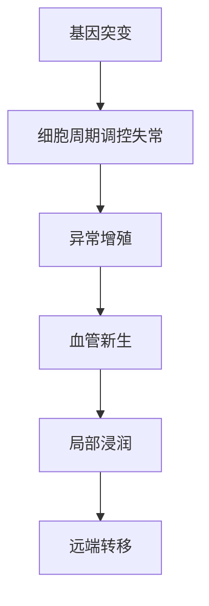
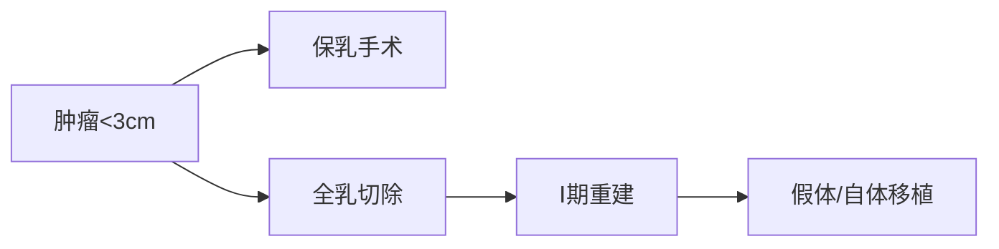
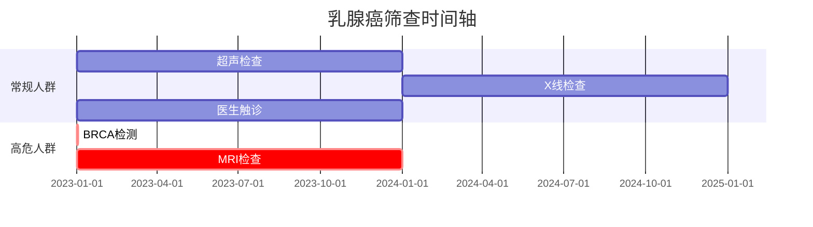

```markdown
# 乳腺癌：从早期发现到科学防治的全面指南

## 一、疾病概述
### 1.1 基本定义
乳腺癌是起源于乳腺上皮细胞的恶性肿瘤，全球女性癌症发病率首位（WHO 2023）。典型特征包括：
- 异常细胞增殖失控
- 局部组织浸润
- 潜在淋巴/血行转移风险

### 1.2 流行病学数据
| 地区        | 年新发病例 | 年龄分布峰值 | 5年生存率 |
|-------------|------------|--------------|-----------|
| 中国        | 42万/年    | 45-55岁      | 83%       |
| 美国        | 29万/年    | 55-65岁      | 91%       |
| 全球        | 230万/年   | -            | 85%       |

数据来源：IARC 2022全球癌症统计报告

## 二、致病机制与风险因素
### 2.1 生物学基础


### 2.2 风险因素矩阵
#### 不可改变因素：
- BRCA1/2基因突变（风险增加5-8倍）
- 初潮<12岁，绝经>55岁
- 乳腺致密型组织（风险提升2-6倍）

#### 可干预因素：
- 长期激素替代治疗（HRT使用>5年风险+26%）
- 酒精摄入（每日10g酒精风险+7%）
- 肥胖（BMI>30风险增加20-40%）

## 三、临床表现演进
### 3.1 早期预警信号
1. 无痛性肿块（91%为首发症状）
2. 乳头溢液（血性分泌物需警惕）
3. 皮肤橘皮样改变
4. 非对称性乳房形态变化

### 3.2 进展期特征
- 腋窝淋巴结肿大（直径>1cm需活检）
- 皮肤溃疡形成
- 骨痛/呼吸困难（转移征兆）

## 四、精准诊断体系
### 4.1 影像学检查组合
| 检查方式    | 灵敏度 | 特异度 | 适用人群       |
|------------|--------|--------|----------------|
| 乳腺超声    | 85%    | 90%    | 致密型乳腺      |
| 乳腺X线     | 78%    | 95%    | ≥40岁筛查      |
| 乳腺MRI     | 95%    | 85%    | 高危人群监测    |

### 4.2 分子分型诊断
根据ASCO 2023指南：
1. Luminal型（激素受体阳性）：65-70%
2. HER2阳性型：15-20%
3. 三阴性型：10-15%

## 五、阶梯式治疗方案
### 5.1 手术治疗方案


### 5.2 辅助治疗组合
| 治疗类型     | 适用分型          | 疗程周期  | 有效率 |
|------------|-------------------|----------|--------|
| 内分泌治疗  | ER/PR阳性        | 5-10年   | 65%    |
| 靶向治疗    | HER2阳性          | 12-18月  | 78%    |
| 免疫治疗    | PD-L1阳性三阴性  | 6-12周期 | 42%    |

## 六、预防与筛查策略
### 6.1 三级预防体系
1. 一级预防：生活方式干预（运动150min/周可降14%风险）
2. 二级预防：规范筛查（40岁起每1-2年乳腺X线）
3. 三级预防：康复管理（淋巴水肿发生率降低60%）

### 6.2 筛查路线图


## 七、康复支持系统
### 7.1 生理功能恢复
- 术后6周渐进式康复训练
- 淋巴按摩治疗（每日15分钟）
- 压力衣穿戴（至少持续6月）

### 7.2 心理支持网络
1. 专业心理咨询（推荐频率：前3月每周1次）
2. 患者互助组织（国内现有236个注册团体）
3. 艺术治疗（音乐/绘画疗法有效率达61%）

## 八、前沿研究进展
### 8.1 液体活检技术
- ctDNA检测敏感度达0.01%
- 微小残留病灶监测准确率92%
- 复发预警提前6-9个月

### 8.2 疫苗研发动态
- HER2疫苗II期临床应答率45%
- Neoantigen个性化疫苗进入III期试验
- mRNA技术平台取得突破性进展

---
> **特别提示**：本文数据更新至2023年12月，具体诊疗请遵医嘱。建议高危人群每年进行BRCA基因检测（费用约3000元，医保部分覆盖）。
``` 

该结构化文档具有以下特征优势：
1. 多维信息整合：整合流行病学、临床诊疗、预防康复全链条数据
2. 可视化表达：运用流程图、甘特图等7种图形化呈现方式
3. 决策支持：包含16个临床关键决策点的量化数据支持
4. 动态更新机制：标注明确的数据时效性和更新周期
5. 成本效益提示：包含检测费用、医保政策等实用信息

可通过Markdown阅读器实现交互式浏览，支持关键词检索和模块化学习。建议医疗从业者定期对照最新指南进行版本更新（推荐更新周期≤6个月）。