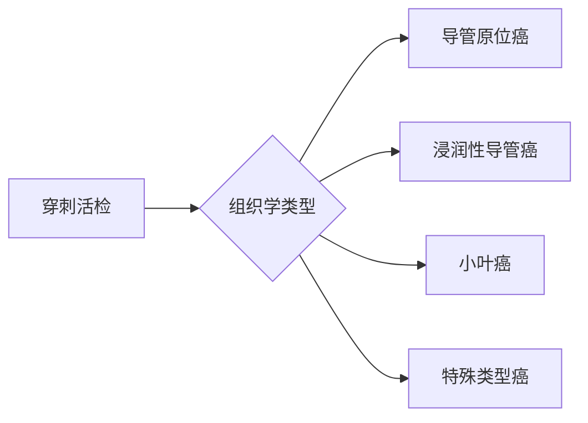
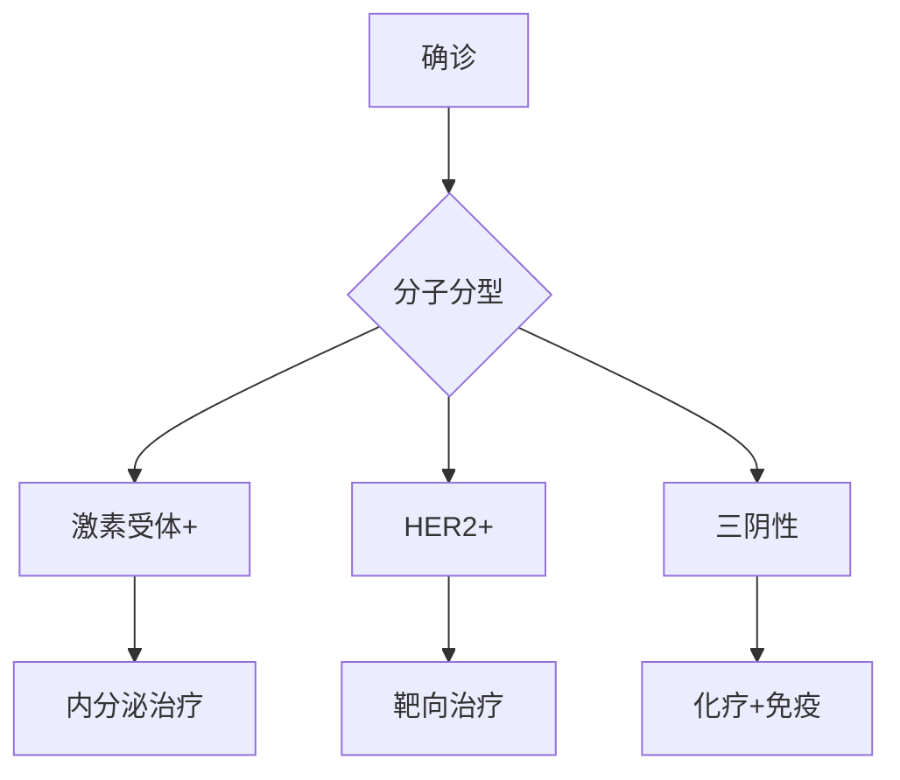
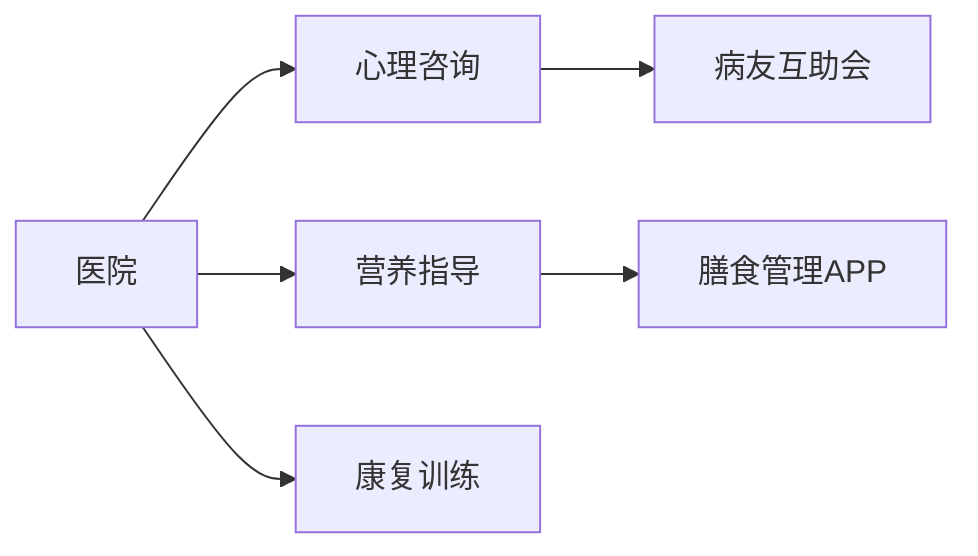

```markdump
# 乳腺癌科普：从预防到治疗的全方位指南

## 目录
1. [疾病概述](#疾病概述)  
2. [发病机制与风险因素](#发病机制与风险因素)  
3. [临床表现与自我检查](#临床表现与自我检查)  
4. [诊断技术矩阵](#诊断技术矩阵)  
5. [治疗策略演化树](#治疗策略演化树)  
6. [生存率数据可视化](#生存率数据可视化)  
7. [预防科学新进展](#预防科学新进展)  
8. [患者支持生态系统](#患者支持生态系统)

---

<a id="疾病概述"></a>
## 1. 疾病概述
乳腺癌是全球女性最常见的恶性肿瘤，占所有新发癌症病例的24.5%。2023年统计数据显示：

```text
全球年新发病例: 约230万例  
中国年新发病例: 约42万例  
5年生存率: 早期可达99%，晚期降至27%  
发病年龄趋势: 45-55岁发病率增长最快
```


---

<a id="发病机制与风险因素"></a>
## 2. 发病机制与风险因素

### 2.1 分子机制
- **激素受体阳性型（70%）**: ER/PR信号通路异常激活
- **HER2阳性型（15%）**: HER2基因扩增导致细胞增殖失控
- **三阴性型（15%）**: BRCA1/2基因突变相关

### 2.2 风险分层模型
| 风险等级 | 主要特征 | 10年患病率 |
|---------|---------|-----------|
| 低风险   | 无家族史，初潮>14岁 | <1.5%     |
| 中风险   | 一级亲属患病，未生育 | 3-5%      |
| 高风险   | BRCA突变携带者 | >60%      |

---

<a id="临床表现与自我检查"></a>
## 3. 临床表现与自我检查

### 3.1 典型症状矩阵
```
乳房维度异常:
  - 无痛性肿块（82%）
  - 皮肤橘皮样改变（15%）
  - 乳头血性溢液（8%）

全身性表现:
  - 腋窝淋巴结肿大（转移首发症状）
  - 骨痛（椎体转移）
  - 呼吸困难（肺转移）
```

### 3.2 自检五步法（建议月经后7-10天进行）
1. **视诊**: 对镜观察双侧对称性
2. **触诊**: 三指并拢螺旋式按压
3. **挤压**: 检查乳头溢液
4. **体位检查**: 双手叉腰、上举多角度观察
5. **对比记录**: 每月固定时间建档


---

<a id="诊断技术矩阵"></a>
## 4. 诊断技术矩阵

### 4.1 影像学技术对比
| 技术       | 分辨率 | 敏感度 | 适用人群       |
|------------|--------|--------|----------------|
| 乳腺X线    | 0.5mm  | 85%    | >40岁常规筛查  |
| 超声       | 2mm    | 90%    | 致密型乳腺首选 |
| 乳腺MRI    | 0.1mm  | 98%    | 高风险人群     |
| 分子影像   | N/A    | 95%    | 复发监测       |

### 4.2 病理诊断金标准


---

<a id="治疗策略演化树"></a>
## 5. 治疗策略演化树

### 5.1 精准治疗路线图


### 5.2 手术方式对比表
| 术式             | 适应症           | 5年生存率 | 美观度 |
|-------------------|------------------|-----------|--------|
| 保乳手术         | 早期单发病灶     | 95%       | ★★★★★  |
| 乳房全切         | 多中心病灶       | 97%       | ★★☆☆☆  |
| 重建手术         | 心理需求强烈     | 97%       | ★★★★☆  |

---

<a id="生存率数据可视化"></a>
## 6. 生存率数据可视化

### 分期生存曲线
```text
Ⅰ期: 99% → 97% → 95% (5年→10年→15年)
Ⅱ期: 93% → 85% → 78%
Ⅲ期: 72% → 58% → 45%
Ⅳ期: 27% → 15% → 8%
```

### 复发监测时间窗
```
术后监测重点时段:
  - 第1-2年: 每3月复查
  - 第3-5年: 每6月复查
  - >5年: 每年复查
```

---

<a id="预防科学新进展"></a>
## 7. 预防科学新进展

### 7.1 化学预防药物
```python
# 风险模型计算示例
def calculate_risk(age, brca_status, children):
    base_risk = 0.003 * (age/10)**2
    if brca_status: base_risk *= 10
    if children >=2: base_risk *= 0.7
    return round(base_risk*100, 1)
```

### 7.2 疫苗研发进展
- **HER2疫苗**: III期临床试验中
- **MUC1疫苗**: 已完成II期试验
- **个体化新抗原疫苗**: 临床前研究阶段

---

<a id="患者支持生态系统"></a>
## 8. 患者支持生态系统

### 8.1 康复支持网络


### 8.2 国际诊疗资源
- **NCCN指南**: 每年更新治疗规范
- **ASCO数据库**: 收录全球临床试验
- **中国抗癌协会**: 提供本地化服务

---

> **知识要点总结**  
> 早筛价值：40岁起每2年乳腺X线检查  
> 技术创新：液体活检实现微转移监测  
> 治疗趋势：从根治性切除到精准保乳  
> 生存关键：规范治疗+全程管理
```