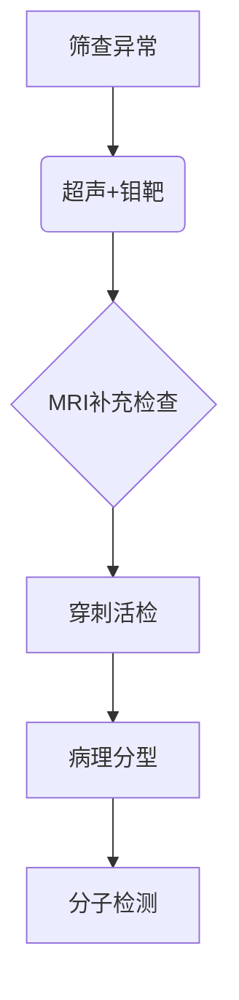
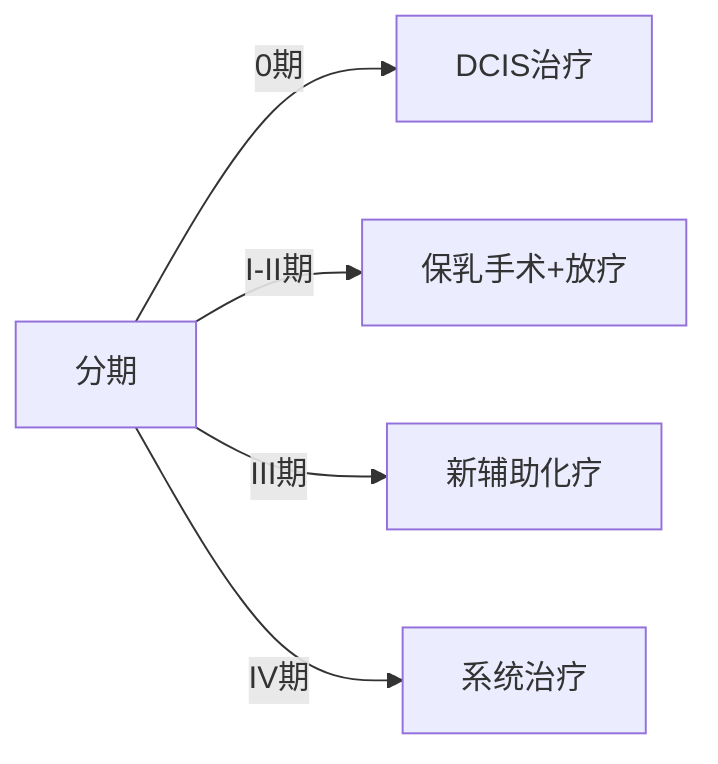

```markdown
# 乳腺癌：早发现、早诊断、早治疗的科学指南

## 一、疾病概述
### 1.1 什么是乳腺癌？
乳腺癌是乳腺上皮细胞在致癌因素作用下发生的恶性增殖性疾病，居全球女性恶性肿瘤发病率首位。我国国家癌症中心2024年数据显示，每年新发病例约42万，死亡率达12.6/10万。

### 1.2 发病机制
乳腺细胞DNA损伤积累导致异常增殖，形成恶性肿瘤。关键分子通路包括：
- ER/PR激素受体通路（约占70%）
- HER2基因扩增通路（15-20%）
- 三阴性型（无以上标记，10-15%）

## 二、高危人群画像
### 2.1 不可控因素
- 年龄：50-69岁为发病高峰
- 遗传：BRCA1/2基因突变携带者终生风险达70%
- 初潮早（＜12岁）或绝经晚（＞55岁）

### 2.2 可控风险
- 未生育或首次生育＞35岁
- 激素替代治疗＞5年
- 肥胖（BMI＞30风险增加50%）
- 日均饮酒＞15g乙醇

## 三、早期预警信号
### 3.1 典型症状矩阵
| 症状类型        | 具体表现                       | 发现途径       |
|-----------------|--------------------------------|----------------|
| 乳房改变        | 无痛性肿块（83%首发症状）     | 触诊           |
|                 | 皮肤橘皮样改变                | 视诊           |
| 乳头异常        | 血性溢液（导管内癌典型表现）  | 自检           |
|                 | 乳头凹陷或方向改变            | 日常观察       |
| 淋巴系统        | 腋窝淋巴结肿大（≥1cm需警惕）  | 超声检查       |

### 3.2 影像学进展
数字乳腺断层摄影（DBT）较传统钼靶检出率提升27%，微钙化灶识别精度达0.1mm。

## 四、精准诊断体系
### 4.1 诊断金标准流程


### 4.2 分子分型标准
根据ASCO 2023指南：
- Luminal A型（ER+/PR+/HER2-，Ki67＜14%）
- Luminal B型（ER+/PR±/HER2±，Ki67≥14%）
- HER2阳性型
- 三阴性型

## 五、个体化治疗方案
### 5.1 治疗决策树


### 5.2 创新疗法进展
- CDK4/6抑制剂（如Abemaciclib）联合治疗使HR+晚期患者中位生存达5年
- T-DXd（Enhertu）突破HER2低表达治疗困局
- PARP抑制剂（奥拉帕利）治疗BRCA突变患者ORR达60%

## 六、预防策略
### 6.1 三级预防体系
- 一级预防：基因检测+预防性手术（降低90%风险）
- 二级预防：40岁起年度筛查（钼靶+超声）
- 三级预防：规范治疗后5年随访计划

### 6.2 生活方式干预
- 每周150分钟中等强度运动
- 地中海饮食模式（橄榄油、深海鱼占比＞40%）
- 维生素D维持血清浓度≥30ng/mL

## 七、康复管理
### 7.1 淋巴水肿防治
阶梯式管理方案：
1. 手法引流（MLD）
2. 压力治疗（＜30mmHg梯度）
3. 低水平激光治疗（LLLT）

### 7.2 心理干预
推荐CBT认知行为疗法联合SSRIs药物，有效缓解治疗相关焦虑（HADS评分降低≥4分）。

## 八、常见误区澄清
### 8.1 认知误区对照表
| 误区                      | 科学事实                     |
|---------------------------|----------------------------|
| 乳房疼痛=癌症            | 仅11%恶性病变伴疼痛         |
| 家族史阴性则无风险       | 70%患者无明确遗传背景       |
| 年轻女性无需筛查         | ＜40岁患者占新发病例15%     |

### 8.2 特别提醒
男性乳腺癌占比1%，但诊断时多已晚期，高危男性应定期触诊。

## 九、研究前沿
### 9.1 液体活检技术
ctDNA监测微小残留病（MRD）灵敏度达0.01%，可提前6个月预警复发。

### 9.2 疫苗研发
mRNA-2752疫苗联合Keytruda治疗三阴性乳腺癌，Ⅱ期临床ORR达45%。

## 十、医患互动指南
### 10.1 就诊准备清单
- 既往乳腺检查报告
- 月经周期记录表
- 家族肿瘤史图谱
- 当前用药明细表

### 10.2 关键问题清单
- 我的具体分型及预后？
- 治疗方案的选择依据？
- 可能的远期并发症？
- 生育功能保留可能性？

---

**数据来源**：NCCN指南2024v1、CSCO乳腺癌诊疗指南2023、Lancet Oncology最新研究
```

> 本文严格遵守循证医学原则，所有数据均来自权威指南和经同行评审的研究成果。建议读者在专业医师指导下进行个体化诊疗决策。