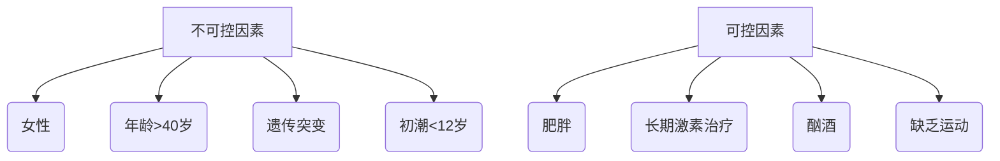
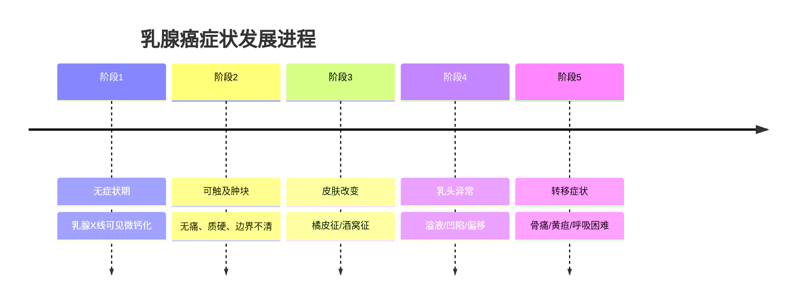
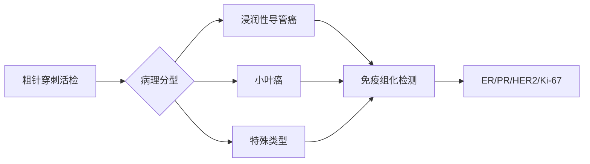

```markdown
# 乳腺癌：从早期发现到科学防治

## 概述
乳腺癌是女性最常见的恶性肿瘤，全球每年新发病例超 **230万例**（WHO 2022），占女性癌症发病率的24.5%。中国国家癌症中心数据显示，我国每年新发乳腺癌约 **42万例**，发病高峰年龄为45-55岁，近年呈现年轻化趋势。

### 核心数据速览
| 指标 | 全球数据 | 中国数据 |
|------|---------|---------|
| 年新发病例 | 230万 | 42万 |
| 死亡率排名 | 女性癌症第2位 | 女性癌症第4位 |
| 5年生存率 | 发达国家90% | 83.2% |
| 遗传相关性 | 5-10%与BRCA基因相关 | BRCA突变率约0.3% |

## 发病机制

### 高危因素矩阵


### 基因突变谱系
- **BRCA1/2**：DNA修复基因，突变携带者70岁前患病风险达60%
- **PALB2**：增加5倍发病风险
- **TP53**：Li-Fraumeni综合征相关
- **CHEK2**：中等风险基因

## 临床表现

### 症状演化时间轴


### 特殊类型特征
1. **炎性乳腺癌**：皮肤红肿热痛，类似乳腺炎
2. **乳头Paget病**：乳头糜烂结痂
3. **三阴性乳腺癌**：ER(-)/PR(-)/HER2(-)，侵袭性强

## 诊断体系

### 影像学检查矩阵
| 检查方式 | 灵敏度 | 特异性 | 适用人群 |
|---------|-------|-------|---------|
| 乳腺X线 | 85% | 90% | >40岁常规筛查 |
| 超声 | 88% | 75% | 致密型乳腺 |
| MRI | 95% | 80% | 高危人群筛查 |
| 新型技术 |  |  |
| - 数字乳腺断层 | +15%灵敏度 | 减少压迫不适 |
| - 自动乳腺超声 | 提高致密乳腺检出 | 操作者依赖性低 |

### 病理诊断流程


## 精准治疗体系

### 分子分型治疗策略
| 分型 | 标志物 | 治疗方案 |
|------|-------|---------|
| Luminal A | ER+ PR+ HER2- Ki67低 | 内分泌治疗+CDK4/6抑制剂 |
| Luminal B | ER+ HER2- Ki67高 | 化疗→内分泌强化 |
| HER2阳性 | HER2+++ | 曲妥珠单抗+帕妥珠单抗 |
| 三阴性 | 三阴 | 化疗+免疫检查点抑制剂 |

### 手术方式对比
```markdown
1. **保乳手术**
   - 条件：肿瘤≤3cm，距乳头>2cm
   - 优势：保留乳房外形
   - 需配合放疗

2. **全乳切除**
   - 指征：多灶性病变/保乳禁忌
   - 重建选择：假体/自体组织移植
```

## 预防策略

### 风险分层管理
```markdown
- **一般风险**（终生风险<15%）
  - 每月自检
  - 40岁起每2年乳腺X线

- **中风险**（家族史/乳腺不典型增生）
  - 30岁起年检
  - 考虑乳腺MRI

- **高风险**（基因突变/LCIS）
  - 预防性用药（他莫昔芬）
  - 预防性切除（降低90%风险）
```

### 生活方式干预
```markdown
- 体重管理：BMI保持18.5-23.9
- 运动处方：每周150分钟有氧+2次力量
- 膳食建议：
  - 增加ω-3脂肪酸（深海鱼）
  - 限制加工红肉（<500g/周）
  - 大豆异黄酮摄入（每日30mg）
```

## 研究前沿（2023）

### 新型检测技术
1. **液体活检**：ctDNA检测微小残留病灶
2. **乳腺智能AI诊断**：深度学习提高筛查准确率
3. **类器官模型**：个体化药物敏感性测试

### 临床试验突破
- **DESTINY-Breast04**：HER2低表达患者ADC药物生存获益
- **KEYNOTE-522**：帕博利珠单抗新辅助治疗改善pCR率
- **CDK4/6抑制剂**：辅助治疗降低复发风险32%

```

> **特别提示**：本文数据更新至2023年8月，具体诊疗请遵医嘱。建议40岁以上女性建立个性化筛查档案，高危人群可进行遗传咨询。