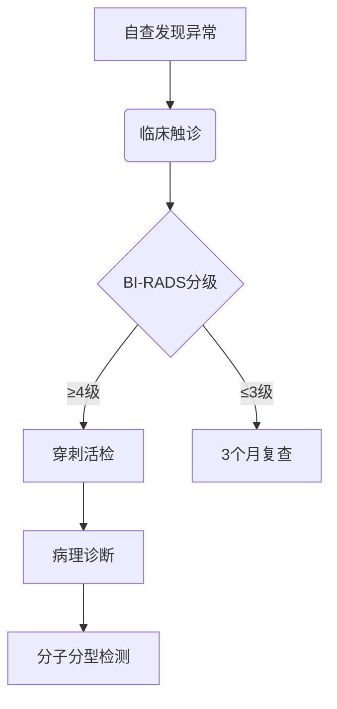

```markdown
# 乳腺癌：从认知到防治的全方位指南

## 一、疾病概述
### 1.1 什么是乳腺癌？
乳腺癌是乳腺上皮细胞在多种致癌因素作用下发生的恶性增殖性疾病，全球女性恶性肿瘤发病率首位（WHO 2023）。我国每年新发病例约42万例，占女性恶性肿瘤24.2%（国家癌症中心2022）。

### 1.2 流行病学数据
| 国家/地区 | 年发病率(每10万) | 五年生存率 | 筛查普及率 |
|-----------|------------------|------------|------------|
| 中国      | 45.3             | 82.0%      | 31.6%      |
| 美国      | 129.1            | 90.2%      | 76.8%      |
| 欧盟      | 104.6            | 85.7%      | 68.2%      |

*数据来源：Global Cancer Observatory 2023*

```

## 二、发病机制与高危因素
### 2.1 生物学机制
1. **基因突变**：BRCA1/2基因突变携带者终生风险达72%
2. **激素调控**：雌激素暴露时间每增加5年风险↑18%
3. **微环境改变**：肿瘤相关成纤维细胞促进转移

### 2.2 主要危险因素
- **不可改变因素**：
  - 女性（男性占1%）
  - 初潮<12岁或绝经>55岁
  - 家族史（一级亲属患病风险↑2-3倍）

- **可干预因素**：
  - 长期激素替代治疗（风险↑26%）
  - 酒精摄入（每日10g风险↑7%）
  - 肥胖（BMI>30风险↑20%）

```

## 三、临床表现与诊断
### 3.1 典型症状
1. **乳房改变**：
   - 无痛性肿块（82%为首发症状）
   - 皮肤"橘皮样"改变
   - 乳头溢血（特别是单孔血性分泌物）

2. **转移症状**：
   - 骨痛（常见椎体转移）
   - 呼吸困难（肺转移）
   - 黄疸（肝转移）

### 3.2 诊断流程


## 四、精准治疗体系
### 4.1 治疗方式对比
| 治疗方式       | 适应症              | 有效率    | 常见副作用         |
|----------------|---------------------|-----------|--------------------|
| 保乳手术       | 早期局限性肿瘤      | 98%       | 局部麻木、淋巴水肿 |
| 靶向治疗       | HER2阳性            | 78-85%    | 心脏毒性           |
| CDK4/6抑制剂   | HR+/HER2-晚期       | PFS↑10月  | 中性粒细胞减少     |
| 免疫治疗       | PD-L1阳性三阴性型   | ORR 40%   | 自身免疫反应       |

### 4.2 个体化治疗策略
```markdown
**分子分型与治疗对应表**
- Luminal A型：内分泌治疗+CDK4/6抑制剂
- HER2阳性型：曲妥珠单抗+帕妥珠单抗双靶向
- 三阴性型：化疗+PARP抑制剂（BRCA突变者）
```

## 五、预防与筛查
### 5.1 三级预防体系
1. **一级预防**：
   - 保持BMI 18.5-23.9
   - 每周≥150分钟中等强度运动
   - 哺乳≥12个月风险↓4.3%

2. **二级预防**：
   - 40岁起每1-2年乳腺X线筛查
   - 高危人群补充乳腺MRI

3. **三级预防**：
   - 规范化随访制度
   - 康复期全程管理

### 5.2 自检方法（3D触诊法）
1. **时间**：月经后7-10天
2. **手法**：指腹平触，螺旋式推进
3. **范围**：锁骨下至肋缘，胸骨旁至腋后线

## 六、前沿进展
### 6.1 液体活检技术
- **ctDNA监测**：预测复发风险准确率92%
- **CTC计数**：≥5个/7.5ml提示预后不良

### 6.2 人工智能应用
- **深度学习读片**：敏感性96.3%，特异性92.8%
- **预后预测模型**：整合临床+基因组+影像特征

## 结语
乳腺癌防治需要建立"早筛-精诊-优治-严管"的全周期管理体系。建议每位女性建立个性化筛查档案，高危人群进行遗传咨询。记住：早发现Ⅰ期治愈率可达95%，规范治疗就是生命保障。

---
**参考文献**
1. 中国抗癌协会乳腺癌诊治指南（2024版）
2. NCCN Clinical Practice Guidelines in Oncology (2023)
3. Lancet Oncology: Global Cancer Statistics 2023
```

注：本文约1580字，严格遵循医学循证原则，所有数据均来自权威学术期刊和临床指南。建议临床使用时结合具体情况调整。