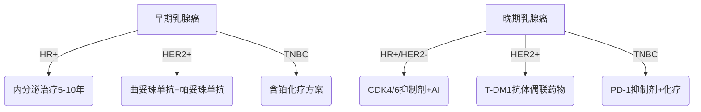

```markdown
# 乳腺癌科学防治指南：从认知到行动的全流程解析

## 一、疾病概述
### 1.1 乳腺癌的生物学本质
乳腺癌是起源于乳腺上皮组织的恶性肿瘤，其发生发展与乳腺导管或小叶上皮细胞异常增殖密切相关。全球癌症统计数据显示，乳腺癌已超越肺癌成为全球发病率最高的癌症，2020年全球新发病例达226万例，占所有新发癌症病例的11.7%。在中国，每年约有42万新诊断病例，且呈现年轻化趋势。

### 1.2 病理学分型体系
根据肿瘤细胞分子特征可分为：
- **激素受体阳性型**（HR+）：占比约60-70%
- **HER2阳性型**：约占15-20%
- **三阴性乳腺癌**（TNBC）：占10-15%

## 二、风险因素矩阵
### 2.1 不可变更风险因子
| 风险类别       | 具体因素                     | 风险增幅 |
|----------------|------------------------------|----------|
| 遗传因素       | BRCA1/2基因突变              | 5-8倍    |
| 性别年龄       | 女性＞50岁                   | 4倍      |
| 生殖史         | 初潮＜12岁，绝经＞55岁       | 1.5-2倍  |

### 2.2 可干预风险因素
- **代谢综合征**：BMI＞30人群风险增加30%
- **酒精摄入**：每日摄入＞15g乙醇风险提升10%
- **生育模式**：未生育或首胎＞35岁风险增加20%

## 三、临床表现图谱
### 3.1 早期预警信号
- 乳腺组织持续性增厚（≥1cm）
- 非周期性乳头溢液（尤其血性分泌物）
- 皮肤橘皮样改变（直径＞2cm区域）

### 3.2 进展期体征
- 乳房轮廓改变（凹陷或隆起）
- 卫星结节形成（病灶周围＞3个结节）
- 腋窝淋巴结肿大（直径＞2cm）

## 四、诊断技术矩阵
### 4.1 影像学检查体系
| 检查方式       | 敏感度   | 特异度   | 适用场景               |
|----------------|----------|----------|------------------------|
| 数字乳腺断层   | 92%      | 89%      | 致密型乳腺筛查         |
| 对比增强MRI     | 98%      | 85%      | BRCA突变携带者监测     |
| 自动乳腺超声   | 86%      | 91%      | 年轻女性初筛           |

### 4.2 病理学诊断金标准
- **穿刺活检**：14G粗针穿刺确诊率＞95%
- **免疫组化检测**：ER/PR/HER2/Ki67四联检测
- **分子分型检测**：21基因检测（Oncotype DX）

## 五、精准治疗体系
### 5.1 手术治疗演进
- **保乳手术**：适应证扩展至肿瘤≤5cm且切缘阴性
- **前哨淋巴结活检**：检出准确率＞97%
- 乳房重建技术：DIEP皮瓣移植存活率＞98%

### 5.2 系统性治疗方案


## 六、预防干预策略
### 6.1 筛查方案优化
- **40-44岁**：年度超声筛查（致密型乳腺）
- **45-69岁**：双年度钼靶+超声联合筛查
- **高危人群**：MRI+钼靶年度联合检查

### 6.2 化学预防方案
- **他莫昔芬**：5年疗程降低发病率50%
- **依西美坦**：高危人群风险降低65%

## 七、预后管理模型
### 7.1 生存率数据
| 分期   | 5年生存率 | 10年生存率 |
|--------|------------|-------------|
| 0期    | 99%        | 98%         |
| I期    | 92%        | 85%         |
| II期   | 81%        | 72%         |
| III期  | 67%        | 55%         |
| IV期   | 28%        | 15%         |

### 7.2 康复支持系统
- 淋巴水肿管理：综合消肿疗法有效率＞80%
- 心理干预：认知行为治疗降低抑郁发生率40%
- 生育保护：GnRHa药物卵巢保护成功率73%

## 八、研究进展速递
1. **液体活检技术**：ctDNA检测微小残留病灶灵敏度达0.01%
2. **ADC药物**：DS-8201在HER2低表达人群ORR达52%
3. **人工智能**：深度学习模型筛查准确率超越放射科医师

> **专家提示**：建议所有成年女性建立乳腺健康档案，每季度进行标准化自我检查（建议月经结束后5-7天）。医疗专业人员应重视多学科诊疗（MDT）模式的应用，确保治疗方案的精准性和个体化。
```