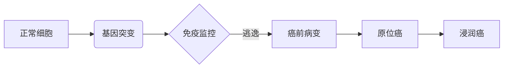
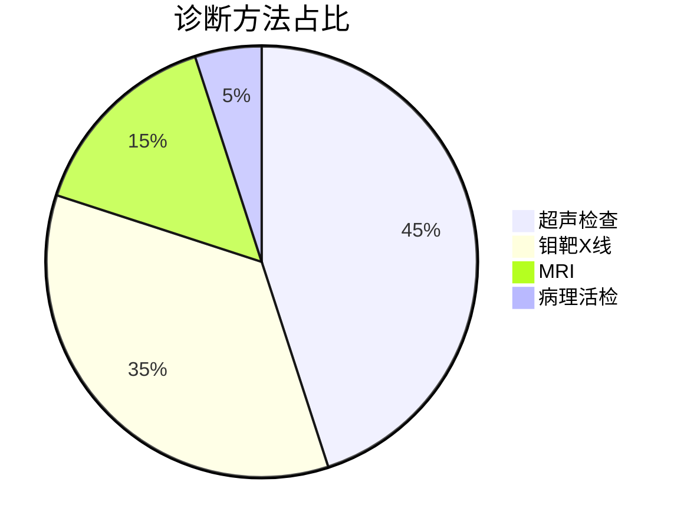
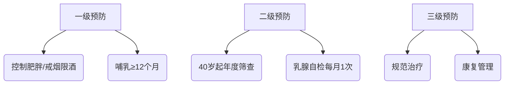

```markdown
# 乳腺癌：从病因到防治的全方位科普

## 引言
乳腺癌是全球女性最常见的恶性肿瘤之一，根据WHO最新统计数据显示：全球每年新发乳腺癌病例超过**230万例**，占所有新发癌症病例的**11.7%**。我国国家癌症中心2023年报告指出，乳腺癌已连续8年位居中国女性恶性肿瘤发病率首位。随着医学技术进步，早期乳腺癌的5年生存率已超过**90%**，但公众认知仍存在诸多误区。

---

## 一、认识乳腺癌

### 1.1 什么是乳腺癌？
乳腺癌是起源于乳腺腺上皮组织的恶性肿瘤，其发生发展具有典型阶段特征：


### 1.2 高危因素矩阵分析
| 风险等级 | 可改变因素                 | 不可改变因素               |
|----------|---------------------------|--------------------------|
| 高风险   | 长期激素替代治疗          | BRCA1/2基因突变          |
|          | 酗酒(>15g酒精/日)         | 乳腺致密型组织           |
| 中风险   | 超重(BMI≥25)              | 初潮早(≤12岁)            |
|          | 缺乏运动(<150分钟/周)      | 绝经晚(≥55岁)            |

---

## 二、临床表现与诊断

### 2.1 典型症状三联征
1. **乳房改变**：无痛性肿块（85%为首发症状）、橘皮样变、乳头回缩
2. **皮肤异常**：酒窝征、静脉曲张、卫星结节
3. **淋巴结肿大**：同侧腋窝淋巴结肿大率可达60%

### 2.2 诊断金标准组合


---

## 三、精准治疗新时代

### 3.1 分子分型指导治疗
| 分型         | 特征标志物         | 治疗方案                 |
|--------------|-------------------|--------------------------|
| Luminal A型  | ER+/PR+/HER2-     | 内分泌治疗+CDK4/6抑制剂  |
| HER2阳性型   | HER2过表达        | 曲妥珠单抗+化疗          |
| 三阴性型     | ER-/PR-/HER2-     | 新辅助化疗+免疫治疗      |

### 3.2 手术方式演变
- **传统术式**：改良根治术（切除范围包括整个乳房+腋窝淋巴结）
- **现代进展**：
  - 保乳手术（需满足肿瘤≤3cm且距乳头≥2cm）
  - 前哨淋巴结活检（降低淋巴水肿发生率60%）
  - 乳房重建术（即时重建成功率>85%）

---

## 四、预防策略金字塔

### 4.1 三级预防体系


### 4.2 筛查指南对比
| 年龄区间 | 中国指南                | 美国NCCN指南           |
|----------|-------------------------|------------------------|
| 40-44岁  | 机会性筛查              | 个体化决定             |
| 45-69岁  | 每1-2年钼靶检查         | 每年钼靶检查           |
| ≥70岁    | 体健者继续筛查          | 酌情停止               |

---

## 五、前沿研究进展

### 5.1 液体活检技术
- **ctDNA检测**：可提前6-12个月预警复发
- **循环肿瘤细胞**：动态监测治疗敏感性

### 5.2 疫苗研究突破
- **HER2多肽疫苗**：II期临床显示复发率降低40%
- **个体化新抗原疫苗**：正在开展全球多中心试验

---

## 结语
面对乳腺癌，早发现早治疗可使生存率提高3-5倍。建议每位女性建立「乳腺健康档案」，记录月经周期、生育哺乳史、家族疾病史等关键信息。记住：科学防治不是与癌抗争，而是与健康同行。

> 本文数据来源：2023版《中国抗癌协会乳腺癌诊治指南》、NCCN指南(2024v1)、The Lancet Oncology最新研究
```