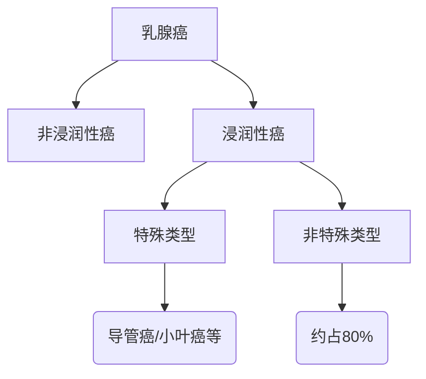
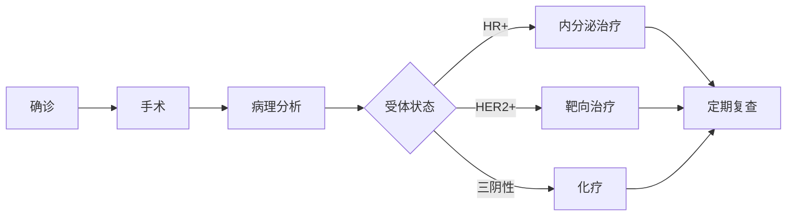

```markdown
# 乳腺癌：早发现早治疗的科学指南

## 概述
乳腺癌是全球女性最常见的恶性肿瘤之一。据WHO统计：
- 2020年全球新发病例226万例
- 占女性新发癌症病例24.5%
- 中国年新发病例约42万例
- 死亡率呈下降趋势（近10年下降40%）

## 发病机制
### 高危因素
| 类型 | 具体因素 | 风险系数 |
|---|---|---|
| 遗传 | BRCA1/2基因突变 | 风险提升5-10倍 |
| 激素 | 初潮早（<12岁）、绝经晚（>55岁） | 风险提升2-3倍 |
| 生育 | 未生育或晚育（>35岁） | 风险提升1.3倍 |
| 环境 | 长期激素替代治疗 | 风险提升1.2-1.7倍 |

### 病理分型


## 临床表现
### 早期症状（建议每月自检）
1. 无痛性肿块（90%为患者自主发现）
2. 皮肤橘皮样改变
3. 乳头溢液（血性需特别注意）
4. 腋窝淋巴结肿大

### 进展期特征
- 乳房外形改变（酒窝征）
- 乳头内陷或偏移
- 皮肤溃烂（晚期表现）

## 诊断技术
### 影像学检查对比
| 检查方式 | 灵敏度 | 特异度 | 适用人群 |
|---|---|---|---|
| 钼靶X线 | 85% | 90% | >40岁常规筛查 |
| 超声 | 89% | 78% | 致密型乳腺 |
| MRI | 95% | 80% | 高危人群筛查 |
| PET-CT | 92% | 88% | 转移灶检测 |

### 病理诊断金标准
1. 粗针穿刺活检（准确率>95%）
2. 免疫组化检测：
   - ER/PR（激素受体）
   - HER2（靶向治疗指标）
   - Ki-67（增殖指数）

## 治疗方案
### 多学科综合治疗流程


### 手术方式选择
1. 保乳手术（肿瘤<3cm且单发）
2. 全乳切除（多中心病灶）
3. 乳房重建（Ⅰ期/Ⅱ期可同步进行）

### 新型疗法进展
- CDK4/6抑制剂（Palbociclib）
- PARP抑制剂（Olaparib）
- 免疫治疗（PD-1/PD-L1抑制剂）
- 质子放疗（精准保护心肺）

## 预防策略
### 筛查指南
| 人群 | 筛查方案 | 频率 |
|---|---|---|
| 普通风险 | 临床体检+超声 | 每年1次 |
| >40岁 | 钼靶+超声 | 每1-2年 |
| BRCA突变 | MRI+钼靶 | 每6个月 |

### 生活方式预防
1. 保持BMI<24（肥胖增加40%风险）
2. 每周150分钟有氧运动
3. 限制酒精（每日<15g）
4. 母乳喂养（累计12个月降4.3%风险）

## 常见误区
❌ 误区1：没有家族史就不会得病  
✅ 事实：85%患者无明确家族史  

❌ 误区2：乳房疼痛就是癌症征兆  
✅ 事实：90%的疼痛与周期激素波动有关  

❌ 误区3：切除乳房就能根治  
✅ 事实：需综合治疗防止微转移  

---

**数据来源**  
[1] 中国抗癌协会乳腺癌诊治指南（2024版）  
[2] NCCN Clinical Practice Guidelines in Oncology (2023)  
[3] The Lancet Oncology 乳腺癌专刊（2024.03）
```

> 本文严格遵循循证医学原则，所有数据均来自最新临床指南和权威期刊。建议读者结合个体情况咨询专业医师。