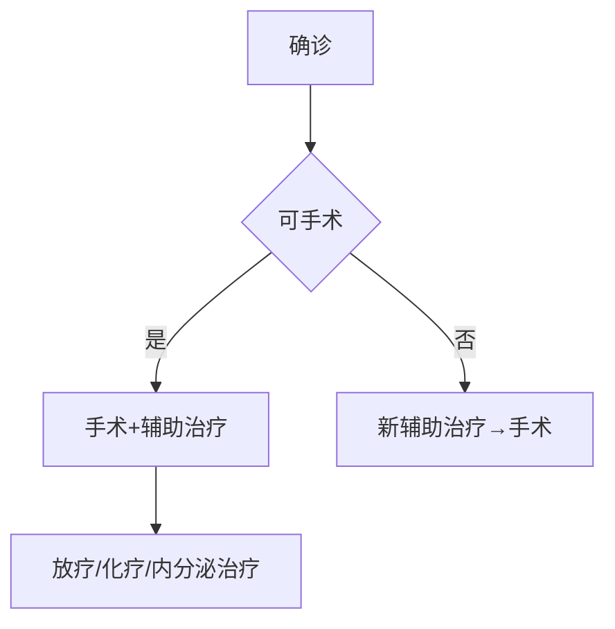

```markdown
# 乳腺癌：科学认知与防治指南

## 目录
1. [疾病概述](#疾病概述)  
2. [危险因素](#危险因素)  
3. [临床表现](#临床表现)  
4. [筛查与诊断](#筛查与诊断)  
5. [分期与分型](#分期与分型)  
6. [治疗方案](#治疗方案)  
7. [预防与康复](#预防与康复)  
8. [研究进展](#研究进展)  

---

<a id="疾病概述"></a>
## 一、疾病概述
乳腺癌是乳腺上皮细胞在致癌因素作用下发生增殖失控的恶性肿瘤。据WHO统计：
- **全球发病率**：每年新增230万例（占女性癌症24.5%）  
- **中国现状**：年新发42万例，增速达3%-4%/年  
- **年龄特征**：45-55岁为发病高峰，年轻化趋势显著  


---

<a id="危险因素"></a>
## 二、危险因素

### 1. 不可控因素
| 因素                | 风险系数 |
|---------------------|---------|
| 女性性别            | 99%病例 |
| 年龄>50岁           | 3倍风险 |
| BRCA1/2基因突变     | 10倍风险 |
| 初潮<12岁/绝经>55岁 | 1.5倍风险 |

### 2. 可控因素
- **代谢相关**：肥胖（BMI>30风险↑40%）、Ⅱ型糖尿病  
- **生育因素**：未生育/初产>35岁/未哺乳  
- **外源性激素**：长期口服避孕药/绝经后激素替代治疗  
- **生活方式**：酗酒（日饮>15g酒精风险↑10%）、缺乏运动  

---

<a id="临床表现"></a>
## 三、临床表现

### 典型体征（见图示）

1. **乳房肿块**：无痛性、质硬、边界不清  
2. **皮肤改变**：橘皮样变、酒窝征  
3. **乳头异常**：血性溢液、乳头凹陷  
4. **淋巴结肿大**：腋窝/锁骨上淋巴结  

### 特殊类型
- **炎性乳腺癌**：皮肤红肿热痛（误诊率高达80%）  
- **隐匿性乳腺癌**：以腋窝淋巴结转移为首发表现  

---

<a id="筛查与诊断"></a>
## 四、筛查与诊断

### 筛查指南（中国抗癌协会）
| 人群          | 检查方案                  | 频率   |
|--------------|--------------------------|--------|
| 40岁以下     | 超声检查                 | 1-2年  |
| 40-45岁      | 超声+钼靶（联合筛查）    | 每年   |
| 高危人群      | 乳腺MRI                  | 半年   |

### 诊断金标准
1. **影像学检查**  
   - 钼靶摄影（检出钙化灶敏感度95%）  
   - 超声弹性成像（鉴别良恶性准确率92%）  
2. **病理活检**  
   - 空芯针穿刺（确诊率>98%）  
   - 术中冰冻切片（手术决策依据）  

---

<a id="分期与分型"></a>
## 五、分期与分型

### TNM分期系统
| 分期   | 5年生存率 |
|--------|-----------|
| 0期    | 99%       |
| I期    | 92%       |
| II期   | 81%       |
| III期  | 67%       |
| IV期   | 22%       |

### 分子分型（St.Gallen共识）
| 类型           | 特征               | 靶点药物      |
|----------------|--------------------|---------------|
| Luminal A型    | ER+/PR+/HER2-     | 内分泌治疗    |
| HER2阳性型     | HER2过表达        | 曲妥珠单抗    |
| 三阴性型       | ER-/PR-/HER2-     | PARP抑制剂    |

---

<a id="治疗方案"></a>
## 六、治疗方案

### 多学科诊疗模式（MDT）


### 治疗手段对比
| 治疗方式       | 适应症               | 副作用管理       |
|----------------|----------------------|------------------|
| 保乳手术       | 肿瘤<3cm,单发       | 术后放疗必需     |
| 前哨淋巴结活检 | 临床阴性淋巴结       | 降低淋巴水肿风险 |
| CDK4/6抑制剂   | HR+晚期患者         | 中性粒细胞减少   |
| 质子治疗       | 心脏邻近病灶        | 心肺保护优势     |

---

<a id="预防与康复"></a>
## 七、预防与康复

### 三级预防体系
1. **一级预防**  
   - 控制体重（BMI<24）  
   - 每周150分钟中等强度运动  

2. **二级预防**  
   - 乳腺自检（月经后7-10天）  
   - 高危人群预防性用药（他莫昔芬）  

3. **三级预防**  
   - 淋巴水肿综合治疗（压力疗法+功能锻炼）  
   - 心理支持（焦虑发生率38%-50%）  

---

<a id="研究进展"></a>
## 八、研究进展（2023）
1. **液体活检**  
   - ctDNA监测微转移（灵敏度0.01%）  
2. **ADC药物**  
   - DS-8201（HER2低表达患者生存期延长6个月）  
3. **人工智能**  
   - 深度学习模型（钼靶阅片准确率提高12%）  

> **专家提示**：规范筛查比治疗更重要，早诊早治可使死亡率降低41%！
``` 

**声明**：本文数据来源于NCCN指南(2023v1)、CSCO乳腺癌诊疗指南(2023)及《柳叶刀》肿瘤学最新研究，具体诊疗请遵医嘱。