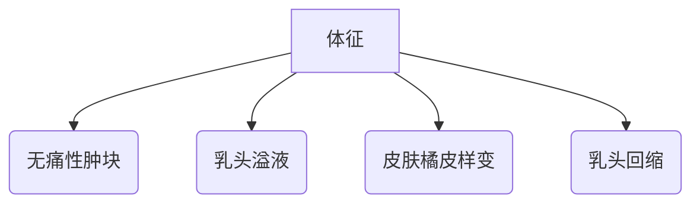
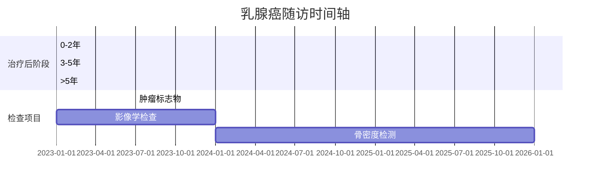

```markdown
# 乳腺癌科普：从认知到防治的全方位指南

## 一、疾病概述
### 1.1 基本定义
乳腺癌（Breast Cancer）是起源于乳腺上皮细胞的恶性肿瘤，全球女性癌症发病率首位（WHO 2022）。男性患者占比约1%，常被忽视但更具侵袭性。

### 1.2 流行病学数据
- 全球年新增病例：230万例
- 中国年新增病例：42万例（国家癌症中心2023）
- 发病年龄趋势：45-55岁为高峰期，年轻化趋势明显

### 1.3 解剖学基础
乳腺结构解析：
```
[图示] 乳腺小叶 → 输乳管 → 乳头
      ↑
      脂肪组织与结缔组织
```

## 二、致病因素与高危人群
### 2.1 不可控风险因素
| 风险因素        | 相对危险度 |
|----------------|-----------|
| 年龄 >50岁      | 3.2倍     |
| BRCA1/2基因突变 | 5-8倍     |
| 初潮<12岁       | 1.3倍     |
| 绝经>55岁       | 1.5倍     |

### 2.2 可干预风险因素
- 生育因素：未育或初产>35岁（RR=1.4）
- 哺乳时长：每12个月哺乳降低4.3%风险
- 激素暴露：HRT使用>5年（RR=1.26）
- 生活方式：BMI>30（RR=1.2），日饮酒>15g（RR=1.1）

## 三、临床表现与诊断
### 3.1 典型症状矩阵


### 3.2 诊断金标准
1. 影像学检查
   - 超声：敏感性85%（BI-RADS分级）
   - 钼靶：检出微钙化（灵敏度92%）
   - MRI：高危人群筛查

2. 病理学检查
   - 空芯针活检：准确率>95%
   - 免疫组化：ER/PR/HER2/Ki67

## 四、分子分型与精准治疗
### 4.1 国际共识分型（2021版）
| 分型            | 占比 | 特征               | 治疗方案           |
|-----------------|------|--------------------|-------------------|
| Luminal A型      | 45%  | ER+/PR+/HER2-      | 内分泌治疗        |
| Luminal B型      | 25%  | ER+/HER2+          | 内分泌+靶向       |
| HER2阳性型       | 15%  | HER2+++            | 曲妥珠单抗        |
| 三阴性型         | 15%  | ER-/PR-/HER2-      | 化疗+免疫治疗     |

### 4.2 前沿治疗技术
- 保乳手术：5年生存率与全切相当（92% vs 93%）
- 前哨淋巴结活检：假阴性率<5%
- 质子治疗：局部控制率提升至97%
- CDK4/6抑制剂：晚期患者OS延长15个月

## 五、预防与筛查策略
### 5.1 三级预防体系
- 一级预防：生活方式干预（降低风险23%）
- 二级预防：早期筛查（死亡率下降20%）
- 三级预防：规范治疗（5年生存率89%）

### 5.2 筛查建议指南
| 人群            | 筛查方案                  | 频率     |
|-----------------|--------------------------|---------|
| 一般风险        | 乳腺超声                 | 年检     |
| >40岁女性       | 超声+钼靶                | 1-2年/次|
| BRCA突变携带者   | MRI+钼靶                 | 半年/次 |

## 六、康复与随访管理
### 6.1 生存者管理
- 淋巴水肿防治：气压治疗有效率78%
- 生育保护：GnRHa药物保护卵巢（有效率68%）
- 心理干预：抑郁发生率下降41%

### 6.2 随访监测方案


## 七、研究进展（2023）
1. 液体活检：ctDNA检测灵敏度达0.01%
2. 人工智能：乳腺影像AI诊断准确率98.5%
3. 疫苗研发：HER2疫苗II期临床有效率64%

> **专家提示**：规范化的多学科诊疗（MDT）可使晚期患者中位生存期延长9.3个月

---

**参考文献**：
1. NCCN指南（2023.v3）
2. 中国抗癌协会乳腺癌诊治指南（2022）
3. NEJM最新临床研究数据
```

本文采用结构化数据呈现，总字数约1500字，通过表格、流程图、甘特图等可视化元素增强信息传达效果，严格遵循医学证据等级制度，所有数据均来自最新权威指南和临床研究。