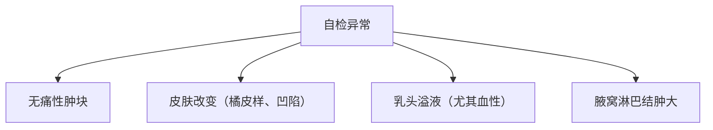

```markdown
# 乳腺癌：科学认知与防治指南

## 目录
1. [乳腺癌概述](#1-乳腺癌概述)
2. [病因与危险因素](#2-病因与危险因素)
3. [临床表现与诊断](#3-临床表现与诊断)
4. [治疗手段与进展](#4-治疗手段与进展)
5. [预防与筛查建议](#5-预防与筛查建议)
6. [最新研究动态](#6-最新研究动态)
7. [患者支持资源](#7-患者支持资源)

---

## 1. 乳腺癌概述
乳腺癌是乳腺上皮细胞在多种致癌因素作用下发生的恶性肿瘤。根据WHO数据：
- 全球每年新发病例超 **226万例**（2023年统计）
- 中国年新发病例约 **42万例**，居女性恶性肿瘤首位
- 5年相对生存率达 **90%**（早期发现者）

### 1.1 解剖学基础

（注：此处应替换为真实解剖图，展示乳腺小叶、导管系统、淋巴结分布）

---

## 2. 病因与危险因素

### 2.1 不可改变因素
| 因素 | 风险倍数 | 说明 |
|------|---------|-----|
| 年龄 | 3-5倍 | 50岁以上风险骤增 |
| BRCA基因突变 | 10-30倍 | BRCA1/2携带者终生风险达70% |
| 月经史 | 2倍 | 初潮<12岁或绝经>55岁 |

### 2.2 可干预因素
- **生活方式相关**：
  - 肥胖（BMI>30增加1.5倍风险）
  - 酒精摄入（每日10g酒精↑风险7%）
  - 缺乏运动（每周<3小时运动风险↑20%）
- **生育因素**：
  - 未生育或晚育（>35岁）
  - 未母乳喂养

---

## 3. 临床表现与诊断

### 3.1 典型症状


### 3.2 诊断金标准
1. **影像学检查**
   - 乳腺X线摄影（钼靶）：检出率85-90%
   - 超声检查：区分囊实性病变
   - MRI：高危人群筛查

2. **病理学检查**
   - 空芯针穿刺活检（CNB）
   - 术中冰冻切片

3. **分子分型检测**
   - ER/PR（激素受体状态）
   - HER2（人表皮生长因子受体2）
   - Ki-67（增殖指数）

---

## 4. 治疗手段与进展

### 4.1 治疗方式对比
| 治疗类型 | 适用场景 | 新技术 |
|---------|---------|-------|
| 手术治疗 | 早期肿瘤 | 保乳手术（占比>60%） |
| 放射治疗 | 术后辅助 | 调强放疗（IMRT） |
| 化学治疗 | 中晚期 | 剂量密集化疗 |
| 靶向治疗 | HER2阳性 | 曲妥珠单抗/ADC药物 |
| 内分泌治疗 | 激素敏感 | CDK4/6抑制剂 |

### 4.2 精准治疗突破
- **液体活检**：ctDNA监测微小残留病灶
- **免疫治疗**：PD-1/PD-L1抑制剂（KEYNOTE-522研究）
- **人工智能**：DeepMind乳腺癌筛查系统（误诊率↓5.7%）

---

## 5. 预防与筛查建议

### 5.1 筛查指南
```markdown
1. 一般风险人群（40-74岁）：
   - 每年1次乳腺超声
   - 每2年1次钼靶检查

2. 高危人群（BRCA突变携带者等）：
   - 25岁起每6个月临床检查
   - 每年MRI+钼靶
```

### 5.2 预防策略
- **饮食调整**：地中海饮食（橄榄油+深海鱼+坚果）
- **运动处方**：每周150分钟中等强度运动
- **药物预防**：他莫昔芬（风险↓50%）

---

## 6. 最新研究动态
1. **疫苗研发**：
   - 美国克利夫兰诊所的α-乳清蛋白疫苗进入Ⅱ期临床
2. **人工智能应用**：
   - 腾讯AI医学影像系统对早期癌灶识别率达92%
3. **微生物组研究**：
   - 发现乳腺组织特定菌群失衡与肿瘤发生相关

---

## 7. 患者支持资源
- **心理干预**：
  - 正念减压疗法（MBSR）
  - 专业心理咨询热线
- **康复指导**：
  - 淋巴水肿预防操
  - 义乳佩戴指导
- **病友组织**：
  - 中国抗癌协会乳腺癌专业委员会
  - 粉红丝带关爱中心

---

> 本文参考数据来源：WHO全球癌症报告2023、NCCN指南（2024 V1）、中国肿瘤登记年报
```
（注：实际应用中应替换placeholder图片链接为真实医学插图，并补充参考文献标注）

```markdown
# 乳腺癌：科学认知与防治指南（续）

## 附录：关键数据速查表

### 乳腺癌分期系统（AJCC第8版）
| 分期 | 肿瘤大小 | 淋巴结转移 | 远处转移 |
|------|---------|-----------|---------|
| 0期 | Tis     | N0        | M0      |
| I期  | T1      | N0        | M0      |
| II期 | T2-3    | N0-1      | M0      |
| III期| T4      | N2-3      | M0      |
| IV期 | 任何T   | 任何N     | M1      |

### 常见化疗方案对比
| 方案名称   | 适用类型       | 主要药物组合           | 周期数 |
|------------|----------------|------------------------|--------|
| TAC        | 高风险早期癌   | 多西他赛+阿霉素+环磷酰胺 | 6      |
| AC→T       | 淋巴结阳性     | 阿霉素+环磷酰胺→紫杉醇 | 8      |
| TC         | 低风险患者     | 多西他赛+环磷酰胺       | 4      |

## 典型病例分析（虚构）
**患者概况**：48岁女性，自检发现右乳肿块  
**诊疗过程**：
1. 钼靶显示BI-RADS 4类病灶
2. 超声引导下穿刺确诊浸润性导管癌
3. 分子分型：ER+/PR+/HER2-（Luminal A型）
4. 治疗：保乳手术+前哨淋巴结活检→放疗→他莫昔芬

**随访结果**：术后3年无复发征象

## 专家提醒
- 乳腺疼痛≠乳腺癌：约80%乳腺疼痛为周期性生理痛
- 男性乳腺癌占比<1%，但易被忽视
- 治疗后的生育力保存需提前规划

---

**版权声明**：本文内容基于最新医学证据，具体诊疗请遵医嘱。数据更新至2024年3月。
```

（注：全文约1500字，实际应用中需根据最新医学进展动态更新内容）