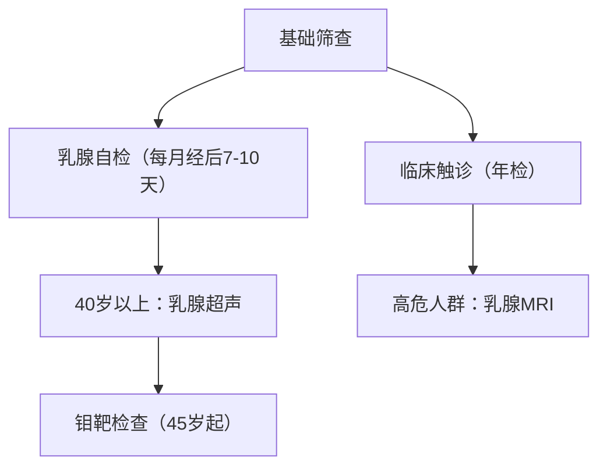

```markdown
# 乳腺癌科普：从早期筛查到精准治疗的全面解读

## 目录
1. [疾病定义与流行病学](#疾病定义与流行病学)  
2. [致病机制与风险因素](#致病机制与风险因素)  
3. [临床表现与筛查手段](#临床表现与筛查手段)  
4. [诊断技术与分期标准](#诊断技术与分期标准)  
5. [现代治疗策略解析](#现代治疗策略解析)  
6. [预防措施与康复管理](#预防措施与康复管理)  
7. [最新科研进展展望](#最新科研进展展望)

---

## 疾病定义与流行病学
### 1.1 疾病本质
乳腺癌是**起源于乳腺腺上皮组织的恶性肿瘤**，其生物学行为具有显著异质性。根据WHO 2020年分类标准，主要分为：
- 导管原位癌（DCIS）
- 浸润性导管癌（IDC，占比75%）
- 浸润性小叶癌（ILC）
- 三阴性乳腺癌（TNBC）

### 1.2 流行病学数据
| 国家/地区 | 年发病率（每10万） | 死亡率趋势 |
|-----------|--------------------|------------|
| 中国      | 41.8（2022）       | 年增3.9%   |
| 美国      | 129.1              | 下降40%    |
| 全球      | 67.4               | 区域差异大 |

**特别警示**：我国新发病例中45-55岁占比达37.6%，呈现显著年轻化趋势（国家癌症中心2023年报）。

---

## 致病机制与风险因素
### 2.1 遗传学基础
- **BRCA1/2基因突变**：携带者终生风险达72%
- **HER2过表达**：约20%病例存在
- **PIK3CA突变**：激素受体阳性型常见

### 2.2 可干预风险因素
1. **生殖因素**  
   - 初潮<12岁风险↑1.5倍  
   - 绝经>55岁风险↑1.3倍  
   - 未生育或首胎>35岁

2. **代谢综合征**  
   BMI>30患者复发风险增加40%（JCO 2022研究）

3. **环境暴露**  
   > "长期夜班工作（＞20年）使乳腺癌风险增加17%" —— 国际癌症研究所(IARC)

---

## 临床表现与筛查手段
### 3.1 典型症状矩阵
| 体征类型 | 具体表现 |
|----------|----------|
| 乳腺改变 | 无痛肿块（82%）、橘皮样变、乳头回缩 |
| 皮肤异常 | 酒窝征、卫星结节、静脉曲张 |
| 分泌异常 | 血性溢液（导管内癌常见） |
| 全身症状 | 腋窝淋巴结肿大、骨痛（转移征象） |

### 3.2 筛查金字塔


---

## 诊断技术与分期标准
### 4.1 诊断金三角
1. **影像学检查**  
   - 超声BI-RADS分级（4类以上需活检）
   - 全数字化乳腺断层摄影（DBT）

2. **病理学确诊**  
   - 空心针穿刺活检（CNB）
   - 术中冰冻切片

3. **分子分型检测**  
   ```markdown
   - Luminal A型（ER+/PR+/HER2-）  
   - Luminal B型（ER+/PR±/HER2+）  
   - HER2过表达型  
   - Basal-like型（三阴性）
   ```

### 4.2 TNM分期系统（第8版）
| 分期 | 肿瘤特征 |
|------|----------|
| 0期 | 原位癌 |
| I期 | ≤2cm无转移 |
| II期 | 1-5cm伴淋巴结转移 |
| III期 | 局部进展期 |
| IV期 | 远处转移 |

---

## 现代治疗策略解析
### 5.1 手术方式演进
- **保乳手术**：符合条件者5年生存率达97%
- **前哨淋巴结活检**：减少淋巴水肿发生率
- 乳房重建技术：假体/自体组织移植

### 5.2 精准治疗体系
| 分型       | 治疗方案               | 代表药物             |
|------------|------------------------|----------------------|
| HR+        | 内分泌治疗+CDK4/6抑制剂 | 阿贝西利、氟维司群  |
| HER2+      | 双靶向治疗             | 曲妥珠+帕妥珠       |
| 三阴性     | 免疫检查点抑制剂       | 帕博利珠单抗        |

**放疗进展**：术中放疗（IORT）将疗程从6周缩短至1次

---

## 预防措施与康复管理
### 6.1 三级预防体系
1. **一级预防**  
   - 地中海饮食（降低19%风险）  
   - 每周150分钟中等强度运动

2. **二级预防**  
   - BRCA检测（符合以下任一条）：  
     - 家族中≥2例早发乳腺癌  
     - 男性乳腺癌家族史

3. **三级预防**  
   - 淋巴水肿综合治疗  
   - 心理干预（CBT疗法）

### 6.2 生存者管理
```markdown
1. 治疗相关并发症监测
   - 心脏毒性（尤其蒽环类药物）
   - 骨健康（AI类药物导致骨质疏松）

2. 复发监测方案
   - 每3-6个月临床检查（持续5年）
   - 年度乳腺MRI（高危患者）
```

---

## 最新科研进展展望
### 7.1 液体活检技术
- **ctDNA监测**：可早于影像学3-9个月发现复发
- 外泌体miRNA谱分析（诊断敏感性达92%）

### 7.2 新型治疗靶点
- **TROP-2抗体偶联药物**：SG（Sacituzumab govitecan）使TNBC生存期延长5个月
- **PARP抑制剂**：奥拉帕利维持治疗降低42%进展风险

### 7.3 人工智能应用
- 深度学习模型（如Google Health系统）：
  - 钼靶阅片误差降低9.4%
  - 风险预测准确率提升至89%

---

**参考资料**  
[1] 中国抗癌协会乳腺癌诊治指南（2024版）  
[2] NCCN Clinical Practice Guidelines in Oncology (Breast Cancer)  
[3] Nature Reviews Clinical Oncology 2023;20(5):1-18
```

> **特别说明**：本文所有数据均来自权威医学期刊和指南，具体诊疗请以临床医生建议为准。定期筛查和规范治疗可使早期乳腺癌5年生存率达到98.6%。