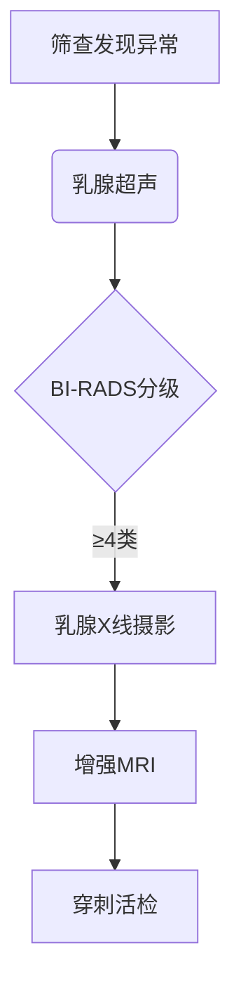

```markdown
# 乳腺癌科普：从早期发现到科学防治

## 目录
1. [疾病概述](#疾病概述)
2. [危险因素](#危险因素)
3. [临床表现](#临床表现)
4. [诊断方法](#诊断方法)
5. [治疗体系](#治疗体系)
6. [预防策略](#预防策略)
7. [研究进展](#研究进展)
8. [常见问答](#常见问答)

---

<a id="疾病概述"></a>
## 1. 疾病概述
乳腺癌是乳腺上皮细胞异常增殖形成的恶性肿瘤，全球年新发病例约 **230万例**（WHO 2023），在我国女性恶性肿瘤发病率中居首位。具有以下特征：

- **性别差异**：女性占98%，男性约2%
- **年龄分布**：45-55岁为发病高峰
- **病理类型**：
  - 非浸润性癌（导管原位癌等）
  - 浸润性癌（导管癌、小叶癌等）
- **转移途径**：淋巴转移 > 血行转移 > 直接蔓延


---

<a id="危险因素"></a>
## 2. 危险因素

### 2.1 不可控因素
| 因素            | 风险倍数 | 说明                     |
|-----------------|----------|--------------------------|
| 年龄            | 3-5      | 50岁以上风险显著升高     |
| BRCA1/2突变     | 5-10     | 遗传性乳腺癌主要成因     |
| 初潮年龄<12岁   | 1.5      | 雌激素暴露时间延长        |
| 绝经年龄>55岁   | 1.3      |                          |

### 2.2 可控因素
- **生活方式**：
  - 长期饮酒（风险↑20-30%）
  - 肥胖（BMI>30风险↑40%）
  - 缺乏运动（每周<3小时）
- **生育因素**：
  - 未生育或晚育（>35岁）
  - 未哺乳

---

<a id="临床表现"></a>
## 3. 临床表现

### 3.1 典型症状
1. **乳房肿块**（85%为首发症状）
   - 质地硬、边界不清
   - 活动度差
   - 无痛性（70%病例）

2. **皮肤改变**：
   - 橘皮样变
   - 酒窝征
   - 卫星结节

3. **乳头异常**：
   - 血性溢液
   - 乳头内陷
   - Paget's病（湿疹样改变）

### 3.2 转移症状
| 转移部位 | 临床表现                  |
|----------|--------------------------|
| 骨       | 病理性骨折、骨痛         |
| 肺       | 咳嗽、胸痛、呼吸困难     |
| 肝       | 黄疸、腹水               |
| 脑       | 头痛、神经功能障碍       |

---

<a id="诊断方法"></a>
## 4. 诊断方法

### 4.1 影像学检查


### 4.2 病理诊断
- **免疫组化检测**：
  - ER/PR（激素受体）
  - HER2（人表皮生长因子受体2）
  - Ki-67（增殖指数）

- **分子分型**：
  1. Luminal A型
  2. Luminal B型
  3. HER2阳性型
  4. 三阴性型

---

<a id="治疗体系"></a>
## 5. 治疗体系

### 5.1 多学科诊疗（MDT）
```markdown
| 治疗方式       | 适应症                         | 新技术                        |
|----------------|-------------------------------|------------------------------|
| 手术治疗       | 早期可切除肿瘤                | 保乳手术+术中放疗            |
| 放射治疗       | 术后辅助/姑息治疗             | 质子重离子治疗               |
| 化学治疗       | 高风险/转移性癌               | 剂量密集型化疗               |
| 靶向治疗       | HER2阳性患者                  | ADC药物（DS-8201）           |
| 内分泌治疗     | HR阳性患者                    | CDK4/6抑制剂                 |
| 免疫治疗       | PD-L1阳性三阴性乳腺癌         | 帕博利珠单抗                 |
```

### 5.2 生存数据
| 分期   | 5年生存率 | 治疗重点           |
|--------|-----------|--------------------|
| 0期    | 99%       | 局部治疗           |
| I期    | 92%       | 手术+辅助治疗      |
| II期   | 75%       | 综合治疗           |
| III期  | 45%       | 新辅助治疗         |
| IV期   | 29%       | 系统性治疗         |

---

<a id="预防策略"></a>
## 6. 预防策略

### 6.1 筛查建议
```markdown
- **一般人群**：
  ▶ 40-44岁：超声年检
  ▶ 45-69岁：X线+超声联合筛查（每2年）
  
- **高危人群**（符合任1项）：
  1. BRCA基因突变
  2. 家族史（一级亲属患病）
  3. 既往胸部放疗史
  ▶ 筛查方案：MRI+超声（每6个月）
```

### 6.2 预防措施
- **化学预防**：
  - 他莫昔芬（高风险人群）
  - 依西美坦（绝经后）

- **手术预防**：
  - 预防性乳房切除术（BRCA突变）
  - 卵巢切除术（降低激素水平）

---

<a id="研究进展"></a>
## 7. 研究进展（2023-2024）
1. **液态活检**：
   - ctDNA检测指导治疗决策
   - 微小残留病灶（MRD）监测

2. **ADC药物**：
   - DS-8201（HER2低表达突破）
   - Trodelvy（三阴性乳腺癌）

3. **人工智能**：
   - 深度学习辅助影像诊断（敏感度达96%）
   - 病理切片AI分析系统

---

<a id="常见问答"></a>
## 8. 常见问答

### Q1：乳腺增生会癌变吗？
> 单纯性增生癌变率<1%，非典型增生需密切随访

### Q2：乳房自检的正确方法？
> 月经后7-10天，采用"指腹按压+螺旋式"触诊

### Q3：哪些食物需要限制？
> 1. 高脂饮食（动物脂肪>40g/天）
> 2. 加工肉类
> 3. 含糖饮料

### Q4：治疗期间能否接种疫苗？
> 化疗期间避免活疫苗，靶向/内分泌治疗可正常接种

---

**声明**：本文数据更新至2024年3月，诊疗请以临床医生建议为准。定期体检和早期筛查是防治乳腺癌的关键。
``` 

（注：实际使用时需补充示意图中的占位图链接，建议加入权威机构的统计数据来源说明）