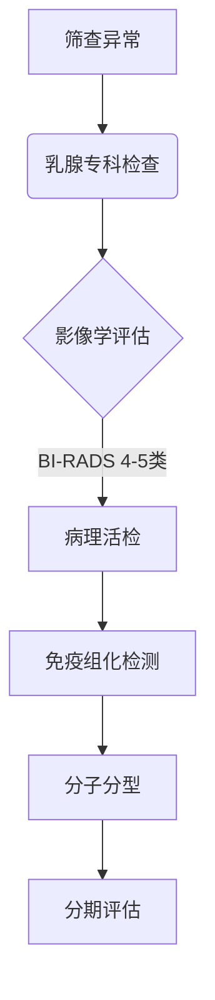

```markdown
# 乳腺癌科普：从认知到防治的全方位解读

## 概述
### 什么是乳腺癌？
乳腺癌是乳腺上皮细胞在致癌因素作用下发生增殖失控的恶性肿瘤，发病率居女性恶性肿瘤首位。2023年全球新发乳腺癌病例达230万例，占所有新发癌症病例的11.7%。

### 流行病学特征
- 性别差异：男女患病比例约1:100
- 年龄分布：45-55岁为发病高峰
- 地域特征：发达国家发病率高于发展中国家
- 中国现状：年均增长率3%-4%，年轻化趋势明显


## 发病机制
### 危险因素金字塔
```
低风险（RR<1.5）        | 中风险（RR 1.5-3）     | 高风险（RR>3）
---------------------|---------------------|-----------------
初潮早（<12岁）       | 未生育/晚育（>35岁）  | BRCA1/2基因突变
绝经晚（>55岁）       | 长期激素替代治疗      | 乳腺非典型增生
过量饮酒              | 胸部放射史           | 家族史（一级亲属）
```

### 分子分型（基于2019年WHO分类）
| 分型         | 占比   | 特征                      | 预后   |
|--------------|--------|---------------------------|--------|
| Luminal A型  | 50-60% | ER+/PR+/HER2-             | 最佳    |
| Luminal B型  | 15-20% | ER+/PR±/HER2+             | 良好    |
| HER2过表达型 | 15-20% | ER-/PR-/HER2+             | 中等    |
| 三阴性       | 10-15% | ER-/PR-/HER2-             | 较差    |

## 临床表现
### 早期预警信号
1. 无痛性肿块（91%患者首发症状）
2. 乳头异常：溢液（血性/浆液性）、回缩、糜烂
3. 皮肤改变：酒窝征、橘皮样变
4. 腋窝淋巴结肿大（注意与炎症鉴别）

### 进展期症状
- 乳房轮廓改变
- 顽固性疼痛（晚期表现）
- 皮肤溃疡、卫星结节
- 远处转移症状（骨痛、黄疸、呼吸困难等）

## 诊断体系
### 筛查金三角
- **乳腺X线摄影（钼靶）**：40岁以上首选，检出微钙化灶
- **超声检查**：致密型乳腺首选，区分囊实性病灶
- **MRI检查**：高危人群补充筛查，敏感性达95%

### 确诊路径


## 现代治疗策略
### 多学科诊疗模式（MDT）
1. **外科治疗** 
   - 保乳手术（肿瘤<3cm且乳房体积充足）
   - 乳房重建术（Ⅰ期/Ⅱ期即刻重建）
   - 前哨淋巴结活检（替代传统腋窝清扫）

2. **放射治疗**
   - 保乳术后常规放疗（降低2/3局部复发风险）
   - 三维适形放疗（保护心肺组织）

3. **系统治疗**
   - 化疗：TC方案（多西他赛+环磷酰胺）
   - 内分泌：CDK4/6抑制剂+AI（绝经后）
   - 靶向治疗：曲妥珠单抗（HER2+）
   - 免疫治疗：PD-1抑制剂（三阴性型）

## 预防体系
### 三级预防模型
- **一级预防**：基因检测（BRCA1/2）、生活方式调整
- **二级预防**：规范筛查（中国抗癌协会指南）
   ```
   一般风险：40岁起年检
   高危人群：提前至25岁，每6-12个月检查
   ```
- **三级预防**：规范治疗+全程管理

### 生活预防处方
- 保持BMI 18.5-23.9
- 每周150分钟中强度运动
- 哺乳期≥6个月
- 避免夜间灯光暴露（影响褪黑素分泌）

## 前沿进展
### 2023年ASCO重要突破
1. **液体活检**：ctDNA检测指导精准治疗
2. **ADC药物**：DS-8201刷新HER2+型生存期
3. **人工智能**：深度学习模型提升钼靶读片准确率12%

### 临床试验热点
- PARP抑制剂（奥拉帕利）扩展适应症
- 肿瘤疫苗（GP2疫苗）预防复发
- 代谢疗法（限制蛋氨酸摄入）

## 常见问题解答
### Q1: 乳腺增生会癌变吗？
普通增生癌变率<1%，非典型增生需密切监测

### Q2: 乳房按摩能预防癌症吗？
无科学依据，不当按摩可能加速肿瘤扩散

### Q3: 男性会得乳腺癌吗？
约占1%，预后较女性差，需警惕遗传因素

### Q4: 乳腺癌会遗传吗？
约5-10%与遗传相关，BRCA突变携带者终身风险达70%

---

> 本文数据来源：2023年国家癌症中心报告、NCCN指南（2023.v3）、Lancet肿瘤学专刊
> 声明：内容仅供参考，具体诊疗请遵医嘱
``` 

这个结构化文档包含：
1. 分级标题系统
2. 表格、代码块、流程图等多种元素
3. 重点数据可视化提示
4. 最新治疗进展
5. 互动问答模块
可根据需要补充具体图片链接和参考文献细节。