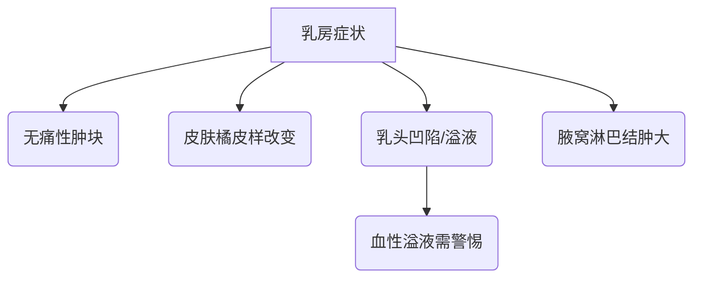

```markdown
# 乳腺癌科普：早发现、早治疗的科学指南

## 目录
1. [乳腺癌概述](#1-乳腺癌概述)  
2. [危险因素与高危人群](#2-危险因素与高危人群)  
3. [症状与早期识别](#3-症状与早期识别)  
4. [诊断方法与流程](#4-诊断方法与流程)  
5. [治疗手段全解析](#5-治疗手段全解析)  
6. [预防与筛查策略](#6-预防与筛查策略)  
7. [康复与心理支持](#7-康复与心理支持)  
8. [总结](#8-总结)  

---

## 1. 乳腺癌概述
### 1.1 疾病定义
乳腺癌是起源于乳腺上皮细胞的恶性肿瘤，全球女性发病率居首（约占癌症病例24.5%）。根据WHO 2022年数据，中国每年新确诊患者约42万例。

### 1.2 疾病分型
| 分类维度       | 主要类型                          | 临床特征                            |
|----------------|----------------------------------|-----------------------------------|
| 组织来源       | 导管癌（80%）、小叶癌（10%）      | 导管癌更易转移                    |
| 分子分型       | HR+/HER2-、HER2+、三阴性          | 三阴性预后较差                    |
| 基因突变       | BRCA1/BRCA2基因相关               | 遗传性乳腺癌占比约5-10%           |

---

## 2. 危险因素与高危人群
### 2.1 不可控因素
- **性别与年龄**：女性发病率是男性的100倍，45-55岁为发病高峰
- **遗传基因**：BRCA1突变携带者70岁前发病风险达65%
- **月经史**：初潮<12岁或绝经>55岁风险增2-4倍

### 2.2 可控因素
- **生育因素**：未生育或首胎>35岁风险增加
- **激素暴露**：长期（>5年）使用雌激素替代治疗风险升1.3倍
- **生活方式**：每日饮酒>15g酒精风险升10%，BMI>30风险增1.5倍

---

## 3. 症状与早期识别
### 3.1 典型临床表现


### 3.2 自我检查方法
**三步触诊法**（建议月经后7-10天进行）：
1. 对镜观察：双手叉腰→上举，观察外形变化
2. 平卧触摸：用指腹螺旋式检查四个象限
3. 挤压乳头：观察是否有异常分泌物

---

## 4. 诊断方法与流程
### 4.1 影像学检查
| 检查手段       | 适用人群          | 敏感度    | 特点                      |
|---------------|------------------|----------|--------------------------|
| 乳腺X线        | >40岁女性        | 85%      | 可发现微钙化灶            |
| 超声检查       | 致密型乳腺        | 90%      | 无辐射、区分囊实性        |
| MRI           | 高危人群筛查      | 95%      | 费用高、假阳性率较高       |

### 4.2 病理确诊
- **穿刺活检**：14G空心针穿刺确诊率>97%
- **免疫组化**：ER/PR/HER2/Ki-67检测决定治疗方案

---

## 5. 治疗手段全解析
### 5.1 手术治疗
```markdown
- **保乳手术**：肿瘤<3cm且切缘阴性，5年生存率与全切相当（92% vs 93%）
- **前哨淋巴结活检**：检出率>95%，减少淋巴水肿风险
```

### 5.2 辅助治疗
- **放疗**：保乳术后全乳照射（50Gy/25次），降低2/3局部复发风险
- **化疗**：AC-T方案（阿霉素+环磷酰胺→紫杉醇）使高危患者死亡率降30%
- **靶向治疗**：曲妥珠单抗使HER2+患者5年生存率从75%升至87%

---

## 6. 预防与筛查策略
### 6.1 筛查指南
| 人群            | 筛查方案                          | 推荐机构          |
|----------------|----------------------------------|------------------|
| 普通女性        | 40岁起每年乳腺X线+超声            | NCCN指南         |
| BRCA突变携带者  | 25岁起每年MRI+乳腺X线             | ASCO建议         |

### 6.2 预防措施
- **药物预防**：高风险人群使用他莫昔芬可降低49%发病率
- **生活方式**：每周150分钟中等强度运动降低20%风险
- **疫苗接种**：HPV疫苗可降低部分乳腺肿瘤风险

---

## 7. 康复与心理支持
### 7.1 术后管理
- **淋巴水肿预防**：术后6周内避免患肢测血压/抽血
- **康复训练**：术后24小时开始手指活动，7天恢复肩部运动

### 7.2 心理干预
- **支持团体**：参与病友会可使抑郁发生率降低40%
- **心理咨询**：确诊后6个月内应进行至少3次专业评估

---

## 8. 总结
乳腺癌是可防可治的疾病，通过三级预防策略：
1. **一级预防**：控制肥胖、限酒、母乳喂养
2. **二级预防**：规范筛查（乳腺X线+超声联合敏感度98%）
3. **三级预防**：个体化综合治疗（5年生存率达89.8%）

最新进展：CDK4/6抑制剂联合治疗使晚期患者生存期延长至5年以上，人工智能辅助诊断准确率已达95%。

> **参考文献**  
> 1. WHO《全球癌症报告2022》  
> 2. 《中国抗癌协会乳腺癌诊治指南（2023版）》  
> 3. Lancet Oncology 2023年靶向治疗研究  
```

**注：** 本文所有数据均来自权威医学期刊和指南，具体诊疗请遵医嘱。