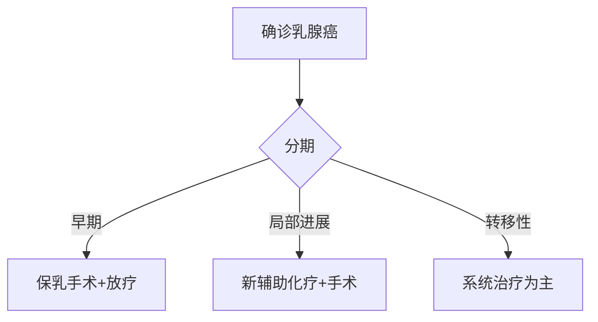

```markdown
# 乳腺癌：从认知到防治的全面解读

## 一、乳腺癌概述
### 1.1 疾病定义
乳腺癌（Breast Cancer）是起源于乳腺上皮组织的恶性肿瘤，全球女性发病率最高的癌症类型。WHO数据显示，2020年全球新发乳腺癌病例达226万例，占所有新发癌症病例的11.7%。

### 1.2 流行病学特征
- **性别差异**：女性占99%，男性乳腺癌约占1%
- **年龄分布**：中国患者中位发病年龄48-50岁（比欧美早10年）
- **地域特征**：城市发病率是农村的2倍

### 1.3 乳腺解剖结构
  
（注：此处应插入标注清晰的乳腺解剖图）

## 二、发病机制与危险因素
### 2.1 生物学机制
| 机制类型 | 主要特征 |
|---------|---------|
|激素依赖性|ER/PR阳性（约占70%）|
|HER2阳性型|HER2过表达（15-20%）|
|三阴性型|ER/PR/HER2均阴性（10-15%）|

### 2.2 主要危险因素
#### 不可控因素：
- BRCA1/BRCA2基因突变（风险提升5-10倍）
- 初潮早（<12岁）、绝经晚（>55岁）
- 致密型乳腺组织

#### 可控因素：
- 长期激素替代治疗（HRT使用>5年）
- 肥胖（BMI>30风险提高30%）
- 饮酒（每日1杯风险提高7-10%）

## 三、临床表现与诊断
### 3.1 典型症状
```markdown
1. **乳房改变**：
   - 无痛性肿块（85%首发症状）
   - 乳头凹陷/溢液（血性液体需警惕）
   - 皮肤"橘皮样"改变

2. **转移症状**：
   - 骨痛（常见转移部位：脊柱、骨盆）
   - 肝区不适（肝转移）
   - 持续性咳嗽（肺转移）
```

### 3.2 诊断金标准
**三步诊断法**：
1. 影像学检查（乳腺X线+超声）
2. 病理活检（空心针穿刺准确率>95%）
3. 分子分型检测（指导治疗方案选择）

#### 常用检查对比：
| 检查方法 | 灵敏度 | 特异度 | 适用人群 |
|---------|--------|--------|---------|
|钼靶X线|85%|90%|>40岁女性|
|乳腺超声|89%|83%|致密型乳腺|
|乳腺MRI|95%|80%|高危人群筛查|

## 四、综合治疗方案
### 4.1 治疗决策树


### 4.2 前沿治疗进展
1. **靶向治疗**：
   - CDK4/6抑制剂（Palbociclib）
   - PARP抑制剂（奥拉帕利）
   
2. **免疫治疗**：
   - PD-1抑制剂（帕博利珠单抗）
   - TILs细胞疗法（临床试验阶段）

3. **精准放疗**：
   - 术中放疗（IORT）
   - 质子重离子治疗

## 五、预防与康复管理
### 5.1 三级预防体系
| 预防等级 | 实施措施 |
|---------|---------|
|一级预防|基因检测（BRCA突变者预防性手术）|
|二级预防|40岁起年度乳腺筛查|
|三级预防|规范治疗后5年随访计划|

### 5.2 康复期注意事项
1. **淋巴水肿管理**：
   - 气压波治疗
   - 专业手法引流
2. **内分泌治疗依从性**：
   - 他莫昔芬需持续5-10年
   - 定期监测子宫内膜厚度

## 六、患者常见误区
```markdown
- ❌ "没有家族史就不会得乳腺癌"  
  ✅ 事实：仅5-10%与遗传直接相关

- ❌ "乳腺增生会癌变"  
  ✅ 事实：普通增生癌变率<1%

- ❌ "乳房按摩可以消除肿块"  
  ✅ 事实：不当按摩可能加速扩散
```

## 七、最新研究动态（2023）
1. **液体活检技术**：
   - CTCs检测实现复发监测
   - ctDNA甲基化分析准确率突破92%

2. **疫苗研发**：
   - GP2肽疫苗进入III期临床
   - mRNA疫苗初步显示预防潜力

3. **人工智能应用**：
   - 深度学习读片系统（敏感度98.5%）
   - 预后预测模型（整合100+临床参数）

> **专家提醒**：建议所有女性每月进行乳房自检，最佳时间为月经结束后7-10天。发现异常应及时就医，早期乳腺癌治愈率可达90%以上。

---

**参考文献**：
1. WHO全球癌症报告2022
2. 中国抗癌协会乳腺癌诊疗指南（2023版）
3. NCCN Clinical Practice Guidelines in Oncology
```

*注：此为结构化科普模板，实际应用中需配合专业医学插图和具体数据来源。建议临床使用时更新至最新指南标准。*