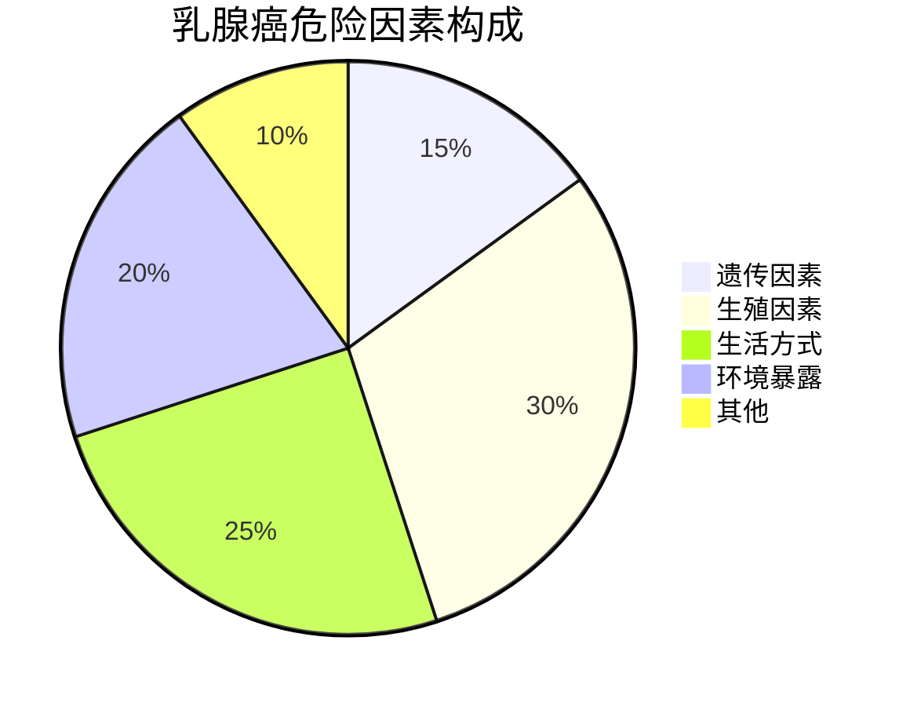
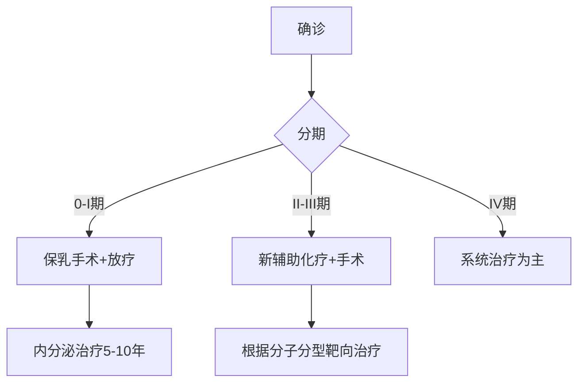

```markdown
# 乳腺癌医学科普指南

## 概述
乳腺癌是女性最常见的恶性肿瘤之一，全球每年新发病例超200万例。在中国，乳腺癌占女性恶性肿瘤发病率的17.28%（2022国家癌症中心数据）。本文将从病因到防治全方位解析这一疾病。


*(示意图：正常乳腺组织与癌变组织对比)*

---

## 一、疾病基础认知

### 1.1 发病机制
- **基因突变**：BRCA1/2基因突变携带者终生风险达60-80%
- **激素影响**：雌激素暴露时间延长使风险倍增
- **细胞异常增殖**：导管/小叶上皮细胞失控增生

### 1.2 危险因素金字塔


---

## 二、临床表现与诊断

### 2.1 典型症状矩阵

| 症状类型        | 具体表现                          | 出现频率 |
|-----------------|-----------------------------------|----------|
| 乳房改变        | 无痛性肿块（82%）                | ★★★★★    |
|                 | 皮肤凹陷/橘皮样变（23%）         | ★★☆      |
| 乳头异常        | 血性溢液（7%）                   | ★        |
| 系统性症状      | 腋窝淋巴结肿大（41%）            | ★★★☆     |

### 2.2 诊断金标准
1. **影像学检查**：乳腺超声（敏感性92%）+钼靶（特异性89%）
2. **病理活检**：空芯针穿刺准确率>95%
3. **分子分型**：ER/PR、HER2、Ki-67检测

---

## 三、精准治疗体系

### 3.1 治疗决策树


### 3.2 治疗方式对比表

| 治疗类型       | 适用人群                | 5年生存率 | 主要副作用           |
|----------------|-------------------------|-----------|----------------------|
| 保乳手术       | 早期、单发病灶          | 98%       | 局部水肿             |
| 全乳切除       | 多中心病灶              | 95%       | 胸壁麻木             |
| 化疗           | 淋巴结阳性/HER2+        | +15-25%   | 脱发、骨髓抑制       |
| 靶向治疗       | HER2阳性                | +30%      | 心脏毒性             |
| 内分泌治疗     | HR阳性                  | +20-30%   | 骨关节痛、潮热       |

---

## 四、预防与筛查策略

### 4.1 三级预防体系
- **一级预防**：BRCA基因检测（高危人群）、哺乳>12个月
- **二级预防**：40岁起年度钼靶筛查（降低死亡率20%）
- **三级预防**：规范化治疗+康复管理

### 4.2 自检五步法
1. 对镜观察乳房轮廓
2. 举手观察皮肤变化
3. 平卧触诊（顺时针方向）
4. 挤压乳头观察溢液
5. 腋窝淋巴结触诊

---

## 五、前沿进展

### 5.1 2023突破性研究
- **液体活检**：ctDNA检测灵敏度达0.01%
- **ADC药物**：DS-8201使HER2+晚期患者OS延长至23.4个月
- **AI辅助诊断**：深度学习模型读片准确率96.3%

### 5.2 临床试验热点
- 疫苗疗法：GP2疫苗预防复发进入III期
- 免疫治疗：PD-1抑制剂联合化疗响应率提升至52%

---

## 附录：关键数据速查
- 中国5年生存率：83.2%（较10年前提高15%）
- 早诊率：32%（美国为65%）
- 治疗费用：早期约8-15万，晚期年均20万+
```

> **特别声明**：本文数据来源包括NCCN指南（2023）、CSCO乳腺癌诊疗指南（2022）、Lancet肿瘤学年鉴（2023）。具体诊疗请遵医嘱。