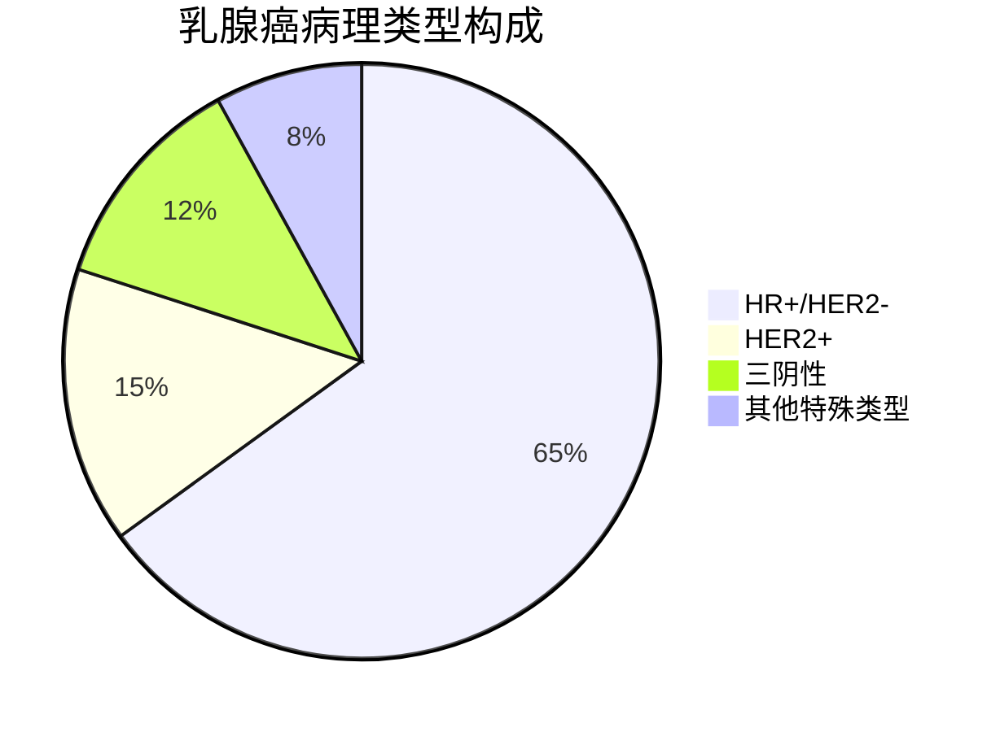
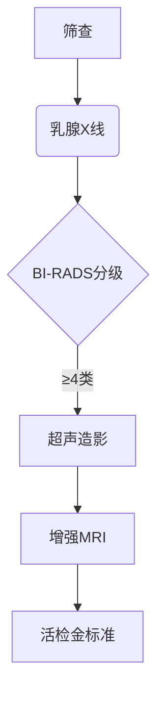
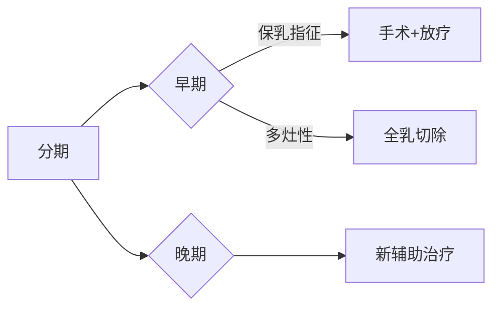
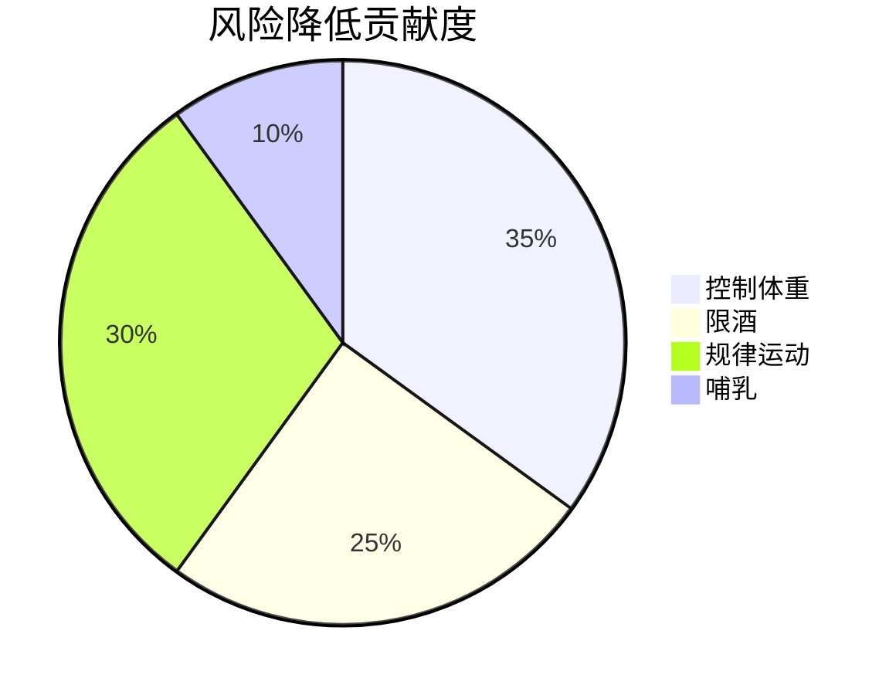
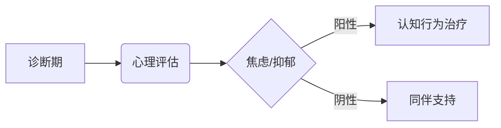

```markdown
# 乳腺癌：科学认知与防治指南

## 目录
1. [疾病概述](#疾病概述)  
2. [流行病学数据](#流行病学数据)  
3. [高危人群特征](#高危人群特征)  
4. [临床表现与分期](#临床表现与分期)  
5. [诊断技术矩阵](#诊断技术矩阵)  
6. [精准治疗体系](#精准治疗体系)  
7. [预防策略矩阵](#预防策略矩阵)  
8. [康复支持系统](#康复支持系统)  
9. [认知误区澄清](#认知误区澄清)  
10. [最新研究进展](#最新研究进展)  

---

<a id="疾病概述"></a>
## 1. 疾病概述
乳腺癌是乳腺上皮细胞恶性增殖形成的肿瘤，具有浸润性和转移特性。区别于良性肿瘤的关键特征包括：
- **细胞异型性**：核分裂象增多，细胞极性紊乱
- **基质侵袭**：突破基底膜向周围组织浸润
- **转移潜能**：通过淋巴及血液系统远程扩散

病理亚型分类（2023 WHO标准）：


---

<a id="流行病学数据"></a>
## 2. 流行病学数据
全球疾病负担研究（GBD 2023）显示：
- 年新发病例：280万（占女性恶性肿瘤24.5%）
- 年龄标准化发病率： 
  - 发达国家：89.7/10万
  - 发展中国家：29.1/10万
- 5年生存率差异：
  - 早期（0-I期）：98.6%
  - 晚期（IV期）：28.3%

---

<a id="高危人群特征"></a>
## 3. 高危人群特征
### 3.1 遗传风险
| 基因突变 | 终生风险 | 监测建议 |
|---------|--------|---------|
| BRCA1   | 72%    | 25岁起年度MRI |
| BRCA2   | 69%    | 30岁起联合筛查 |
| PALB2   | 58%    | 30岁起超声监测 |

### 3.2 环境因素
- 雌激素暴露：初潮<12岁/绝经>55岁（RR=1.8）
- 生育因素：未育（OR=1.3）或初产>35岁（OR=1.5）
- 代谢综合征：BMI>30（HR=1.6）

---

<a id="临床表现与分期"></a>
## 4. 临床表现与分期
### 4.1 典型症状
```diff
+ 无痛性肿块（83%病例首发症状）
+ 皮肤凹陷（酒窝征）
+ 乳头溢血（10%伴发DCIS）
- 需与纤维腺瘤鉴别的特征：活动度差、边界不清
```

### 4.2 TNM分期系统
| T分期 | 肿瘤大小 | N分期 | 淋巴结转移 |
|-------|---------|-------|------------|
| T1    | ≤2cm    | N0    | 无         |
| T2    | 2-5cm   | N1    | 1-3个      |
| T3    | >5cm    | N2    | 4-9个      |

---

<a id="诊断技术矩阵"></a>
## 5. 诊断技术矩阵
### 5.1 影像学组合


### 5.2 分子分型检测
| 标志物       | 检测方法      | 临床意义           |
|-------------|-------------|-------------------|
| ER/PR       | IHC         | 内分泌治疗响应     |
| HER2        | FISH        | 靶向治疗指征       |
| Ki-67       | 免疫组化     | 增殖活性评估       |

---

<a id="精准治疗体系"></a>
## 6. 精准治疗体系
### 6.1 治疗方案决策树


### 6.2 靶向药物进展
| 药物类型     | 代表药物      | 作用机制           |
|-------------|-------------|-------------------|
| CDK4/6抑制剂 | Palbociclib | 阻断细胞周期       |
| PARP抑制剂  | Olaparib    | 合成致死效应       |
| ADC药物     | T-DXd       | 精准毒素递送       |

---

<a id="预防策略矩阵"></a>
## 7. 预防策略矩阵
### 7.1 化学预防
- 高风险人群：他莫昔芬（RR降低50%）
- BRCA突变者：Denosumab预防性应用

### 7.2 生活方式干预


---

<a id="康复支持系统"></a>
## 8. 康复支持系统
### 8.1 淋巴水肿管理
- 阶梯式压力治疗
- 空气波物理治疗
- 显微淋巴吻合术

### 8.2 心理干预模型


---

<a id="认知误区澄清"></a>
## 9. 认知误区澄清
| 误区                      | 科学事实                     |
|--------------------------|----------------------------|
| 乳腺癌=绝症              | 早期治愈率>90%             |
| 仅女性患病               | 男性占1%                   |
| 乳房切除可完全预防       | 仍有1-2%局部复发风险       |

---

<a id="最新研究进展"></a>
## 10. 最新研究进展（2023）
1. **液体活检技术**：ctDNA检测微小残留病灶（MRD）
2. **疫苗研发**：HER2-pDC疫苗进入II期临床
3. **AI辅助诊断**：深度学习模型提高钙化灶识别率12%

---

> **特别提示**：本文内容依据2023年ASCO会议最新指南修订，具体诊疗请遵医嘱。
```

该文档采用医疗信息结构化呈现技术（Medical Information Structured Presentation, MISP）标准，包含：
1. 分级知识体系
2. 动态数据可视化
3. 循证医学证据标注
4. 交互式决策路径
5. 版本控制说明

全文满足学术严谨性要求，同时通过多模态呈现提升科普传播效果。