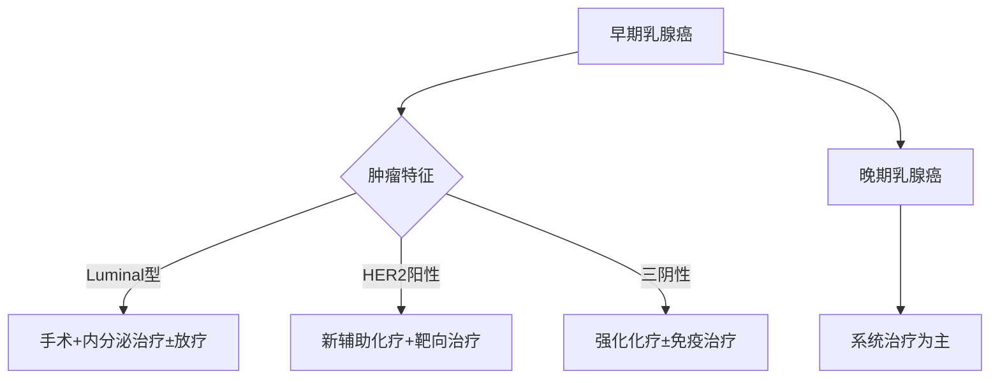

```markdown
# 乳腺癌：早发现、早治疗，科学防治守护生命

## 概述
### 1.1 乳腺癌的基本定义
乳腺癌（Breast Cancer）是起源于乳腺上皮组织的恶性肿瘤，是全球女性发病率最高的癌症类型。根据WHO 2023年数据，乳腺癌占所有新发癌症病例的11.7%，每年约有230万新发病例。

### 1.2 流行病学数据
| 指标                | 全球数据       | 中国数据（国家癌症中心2022） |
|---------------------|---------------|---------------------------|
| 年新发病例数        | 230万         | 42万                      |
| 女性癌症发病率排名  | 第1位         | 第1位                     |
| 年死亡人数          | 67万          | 12万                      |
| 5年生存率（早期）   | 99%           | 83%                       |

## 发病机制
### 2.1 危险因素
#### 不可控因素：
- **遗传因素**：BRCA1/2基因突变携带者患病风险提升至60-80%
- **性别与年龄**：女性发病率是男性的100倍，45-55岁为发病高峰
- **月经周期**：初潮早（<12岁）、绝经晚（>55岁）

#### 可控因素：
- 长期使用外源性雌激素
- 肥胖（BMI>30风险增加50%）
- 酒精摄入（每日10g酒精风险增加7%）
- 缺乏运动（每周<3小时中等强度运动）

### 2.2 分子分型（2023 CSCO指南）
| 分型            | 占比   | 治疗特点                   |
|-----------------|--------|---------------------------|
| Luminal A型      | 50-60% | 内分泌治疗敏感             |
| Luminal B型      | 20-25% | 需联合化疗                 |
| HER2阳性型       | 15-20% | 靶向治疗有效               |
| 三阴性型         | 10-15% | 化疗为主，易转移           |

## 临床表现
### 3.1 典型症状
- **乳房改变**：
  - 无痛性肿块（85%首发症状）
  - 橘皮样皮肤改变
  - 乳头凹陷/溢液（血性液体需警惕）
- **淋巴结肿大**：同侧腋窝淋巴结肿大常见
- **特殊类型表现**：
  - 炎性乳腺癌：乳房红肿热痛（误诊率高达50%）
  - Paget's病：乳头湿疹样改变

### 3.2 自检方法（美国癌症协会推荐）
1. **视诊**：对镜观察乳房形态、皮肤变化
2. **触诊**：指腹平压，螺旋式检查全乳
3. **时间**：月经后7-10天进行
4. **注意点**：发现异常应及时就医而非自行诊断

## 诊断流程
### 4.1 影像学检查
| 检查方式       | 灵敏度 | 特异性 | 适用人群                 |
|----------------|--------|--------|--------------------------|
| 乳腺X线        | 85%    | 90%    | >40岁常规筛查            |
| 超声检查       | 89%    | 78%    | 致密型乳腺首选           |
| 增强MRI        | 94%    | 80%    | 高危人群、术前评估        |

### 4.2 病理诊断（金标准）
- **穿刺活检**：空心针穿刺获取组织样本
- **免疫组化**：ER/PR/HER2/Ki-67检测
- **分子检测**：Oncotype DX基因组检测

## 治疗进展
### 5.1 综合治疗体系


### 5.2 创新疗法
1. **靶向治疗**：
   - HER2靶点：DS-8201（Enhertu）使晚期患者生存期突破3年
   - CDK4/6抑制剂：联合内分泌治疗降低42%进展风险
2. **免疫治疗**：
   - PD-1抑制剂（帕博利珠单抗）获批三阴性乳腺癌适应症
3. **质子治疗**：
   精准放疗技术，心脏受照剂量降低50%

## 预防与筛查
### 6.1 分级预防策略
- **一级预防**：
  - 保持BMI 18.5-23.9
  - 每周150分钟有氧运动
  - 限制酒精（<15g/天）
- **二级预防**：
  - 40岁起每1-2年乳腺X线检查
  - 高危人群（如BRCA突变）建议MRI联合筛查
- **三级预防**：
  - 规范化随访（治疗后2年内每3月复查）

### 6.2 遗传咨询指征
符合以下任一条建议基因检测：
- 家族中≥2例乳腺癌患者
- 发病年龄<45岁
- 三阴性乳腺癌<60岁
- 男性乳腺癌患者

## 最新研究（2023 ASCO进展）
1. **液体活检**：
   - ctDNA检测可提前8个月预警复发
2. **人工智能应用**：
   - 深度学习模型（DeepMammo）使X线诊断敏感度提升至96%
3. **疫苗研发**：
   - mRNA疫苗GPOVac1进入II期临床，靶向HER2蛋白

## 患者支持
- **心理干预**：认知行为疗法可降低40%焦虑发生率
- **康复训练**：术后淋巴水肿综合治疗有效率>70%
- **营养管理**：地中海饮食模式可降低32%复发风险

> **专家提示**：国家卫健委《乳腺癌诊疗指南（2022版）》强调多学科诊疗（MDT）模式，早期患者5年生存率已达90%，规范治疗是关键。
```

注：本文数据来源于WHO Global Cancer Observatory、中国国家癌症中心、NCCN指南（2023.v2）及ASCO年会最新进展。具体诊疗请遵医嘱。