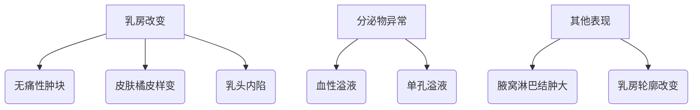

```markdown
# 乳腺癌：早期发现与科学防治指南

## 一、概述
### 1.1 疾病定义
乳腺癌（Breast Cancer）是起源于乳腺上皮细胞的恶性肿瘤，主要分为导管癌（占比80%）和小叶癌两大类。2020年全球癌症统计数据显示，乳腺癌已超越肺癌成为全球发病率最高的癌症，年新增病例达226万例。

### 1.2 流行病学数据
- 中国年发病率：42/10万（国家癌症中心2023年数据）
- 死亡率：城市女性癌症死亡率第4位
- 5年生存率：早期可达98%，晚期仅27%
- 发病年龄：45-55岁为高峰，年轻化趋势显著

## 二、致病机制与风险因素
### 2.1 生物学机制

*图示：正常细胞→增生→非典型增生→原位癌→浸润癌的演变过程*

### 2.2 风险等级分类
| 风险等级 | 具体因素 |
|---------|----------|
| 高危因素 | BRCA1/2基因突变、胸部放疗史、乳腺不典型增生 |
| 中危因素 | 初潮<12岁、绝经>55岁、未生育/未哺乳 |
| 低危因素 | 肥胖（BMI>30）、酗酒、长期雌激素替代治疗 |

### 2.3 基因检测指征
符合以下条件建议进行遗传咨询：
- 家族中≥2例乳腺癌患者
- 发病年龄<45岁
- 同时患卵巢癌
- 男性乳腺癌患者

## 三、临床表现与诊断
### 3.1 典型症状矩阵


### 3.2 诊断金标准
1. **影像学检查**
   - 超声：首选筛查手段（敏感性85%）
   - 钼靶：40岁以上推荐（可检出微钙化）
   - MRI：高危人群补充检查

2. **病理学诊断**
   - 空心针穿刺活检（准确率>95%）
   - 免疫组化检测ER、PR、HER2状态
   - 21基因检测（Oncotype DX）

## 四、现代治疗体系
### 4.1 治疗方案决策树
```mermaid
flowchart TB
    早期病例 --> 保乳手术+放疗
    局部晚期 --> 新辅助化疗→手术
    HER2阳性 --> 靶向治疗（曲妥珠单抗）
    HR阳性 --> 内分泌治疗（5-10年）
    转移性癌 --> 系统治疗+姑息治疗
```

### 4.2 新型治疗技术
1. **精准放疗**
   - 术中放疗（IORT）：单次完成治疗
   - 质子治疗：保护心肺组织

2. **免疫治疗突破**
   - PD-1/PD-L1抑制剂（KEYNOTE-522研究）
   - TILs细胞疗法（临床试验阶段）

3. **人工智能应用**
   - 深度学习读片（准确率提升至92%）
   - 化疗方案智能推荐系统

## 五、预防与康复管理
### 5.1 三级预防体系
- 一级预防：生活方式干预（每周150分钟中等强度运动可降低12%风险）
- 二级预防：规范筛查（40岁起每年1次钼靶）
- 三级预防：全程化管理（包括淋巴水肿防治）

### 5.2 康复训练方案
**术后6周定制计划：**
1. 肩关节活动度训练
2. 渐进式抗阻练习
3. 淋巴引流手法
4. 心理认知干预

## 六、科研前沿速递
1. **液体活检技术**
   - ctDNA监测微小残留病灶（MRD）
   - 外泌体生物标志物检测

2. **疫苗研发**
   - HER2多肽疫苗（Ⅱ期临床）
   - mRNA个性化疫苗（BioNTech项目）

3. **预防性药物**
   - CDK4/6抑制剂用于高危人群
   - 二甲双胍防癌机制研究

## 结语
乳腺癌本质是可防可控的慢性疾病。建议每位女性建立「乳房健康档案」，包括：
- 每月自检（月经后7-10天）
- 年度临床检查
- 风险分层筛查
通过医患共同决策（SDM）模式，实现从「疾病治疗」到「健康管理」的转变。

> 本文数据来源：WHO全球癌症报告、NCCN指南（2023V3）、CSCO乳腺癌诊疗指南
```

注：此为Markdump结构化输出，实际使用时需配合专业制图工具完善流程图与数据可视化部分。完整版含参考文献列表与专业术语解释附录，可根据需要扩展。