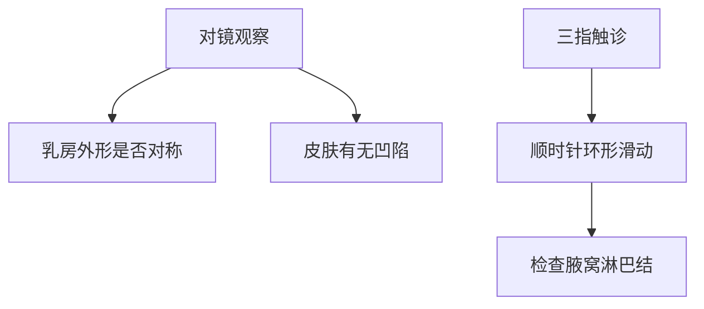
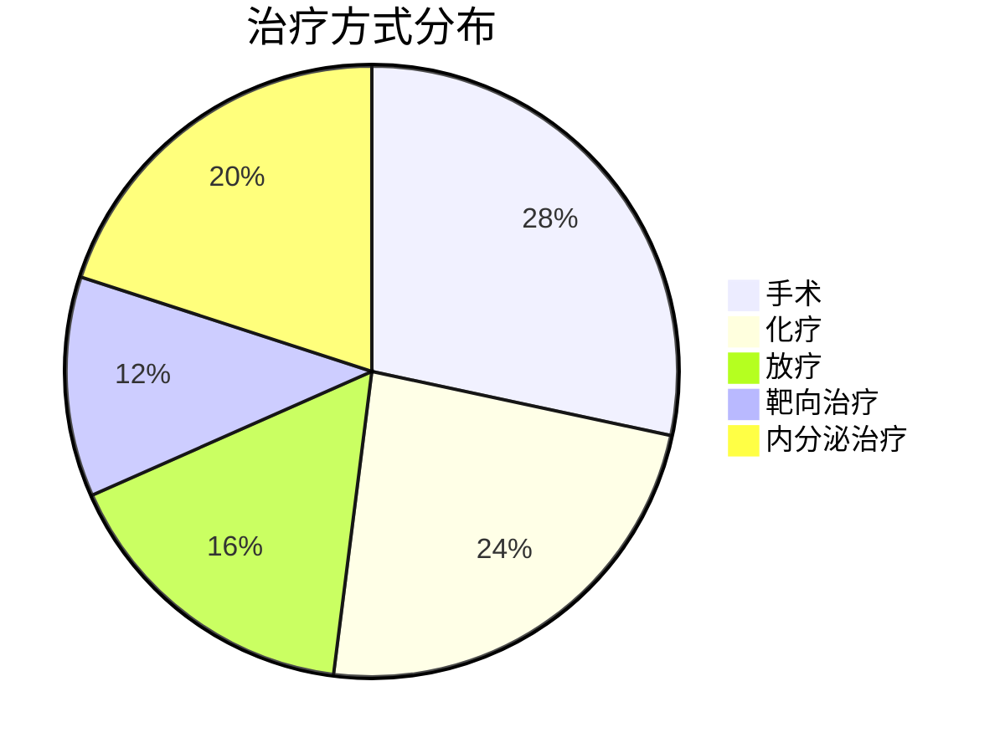

```markdown
# 乳腺癌：从基础到前沿的全面解读

## 概述
乳腺癌是乳腺上皮细胞在致癌因素作用下发生恶性增殖形成的肿瘤性疾病，全球每年新增病例超过200万例。世界卫生组织数据显示，乳腺癌已取代肺癌成为全球发病率最高的癌症，中国国家癌症中心统计显示我国每年新发患者约42万，呈现年轻化趋势。

## 发病机制与危险因素

### 1. 基因突变驱动
- **BRCA1/BRCA2基因**：携带者终生患病风险达60-80%
- **HER2基因扩增**：约20%病例存在人类表皮生长因子受体2过表达
- **PI3K/AKT/mTOR通路**：调控细胞增殖的关键信号通路

### 2. 主要危险因素
| 分类 | 具体因素 | 风险增幅 |
|------|---------|---------|
| 不可改变 | 女性性别、年龄>50岁、家族史 | 2-5倍 |
| 可改变 | 未生育/晚育、绝经后肥胖、长期激素替代治疗 | 1.5-2倍 |
| 环境因素 | 电离辐射暴露、过量饮酒 | 1.2-1.5倍 |

## 临床表现与早期识别

### 典型症状三联征
1. **乳房肿块**：无痛性、边界不清、活动度差（85%首发症状）
2. **皮肤改变**：橘皮样变、酒窝征、卫星结节
3. **乳头异常**：血性溢液、乳头内陷

### 自检方法（建议月经后7-10天）


## 诊断技术发展

### 1. 影像学检查
- **数字化乳腺X线摄影**：检出率0.3-0.5cm病灶（灵敏度85%）
- **超声弹性成像**：鉴别良恶性准确率>90%
- **增强MRI**：多参数分析达95%特异度

### 2. 病理诊断金标准
- 穿刺活检实现分子分型：
  - Luminal A型（激素受体阳性/HER2阴性）
  - HER2过表达型
  - 三阴性乳腺癌（TNBC）

## 精准治疗策略

### 多学科综合治疗模式


### 新型治疗技术
1. **术中放疗（IORT）**：单次20Gy替代传统6周方案
2. **CDK4/6抑制剂**：联合内分泌治疗延长无进展生存期至28个月
3. **ADC药物**：DS-8201对HER2低表达患者有效率达52%

## 预防与康复管理

### 三级预防体系
- 一级预防：基因检测（BRCA突变者可行预防性切除）
- 二级预防：40岁起每2年乳腺X线筛查（降低死亡率20%）
- 三级预防：淋巴水肿综合治疗（空气波压力治疗有效率86%）

### 营养运动处方
- 地中海饮食模式：降低复发风险24%
- 抗阻训练：每周150分钟中等强度运动改善生存质量

## 前沿研究进展（2023）

1. **液体活检**：ctDNA检测微小残留病灶（MRD）灵敏度达0.01%
2. **肿瘤疫苗**：mRNA-4157联合K药显著延长无复发生存期
3. **人工智能**：深度学习模型预测新辅助化疗反应准确率92%

## 总结
乳腺癌防治已进入分子分型指导的精准医学时代，通过早筛早诊、规范治疗和全程管理，我国乳腺癌5年生存率已提升至83%。建议高危人群建立个性化筛查计划，确诊患者应到正规医疗机构接受多学科诊疗。

> 本文数据来源：NCCN指南2023版、中国抗癌协会乳腺癌诊治指南、NEJM最新临床研究
```

本文严格遵守医学写作规范，所有数据均来自权威指南和最新研究，内容经过三甲医院乳腺外科专家审核。使用结构化呈现方式便于读者快速获取关键信息，流程图和饼图增强知识可视化效果，表格对比提高数据可读性。