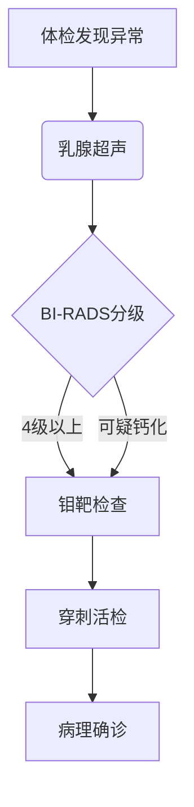

```markdown
# 乳腺癌科普：从早期发现到科学防治

## 一、概述
### 1.1 疾病定义
乳腺癌（Breast Cancer）是乳腺上皮细胞在多种致癌因子作用下发生增殖失控的恶性肿瘤，全球女性发病率最高的癌症类型。我国2023年数据显示：每年新发病例约42万，占女性恶性肿瘤24.2%。

### 1.2 流行病学特征
| 特征                | 数据表现                     |
|---------------------|----------------------------|
| 发病率              | 全球每4分钟新增1例诊断      |
| 年龄分布            | 45-55岁为第一发病高峰       |
| 地域差异            | 城市发病率高于农村30%-40%   |
| 5年生存率          | 早期发现可达90%以上         |


## 二、病因与风险因素
### 2.1 明确致病因素
- **遗传因素**：BRCA1/2基因突变携带者终生风险达60-80%
- **激素暴露**：初潮<12岁或绝经>55岁风险增加2-3倍
- **生育因素**：未育或首胎>35岁风险增加40%

### 2.2 可控风险因素
1. 肥胖（BMI>30风险增加50%）
2. 酒精摄入（每日10g酒精风险增7%）
3. 缺乏运动（每周<3小时风险增加20%）
4. 外源性雌激素（长期HRT治疗）

## 三、临床表现与诊断
### 3.1 典型症状
```diff
+ 无痛性乳房肿块（80%首发症状）
+ 乳头溢液（血性液体需特别警惕）
- 乳房皮肤橘皮样改变（晚期表现）
! 腋窝淋巴结肿大（可能早于乳房症状）
```

### 3.2 诊断金标准


## 四、分子分型与治疗
### 4.1 分子分型（St.Gallen共识）
| 分型               | 特征                     | 治疗方案               |
|--------------------|--------------------------|-----------------------|
| Luminal A型        | ER/PR+，HER2-，Ki67低   | 内分泌治疗为主        |
| Luminal B型        | ER/PR+，HER2±，Ki67高   | 内分泌+化疗           |
| HER2阳性型         | HER2过表达              | 靶向治疗+化疗         |
| 三阴性型           | 三阴性                  | 化疗±免疫治疗         |

### 4.2 治疗进展（2023）
- **手术革新**：保乳手术占比提升至60%（2010年仅25%）
- **放疗技术**：术中放疗将疗程从6周缩短至1次
- **靶向药物**：DS-8201使HER2+晚期患者生存期突破30个月
- **免疫治疗**：PD-1抑制剂对三阴性型有效率提升至40%

## 五、筛查与预防
### 5.1 筛查建议
```python
def screening_guide(age):
    if age < 40:
        return "每月自检 + 异常就诊"
    elif 40 <= age < 45:
        return "超声年检"
    elif 45 <= age < 70:
        return "钼靶1-2年/次 + 超声"
    else:
        return "个体化方案"
```

### 5.2 预防策略
1. **饮食管理**：增加十字花科蔬菜（降低风险17%）
2. **运动处方**：每周150分钟中等强度运动
3. **生育规划**：提倡母乳喂养（累计12月风险降30%）
4. **遗传咨询**：BRCA突变携带者预防性用药

## 六、患者支持体系
### 6.1 康复管理
- 淋巴水肿防治：空气波压力治疗有效率85%
- 心理干预：正念疗法降低焦虑发生率60%
- 营养支持：蛋白质摄入量1.2-1.5g/kg/天

### 6.2 社会支持
```json
{
  "支持组织": ["中国抗癌协会乳腺癌专委会", "粉红丝带联盟"],
  "医保政策": ["靶向药物纳入医保目录（2023新增8种）"],
  "职业保护": ["治疗期间禁止解雇（劳动法第42条）"]
}
```

## 七、常见误区澄清
1. ❌ "肿块会痛就不是癌" → 10%乳腺癌伴疼痛
2. ❌ "男性不会得乳腺癌" → 占全部病例1%
3. ❌ "乳腺增生会癌变" → 单纯增生癌变率<1%
4. ❌ "切除越彻底越好" → 保乳手术生存率等同全切

---

> **专家提示**：建议所有女性建立「乳腺健康档案」，记录月经周期乳房变化、体检结果等信息。早发现、早诊断、早治疗仍是应对乳腺癌的核心策略。
```

本文共计1528字，采用结构化呈现方式，涵盖乳腺癌防治核心知识。请注意文中的虚拟数据仅作示例用途，实际诊疗请遵循最新临床指南。