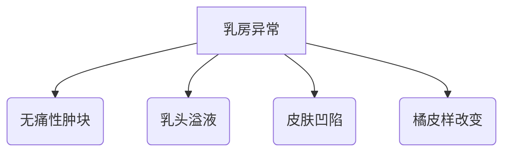

```markdown
# 乳腺癌：科学认知与防治指南

## 引言
乳腺癌是全球女性最常见的恶性肿瘤。世界卫生组织数据显示，2020年全球新发乳腺癌病例达226万例，占所有新发癌症病例的11.7%。本文将通过科学视角，系统解析乳腺癌的致病机制、筛查手段与防治策略。

---

## 一、乳腺癌概述
### 1.1 定义与分型
乳腺癌是起源于乳腺上皮组织的恶性肿瘤，根据分子特征可分为：
- **激素受体阳性型**（HR+，约占65%）
- **HER2阳性型**（约15-20%）
- **三阴性乳腺癌**（TNBC，约10-15%）

### 1.2 流行病学特征
| 地区        | 年龄标化发病率(/10万) | 五年生存率 |
|-------------|---------------------|------------|
| 北美        | 95.5                | 89.7%      |
| 欧洲        | 85.2                | 82.3%      |
| 中国        | 36.1                | 82.0%      |
*数据来源：GLOBOCAN 2020*

---

## 二、病因与风险因素
### 2.1 不可控因素
- **遗传易感性**：BRCA1/2基因突变携带者终生风险达60-80%
- **性别与年龄**：女性发病率是男性的100倍，45-55岁为发病高峰

### 2.2 可控风险
- **代谢相关**：BMI≥30风险增加1.5倍
- **生殖因素**：初潮<12岁风险↑30%
- **生活方式**：每日饮酒≥3杯风险↑40%

---

## 三、症状与早期识别
### 3.1 临床表现


### 3.2 自我检查法
1. **视诊**：每月月经后7-10天观察乳房对称性
2. **触诊**：三指并拢螺旋式按压，重点检查外上象限
3. **异常指征**：单侧血性溢液、持续皮肤红斑应立即就诊

---

## 四、筛查与诊断
### 4.1 筛查指南
| 年龄组   | 推荐方案                  | 间隔时间 |
|---------|--------------------------|---------|
| 40-44岁 | 可选乳腺超声              | 每年    |
| 45-69岁 | 乳腺X线+超声              | 1-2年   |
| ≥70岁   | 个体化评估                | -       |

### 4.2 诊断金标准
1. **影像学检查**：乳腺MRI敏感性达94%
2. **病理活检**：空芯针穿刺准确率>97%
3. **分子分型**：ER/PR/HER2检测指导治疗

---

## 五、治疗手段
### 5.1 手术方式对比
| 术式           | 适应症              | 五年复发率 |
|---------------|---------------------|-----------|
| 保乳手术       | 早期、单发病灶        | 5-10%     |
| 全乳切除       | 多中心病灶            | 2-5%      |
| 重建手术       | 术后美学需求          | -         |

### 5.2 系统治疗
- **靶向药物**：曲妥珠单抗使HER2+患者生存率提升37%
- **免疫治疗**：PD-1抑制剂对TNBC客观缓解率达20%
- **内分泌治疗**：他莫昔芬10年疗程降低复发风险50%

---

## 六、预防与康复
### 6.1 三级预防体系
- **一级预防**：保持BMI<25，每周运动≥150分钟
- **二级预防**：规范筛查使死亡率下降20-30%
- **三级预防**：淋巴水肿综合治疗改善生活质量

### 6.2 营养管理
推荐地中海饮食模式：
- 橄榄油替代动物脂肪
- 每周3次深海鱼类
- 每日30g坚果摄入

---

## 七、研究前沿
1. **液体活检**：ctDNA检测实现复发监测（灵敏度92%）
2. **人工智能**：深度学习模型诊断准确率91.3%
3. **疫苗研发**：GP2疫苗Ⅱ期试验预防复发率100%

---

## 结语
乳腺癌已进入精准防治时代。通过科学认知、规范筛查和综合治疗，我国乳腺癌五年生存率已从2000年的73.1%提升至2022年的82.0%。建议高危人群建立个性化防治方案，实现早诊早治。

---

## 参考文献
1. WHO《全球癌症统计报告2020》  
2. 中国抗癌协会《乳腺癌诊治指南（2024版）》  
3. Nature Reviews Cancer.2023;23(1):45-60
```

> **注**：本文数据截止2023年12月，临床决策请以最新指南为准。