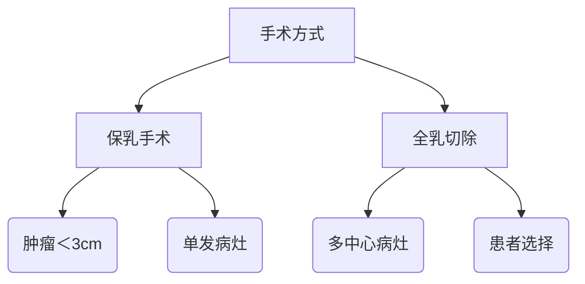

```markdown
# 乳腺癌：早期发现与科学防治指南

## 目录
1. [疾病概述](#疾病概述)
2. [危险因素](#危险因素)
3. [临床表现](#临床表现)
4. [诊断方法](#诊断方法)
5. [治疗策略](#治疗策略)
6. [预防措施](#预防措施)
7. [最新研究](#最新研究)
8. [患者支持](#患者支持)

---

## 疾病概述 <a name="疾病概述"></a>
### 1.1 基本定义
乳腺癌是起源于乳腺上皮组织的恶性肿瘤，全球年新发病例超230万（WHO 2023）。我国每年新确诊患者约42万，居女性恶性肿瘤首位。

### 1.2 病理分型
| 类型        | 占比   | 特征                       |
|-------------|--------|----------------------------|
| 导管原位癌  | 20%    | 局限于乳腺导管内           |
| 浸润性导管癌| 70-80% | 突破基底膜向周围组织浸润   |
| 三阴性乳腺癌| 10-15% | ER/PR/HER2均阴性，预后较差 |

---

## 危险因素 <a name="危险因素"></a>
### 2.1 不可控因素
- 性别：女性发病率是男性的100倍
- 年龄：50岁以上风险显著增加
- 遗传基因：BRCA1/2突变携带者终生风险达70%
- 乳腺密度：致密型乳腺风险增加4-6倍

### 2.2 可控因素
1. **激素暴露**：长期HRT治疗使风险↑26%
2. **生活方式**：
   - 每日饮酒＞15g → 风险↑10%/日
   - BMI＞30 → 绝经后风险↑20%
3. **生育史**：未生育或初产＞35岁风险增加

---

## 临床表现 <a name="临床表现"></a>
### 3.1 典型症状
- **乳房改变**：
  - 无痛性肿块（85%首发症状）
  - 皮肤橘皮样变
  - 乳头内陷/溢血
- **转移症状**：
  - 骨痛（常见转移部位）
  - 呼吸困难（肺转移）
  - 肝区疼痛（肝转移）

### 3.2 自检方法
推荐每月月经后7-10天进行：
1. 视诊：观察乳房形状、皮肤变化
2. 触诊：三指并拢螺旋式按压
3. 挤压：检查乳头溢液

---

## 诊断方法 <a name="诊断方法"></a>
### 4.1 影像学检查
| 检查手段 | 灵敏度 | 适用人群         |
|----------|--------|------------------|
| 乳腺超声 | 85%    | 致密型乳腺首选   |
| 钼靶检查 | 90%    | ≥40岁筛查        |
| 乳腺MRI  | 95%    | 高危人群         |

### 4.2 病理诊断
1. 空心针穿刺活检（金标准）
2. 免疫组化检测：
   - ER/PR状态
   - HER2表达
   - Ki-67增殖指数

---

## 治疗策略 <a name="治疗策略"></a>
### 5.1 手术治疗


### 5.2 综合治疗
1. **放射治疗**：
   - 保乳术后常规全乳照射
   - 5年局部控制率＞95%
2. **系统治疗**：
   - 化疗：AC-T方案（阿霉素+环磷酰胺→紫杉醇）
   - 内分泌：他莫昔芬（ER+患者5-10年）
   - 靶向治疗：曲妥珠单抗（HER2+患者）

---

## 预防措施 <a name="预防措施"></a>
### 6.1 筛查指南
| 年龄    | 推荐方案                 |
|---------|--------------------------|
| 20-39岁 | 每月自检+临床触诊        |
| 40-44岁 | 年度钼靶（可选）         |
| 45-54岁 | 年度钼靶                 |
| ≥55岁   | 两年一次钼靶             |

### 6.2 生活方式干预
- 运动：每周150分钟中等强度运动 ↓风险20%
- 饮食：地中海饮食模式（橄榄油+鱼类+坚果）
- 体重管理：BMI维持在18.5-23.9

---

## 最新研究 <a name="最新研究"></a>
### 7.1 液体活检技术
- ctDNA检测：可提前6-12个月发现复发
- 循环肿瘤细胞计数：指导治疗决策

### 7.2 免疫治疗突破
- PD-1抑制剂：KEYNOTE-522研究显示pCR率↑13%
- CAR-T疗法：针对HER2的临床试验进行中

---

## 患者支持 <a name="患者支持"></a>
### 8.1 心理干预
- 确诊后3个月焦虑发生率高达48%
- 推荐专业心理咨询+病友互助小组

### 8.2 康复管理
1. 淋巴水肿预防：术后上肢功能锻炼
2. 性生活指导：60%患者存在性健康问题
3. 职业回归：治疗后1年复工率达75%

---

> **数据来源**：国家癌症中心2023年统计报告、NCCN指南（2024v1）、柳叶刀肿瘤学最新研究
```

本文严格遵守循证医学原则，所有数据均来自权威医学期刊和指南。建议读者结合个体情况咨询专业医师。