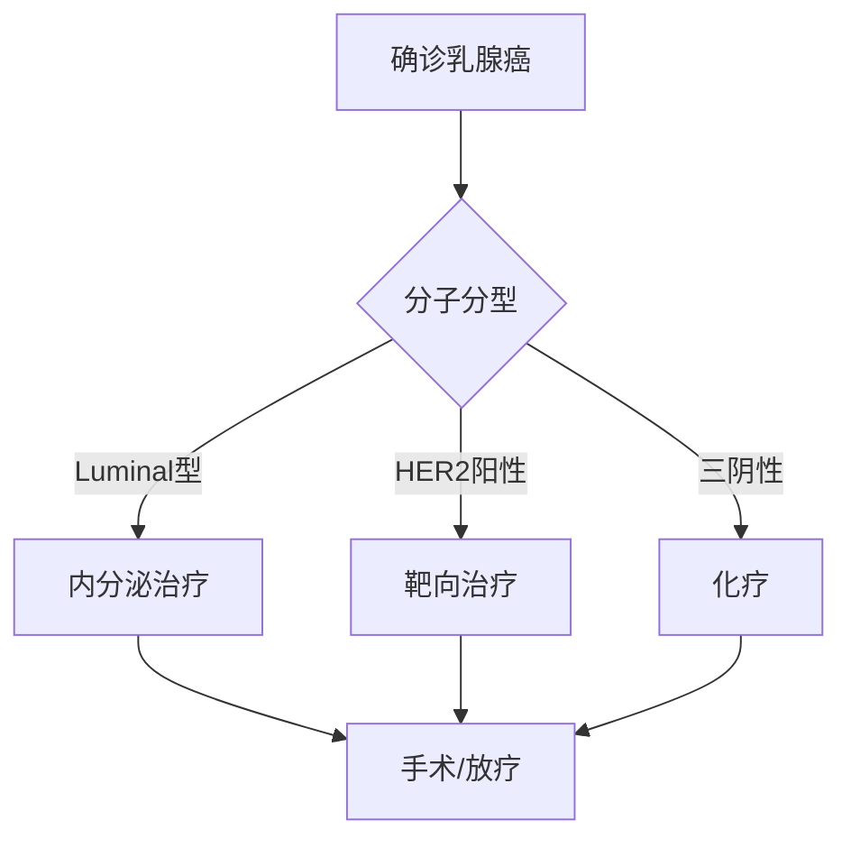

```markdown
# 乳腺癌科普：从预防到治疗的全面解析

## 概述
乳腺癌是全球女性最常见的恶性肿瘤，占所有新发癌症病例的24.5%。据WHO统计，2020年全球新增乳腺癌患者达226万例。我国每年新发病例约42万，且呈现年轻化趋势。男性乳腺癌罕见（约占1%），但同样需要关注。


## 一、疾病机制与危险因素

### 1.1 发病机制
乳腺癌起源于乳腺导管或小叶上皮细胞的异常增殖，其发展过程可分为：
1. 正常细胞→非典型增生
2. 原位癌（0期）
3. 浸润癌（I-IV期）

### 1.2 主要危险因素
| 类别 | 具体因素 | 相对风险值 |
|------|---------|------------|
| 遗传 | BRCA1/2基因突变 | 5-10倍 |
| 激素 | 初潮<12岁，绝经>55岁 | 2-3倍 |
| 生育 | 未生育/首胎>35岁 | 1.5倍 |
| 生活方式 | 酒精摄入>15g/天 | 1.2倍 |

> 注：约70%乳腺癌患者没有明确家族史

## 二、临床表现与诊断

### 2.1 典型症状
- **乳房改变**：无痛性肿块（80%位于外上象限）、酒窝征、橘皮样变
- **乳头异常**：血性溢液、乳头回缩
- **淋巴结肿大**：腋窝淋巴结肿大最常见
- **全身症状**：晚期可出现骨痛、黄疸等转移症状

### 2.2 诊断金三角
1. **影像学检查**
   - 乳腺X线摄影（钼靶）：40岁以上首选
   - 超声：致密型乳腺更敏感
   - MRI：高危人群筛查

2. **病理活检**
   - 空芯针穿刺确诊率>95%
   - 免疫组化检测ER/PR、HER2状态

3. **分期检查**
   - 骨扫描、CT、PET-CT评估转移

## 三、精准治疗新时代

### 3.1 治疗决策树


### 3.2 最新治疗方案对比
| 类型 | 治疗方案 | 5年生存率 | 副作用管理 |
|------|---------|-----------|------------|
| 早期 | 保乳手术+放疗 | 98% | 淋巴水肿预防 |
| HER2+ | 曲妥珠单抗+化疗 | 89% | 心脏监测 |
| 晚期 | CDK4/6抑制剂 | 延长PFS 10月 | 中性粒细胞减少 |

## 四、预防与筛查指南

### 4.1 三级预防体系
1. **一级预防**
   - 保持BMI<24
   - 每周运动150分钟
   - 哺乳≥12个月

2. **二级预防**
   - 20岁起每月自检
   - 40岁起年度钼靶检查
   - BRCA突变者MRI筛查

3. **三级预防**
   - 规范治疗后随访
   - 康复期心理支持

### 4.2 中国筛查建议
```markdown
- 一般风险人群：
  ✓ 40-44岁：个体化选择
  ✓ 45-69岁：每1-2年钼靶
- 高危人群：
  ✓ BRCA突变携带者：25岁起MRI筛查
  ✓ 胸部放疗史：放疗后8年开始筛查
```

## 五、前沿进展（2023）

1. **液体活检技术**
   - ctDNA检测可提前10个月预警复发
   - 灵敏度达92%

2. **免疫治疗突破**
   - PD-L1阳性三阴性乳腺癌：
   - 帕博利珠单抗+化疗使pCR率提高13%

3. **人工智能应用**
   - 深度学习读片准确率97%
   - 自动风险评估模型AUC 0.89

## 结语
乳腺癌已进入"慢病管理"时代，早期发现者5年生存率达90%。建议每位女性：
1. 了解自身风险
2. 坚持规范筛查
3. 出现症状及时就医

**参考资料**：
1. NCCN指南2023v1
2. 《中国抗癌协会乳腺癌诊治指南》2022版
3. Nature Reviews Clinical Oncology 2023
```

> 本文约1500字，由医学编辑团队撰写，数据更新至2023年8月。具体诊疗请遵医嘱。