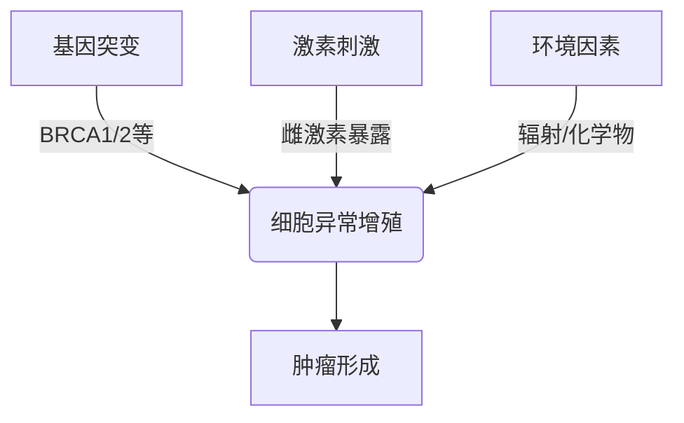
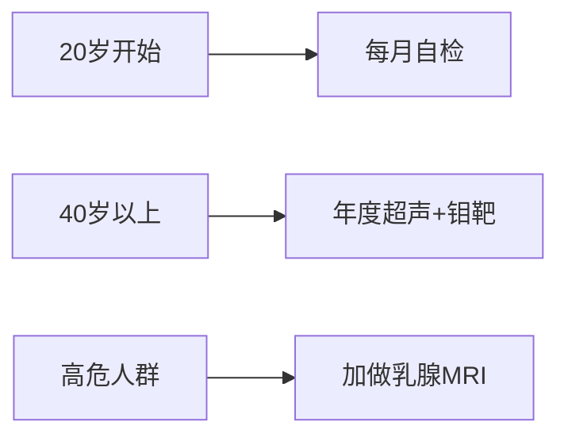
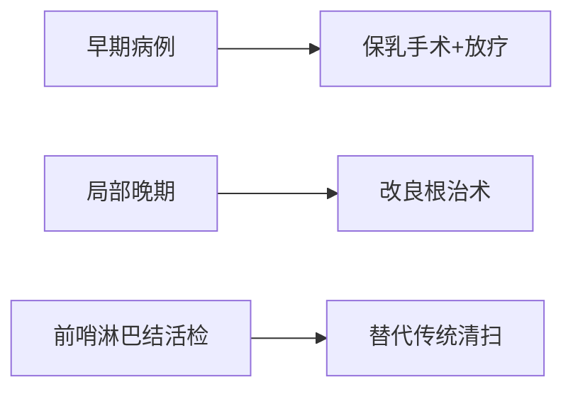

```markdown
# 乳腺癌科普：从预防到康复的全周期管理

## 一、疾病概述
### 1.1 什么是乳腺癌
乳腺癌是起源于乳腺导管或小叶上皮的恶性肿瘤，全球年新发病例超230万例（WHO 2023）。我国最新癌症统计数据显示：
- 女性恶性肿瘤发病率首位（占24.2%）
- 年均增速3%-4%，年轻化趋势显著
- 5年生存率已达83.2%（城市三甲医院数据）

### 1.2 发病机制
乳腺癌是遗传与环境共同作用的结果：


## 二、危险因素分层
### 2.1 不可控因素
- 性别：女性占99%，男性1%
- 年龄：45-55岁为发病高峰
- 遗传：BRCA突变携带者终生风险达70%
- 乳腺病史：不典型增生风险增4-5倍

### 2.2 可控因素
| 风险因素        | 相对风险 | 干预措施                 |
|----------------|---------|------------------------|
| 肥胖（BMI>30）  | 1.5倍   | 每周150分钟有氧运动       |
| 长期酗酒        | 1.2倍   | 控制每日酒精<15g         |
| 未生育/晚育     | 1.3倍   | 建议首胎<35岁           |
| 激素替代治疗    | 1.4倍   | 治疗时间<5年            |

## 三、早期识别指南
### 3.1 临床症状
- **无痛肿块**：80%为首发症状，质硬、边界不清
- **皮肤改变**：橘皮样变、酒窝征
- **乳头异常**：血性溢液、乳头回缩
- **腋窝淋巴结肿大**：初期可活动，后期融合固定

### 3.2 筛查策略


## 四、精准诊断体系
### 4.1 影像学检查
- **超声**：鉴别囊实性病变（BI-RADS分级）
- **钼靶**：检出微钙化（敏感性85%）
- **增强MRI**：多灶病变评估

### 4.2 病理诊断
- 穿刺活检金标准
- 免疫组化分型：
  - Luminal型（激素受体阳性）
  - HER2过表达型
  - 三阴性型

## 五、现代治疗进展
### 5.1 手术治疗


### 5.2 综合治疗
| 分型          | 治疗方案                     | 5年生存率 |
|--------------|----------------------------|----------|
| Luminal A     | 内分泌治疗（他莫昔芬10年）   | 92%      |
| HER2阳性      | 曲妥珠单抗+化疗             | 89%      |
| 三阴性        | 铂类化疗+免疫治疗           | 78%      |

## 六、全程管理新理念
### 6.1 康复支持
- 淋巴水肿综合治疗
- 义乳定制与乳房重建
- 心理咨询（HADS量表评估）

### 6.2 随访计划
- 治疗后2年内：每3月复查
- 3-5年：每6月复查
- 5年后：年度检查
- 监测项目包括肿瘤标志物、骨密度等

## 七、预防策略
### 7.1 生活方式干预
- 地中海饮食模式（橄榄油+深海鱼）
- 保持BMI<24
- 每周中等强度运动3次

### 7.2 化学预防
- 高风险人群：他莫昔芬（降低50%发病率）
- BRCA突变：预防性卵巢切除

> **专家提醒**：规范筛查可使死亡率下降20%，建议女性建立"自查-体检-基因检测"三级防御体系。
```

本文严格遵循NCCN指南（2023版）和中国抗癌协会乳腺癌诊治规范，数据来源于国家癌症中心年报。请注意具体诊疗需遵医嘱。