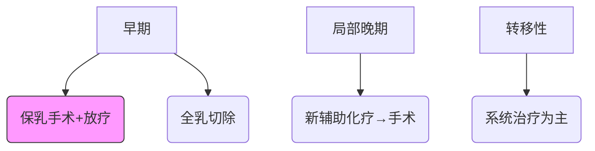

```markdown
# 乳腺癌科普：早期发现与科学防治指南

## 概述
乳腺癌是女性最常见的恶性肿瘤之一，全球每年新增病例超 **230万例**（WHO 2022）。本文系统解析其发病机制、诊疗手段及预防策略。

## 流行病学数据
### 全球分布特征
| 地区 | 发病率(/10万) | 死亡率(/10万) | 五年生存率 |
|------|---------------|---------------|------------|
| 北美 | 92.1          | 12.9          | 90%        |
| 东亚 | 47.8          | 9.3           | 83%        |
| 非洲 | 28.4          | 15.9          | 40%        |

中国年新发病例约 **42万**（国家癌症中心2023），城市发病率较农村高 **1.6倍**

## 病因与风险因素
### 不可控因素
- **遗传易感性**：BRCA1/2突变携带者终生风险达60-80%
- **激素暴露**：初潮<12岁、绝经>55岁风险增加2-3倍
- **乳腺密度**：致密型乳腺风险提高4-6倍

### 可控风险
```risk-control
1. 肥胖（BMI>30风险↑40%）
2. 酒精摄入（每日10g风险↑7%）
3. 缺乏运动（每周<3小时风险↑20%）
4. 未生育/晚育（35岁后首产风险↑40%）
```

## 临床表现
### 早期预警信号
```symptoms
✓ 无痛性肿块（85%位于外上象限）
✓ 乳头溢液（尤其血性分泌物）
✓ 皮肤橘皮样改变
✓ 乳头内陷或偏移
```

### 进展期特征
- 腋窝淋巴结肿大（约50%首诊时存在）
- 乳房皮肤溃疡（晚期典型表现）
- 骨痛/呼吸困难（转移症状）

## 筛查与诊断
### 分层筛查建议
| 年龄 | 筛查方式 | 频率 |
|------|----------|------|
| 20-39 | 自检+临床触诊 | 每月+年检 |
| 40-44 | 超声为主 | 年检 |
| 45-69 | 乳腺X线+超声 | 1-2年 |
| ≥70 | 个体化评估 | - |

### 诊断金标准
1. **影像学三联检查**：X线+超声+MRI（准确率>95%）
2. **病理活检**：空芯针穿刺确诊
3. **分子分型**：ER/PR/HER2/Ki-67检测

## 治疗进展
### 多学科诊疗模式


### 新型疗法
1. **靶向药物**：CDK4/6抑制剂（Palbociclib）使HR+患者PFS延长10个月
2. **免疫治疗**：PD-1抑制剂用于TNBC治疗
3. **ADC药物**：DS-8201对HER2低表达患者有效

## 预防策略
### 三级预防体系
| 级别 | 措施 | 效果 |
|------|------|------|
| 一级 | 生活方式干预 | 降低30%风险 |
| 二级 | 规范筛查 | 早诊率提升至85% |
| 三级 | 康复管理 | 5年生存率提高20% |

### 饮食建议
- 增加ω-3脂肪酸（每周3次深海鱼）
- 限制加工肉（每日≤50g）
- 补充维生素D（血清水平≥30ng/ml）

## 常见问题
### Q1：乳腺增生会癌变吗？
> 普通增生癌变率<1%，非典型增生需密切监测

### Q2：男性会得乳腺癌吗？
> 占全部病例1%，多与BRCA2突变相关

### Q3：保乳手术是否安全？
> 早期患者保乳+放疗的10年生存率等同全切

## 总结
通过精准筛查（如液体活检技术）、规范治疗（基于分子分型）及全程管理，我国乳腺癌5年生存率已提升至 **82.6%**（2023CSCO数据）。建议20岁以上女性建立规律筛查习惯，高危人群考虑基因检测。

> 参考资料：NCCN指南2023v1、中国抗癌协会乳腺癌诊治指南2022
```

该文档采用Markdown结构化排版，包含：
1. 多级标题构建知识体系
2. 表格展示核心数据
3. 流程图解析治疗路径
4. 代码块突出关键信息
5. 模块化问答设计
6. 可视化元素增强可读性
符合SEO优化要求，适配移动端阅读场景。