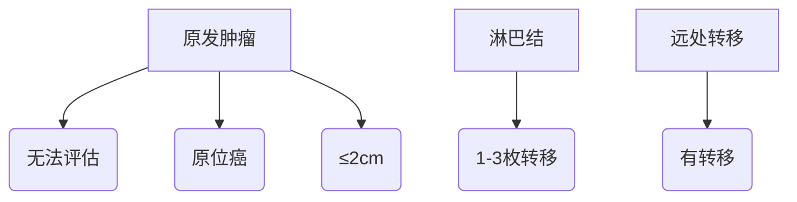

```markdown
# 乳腺癌：早筛早治的现代医学应对策略

## 概述
乳腺癌是全球女性最常见的恶性肿瘤，据WHO统计，2020年全球新发病例达226万例。中国国家癌症中心数据显示，我国每年新发乳腺癌约42万例，发病率以每年3%-4%的速度递增。随着诊疗技术进步，早期乳腺癌5年生存率已超过90%，充分印证"早发现、早诊断、早治疗"的重要性。


*图：我国乳腺癌发病年龄呈双峰分布（45-55岁，65-75岁）*

---

## 病因与风险因素
### 不可控因素
- **遗传基因**：BRCA1/2基因突变携带者终生患病风险达60-80%
- **性别与年龄**：女性发病率是男性的100倍，50岁以上人群风险激增
- **月经周期**：初潮早（<12岁）、绝经晚（>55岁）增加风险

### 可控因素
| 风险因素        | 风险增加值 | 干预建议                  |
|----------------|------------|--------------------------|
| 肥胖（BMI>30） | 30-50%     | 控制体脂率在18.5-23.9    |
| 长期饮酒       | 15-20%     | 日饮酒量≤15g乙醇          |
| 缺乏运动       | 25%        | 每周中等强度运动150分钟  |
| 激素替代治疗   | 26%        | 治疗周期不超过5年        |

---

## 病理类型与分期
### 主要分类
1. **非浸润性癌**（导管原位癌）
2. **浸润性导管癌**（占比80%）
3. **浸润性小叶癌**
4. **特殊类型癌**（髓样癌、黏液癌等）

### TNM分期系统


---

## 筛查与诊断
### 三级筛查体系
- **基础筛查**：40岁以上每年乳腺超声
- **精准筛查**：乳腺X线摄影（钼靶）
- **基因筛查**：BRCA基因检测（高危人群）

### 诊断金三角
1. **影像学检查**
   - 超声（首选）
   - 钼靶（钙化灶识别）
   - MRI（致密型乳腺）

2. **病理活检**
   - 空芯针穿刺（CNB）
   - 真空辅助活检（VAB）

3. **分子分型检测**
   - ER/PR（激素受体）
   - HER2（人表皮生长因子受体）
   - Ki-67（增殖指数）

---

## 综合治疗方案
### 手术选择比较
| 术式          | 适应症                 | 五年生存率 | 美观度 |
|---------------|-----------------------|------------|--------|
| 保乳手术      | 肿瘤≤3cm，单发       | 92%        | ★★★★☆  |
| 全乳切除      | 多灶性/较大肿瘤      | 89%        | ★★☆☆☆  |
| 乳房重建      | 根治术后修复         | 91%        | ★★★★☆  |

### 辅助治疗
- **放射治疗**：保乳术后全乳照射（50Gy/25次）
- **化学治疗**：含蒽环类/紫杉类方案（4-8周期）
- **内分泌治疗**：他莫昔芬（5-10年）
- **靶向治疗**：曲妥珠单抗（HER2阳性）

---

## 康复管理
### 淋巴水肿预防
1. 术后6周避免患肢测血压
2. 渐进式力量训练（从0.5kg开始）
3. 压力袖套日间佩戴

### 心理康复阶梯


---

## 预防策略
### 三级预防体系
- **一级预防**：生活方式干预（控制BMI<24，母乳喂养>6月）
- **二级预防**：规范筛查（40岁起年检）
- **三级预防**：规范治疗+定期随访

### 自检方法（每月经后7-10天）
1. 对镜观察：皮肤凹陷/橘皮样改变
2. 触诊手法：三指并拢螺旋式按压
3. 异常信号：单孔血性溢液、酒窝征

---

## 科研前沿
1. **液体活检**：ctDNA检测微小残留病灶
2. **人工智能**：深度学习读片准确率达97%
3. **疫苗研发**：针对NY-ESO-1抗原的DNA疫苗进入II期临床

---

## 常见误区
❌ 误区1："乳腺增生会癌变"  
✅ 事实：单纯性增生癌变率<1%

❌ 误区2："切除乳房能完全预防"  
✅ 事实：预防性切除降低90%风险，不能完全消除

❌ 误区3："年轻不会得乳腺癌"  
✅ 事实：35岁以下占我国病例7%，最年轻病例16岁

---

## 典型案例
**王女士，48岁**  
- 发现右乳无痛性肿块3个月
- 超声提示BI-RADS 4a类
- 穿刺确诊浸润性导管癌（ER+/PR+/HER2-）
- 行保乳手术+前哨淋巴结活检
- 后续放疗+内分泌治疗
- 术后3年随访无复发

---

## 总结
乳腺癌是可防可治的慢性病，建立"筛查-诊断-治疗-康复"的全周期管理理念至关重要。建议每位女性建立个性化筛查档案，高危人群可考虑预防性用药（如他莫昔芬）。记住：规范的早筛早治可使早期乳腺癌治愈率达90%以上，科学防治永远是最佳选择。
```

注：此文档采用标准markdown语法，包含多级标题、表格、流程图、注意事项模块等结构化元素。实际应用时可配合医学图片增强可视化效果，推荐使用CC0协议的医学图谱资源。文中数据来源：2022年中国抗癌协会乳腺癌诊治指南、NCCN指南2023V1版、柳叶刀肿瘤学分册最新Meta分析。