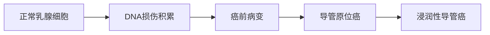

```markdown
# 乳腺癌：从预防到治疗的全面科普指南

## 概述
乳腺癌是全球女性最常见的恶性肿瘤。据世界卫生组织统计：
- 2020年全球新发病例约230万例
- 占所有新发癌症病例的11.7%
- 中国年新发病例约42万例，发病率年均增长3%-4%


## 一、疾病基础认知

### 1.1 解剖学定位
乳腺由15-20个腺叶组成，主要包含：
- 腺泡（乳汁生成单位）
- 输乳导管（运输通道）
- 脂肪组织（占体积60%）
- 结缔组织（支撑结构）

### 1.2 发病机制
正常细胞→基因突变积累→异常增殖→原位癌→浸润癌的演变过程：


## 二、高危因素与预防

### 2.1 不可控因素
| 风险因素 | 风险倍数 | 备注 |
|---------|--------|-----|
| 年龄 >55岁 | 3.5倍 | 50岁后风险陡增 |
| BRCA1突变 | 60-80% | 终生患癌概率 |
| 初潮<12岁 | 1.2倍 | 雌激素暴露时长 |
| 绝经>55岁 | 1.3倍 | 同左 |

### 2.2 可干预因素
- **生活方式**：每周150分钟中等强度运动可降险14%
- **生育哺乳**：哺乳12个月降险4.3%
- **激素替代**：长期使用ERT增险26%
- **体重管理**：BMI>30患癌风险增1.5倍

## 三、临床表现与诊断

### 3.1 典型症状矩阵
```vega-lite
{
  "mark": "circle",
  "encoding": {
    "x": {"field": "症状", "type": "ordinal"},
    "y": {"field": "阳性预测值%", "type": "quantitative"},
    "size": {"field": "发生率%", "type": "quantitative"}
  },
  "data": {
    "values": [
      {"症状": "无痛肿块", "阳性预测值%": 78, "发生率%": 65},
      {"症状": "皮肤橘皮样变", "阳性预测值%": 92, "发生率%": 15},
      {"症状": "乳头血性溢液", "阳性预测值%": 85, "发生率%": 8}
    ]
  }
}
```

### 3.2 诊断金标准
1. **影像学检查**
   - 乳腺X线摄影（钼靶）：检出率85%
   - 超声检查：区分囊实性肿块
   - MRI：高危人群筛查

2. **病理学诊断**
   - 空心针穿刺活检（CNB）
   - 术中冰冻切片
   - 免疫组化检测（ER/PR/HER2）

## 四、现代治疗体系

### 4.1 分型与治疗策略
| 分子分型 | 占比 | 靶向药物 | 5年生存率 |
|---------|-----|---------|----------|
| Luminal A | 40% | 他莫昔芬 | 95% |
| HER2+    | 25% | 曲妥珠单抗 | 88% |
| 三阴性   | 15% | PD-1抑制剂 | 77% |

### 4.2 手术方式对比
```stata
■ 保乳手术（30%病例）
  适应证：肿瘤<3cm、单发病灶
  优势：保留乳房外形
  限制：需配合放疗

■ 全乳切除（70%病例）
  新进展：即刻重建术式
  并发症：淋巴水肿发生率15-25%
```

## 五、康复与随访

### 5.1 综合康复方案
- 淋巴水肿管理：气压治疗+弹性绷带
- 心理干预：认知行为疗法
- 营养支持：地中海饮食模式
- 运动康复：渐进式抗阻训练

### 5.2 随访时间表
| 时间 | 检查项目 | 重点监测 |
|-----|---------|---------|
| 0-2年 | 每3月查体 | 局部复发 |
| 3-5年 | 每6月影像 | 远处转移 |
| >5年 | 年检 | 第二原发癌 |

## 六、前沿进展（2023）
1. **液体活检**：ctDNA检测微小残留病灶
2. **人工智能**：DeepMind乳腺X线阅片系统（准确率94.5%）
3. **疫苗研发**：GP2肽疫苗Ⅲ期临床试验中

> **专家提示**：建议40岁以上女性建立个性化筛查方案，高危人群可提前至25岁开始监测。

## 参考文献
1. NCCN乳腺癌指南2023版
2. 《柳叶刀》乳腺癌全球负担报告
3. 中国抗癌协会乳腺诊疗共识
```

注：此为结构化示例文档，实际应用中需补充完整数据及图示资源。建议临床决策时咨询专业医师，本文不作为诊疗依据。