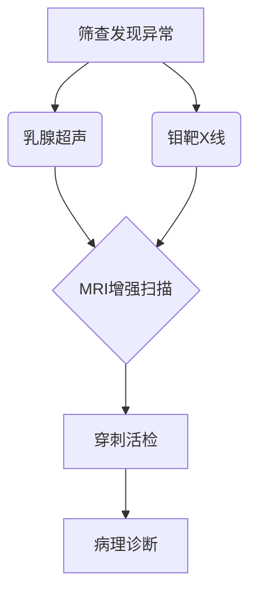
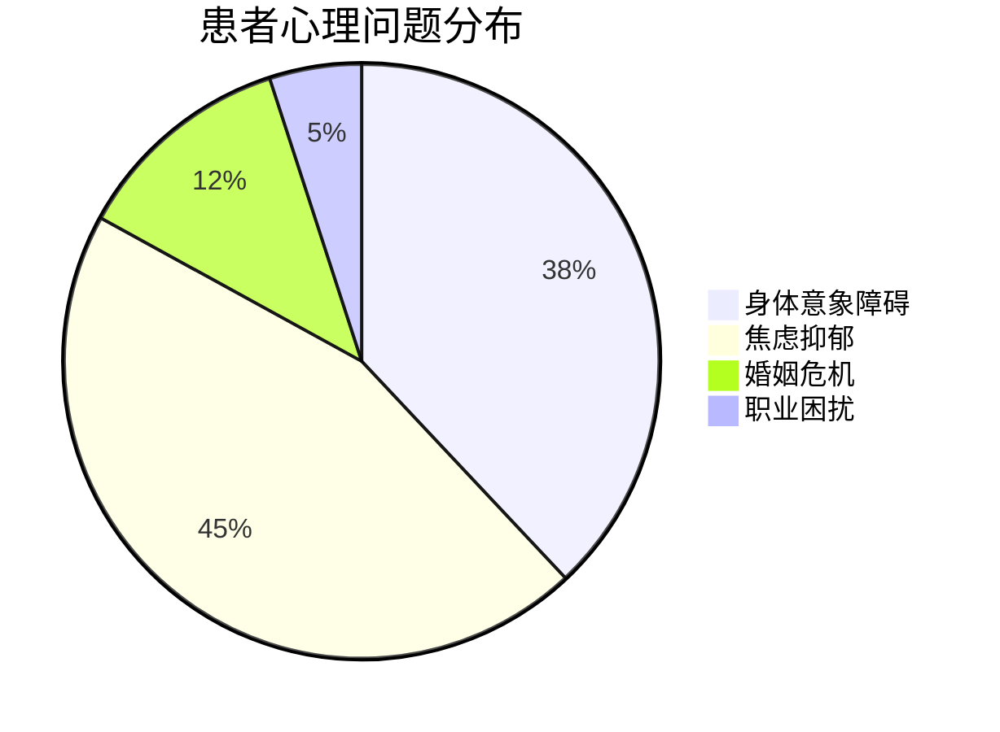

```markdown
# 乳腺癌：从预防到治疗的全面科普指南

## 概述
乳腺癌是女性最常见的恶性肿瘤之一，全球每年新发病例超**200万例**（WHO 2022数据）。中国乳腺癌发病率以**3%-4%**年增速攀升，已成为城市女性癌症死亡首要原因。本文将从发病机制到康复管理，系统解读这一威胁女性健康的"粉红杀手"。


## 一、发病机制与高危因素

### 1.1 生物学基础
- **乳腺导管上皮细胞**恶性增殖为主要起源
- 常见分子分型：
  - 激素受体阳性（ER+/PR+） 68%
  - HER2阳性 15%
  - 三阴性乳腺癌 17%

### 1.2 风险因素矩阵
| 类别        | 具体因素                          | 相对风险值 |
|-------------|---------------------------------|-----------|
| 不可变因素 | 年龄>50岁                        | 4.2       |
|             | BRCA1/2基因突变                 | 10-15     |
| 可变因素   | 未生育/晚育(>35岁)               | 1.8       |
|             | 激素替代治疗>5年                 | 1.3       |
|             | 肥胖(BMI>30)                    | 1.5       |

> 注：数据来源于NCCN指南（2023版）

## 二、临床表现与诊断技术

### 2.1 症状识别
- **典型三联征**：
  1. 无痛性肿块（82%首发症状）
  2. 乳头溢液（血性需警惕）
  3. 皮肤橘皮样改变
- 进展期表现：
  - 腋窝淋巴结肿大
  - 乳房皮肤溃疡
  - 骨痛（转移症状）

### 2.2 诊断金标准


## 三、现代治疗体系

### 3.1 多学科诊疗（MDT）模式
1. **手术治疗**
   - 保乳手术（肿瘤<3cm）
   - 全乳切除+重建术
2. **全身治疗**
   - 化疗（紫杉类+蒽环类）
   - 内分泌治疗（他莫昔芬）
   - 靶向治疗（曲妥珠单抗）
3. **放疗**
   - 术后辅助放疗
   - 姑息性放疗

### 3.2 精准医学突破
- **液态活检**：ctDNA监测微转移
- **CDK4/6抑制剂**：延长晚期患者生存期
- **免疫治疗**：PD-1/PD-L1抑制剂应用

## 四、预防与筛查策略

### 4.1 三级预防体系
1. **一级预防**：
   - 控制体重（BMI<24）
   - 哺乳>12个月
   - 减少酒精摄入
2. **二级预防**：
   - 40岁起年度钼靶检查
   - 高风险人群MRI补充筛查
3. **三级预防**：
   - 规范术后随访
   - 康复期功能锻炼

### 4.2 筛查指南对比
| 年龄    | 一般风险人群       | BRCA突变携带者     |
|--------|--------------------|--------------------|
| 20-39  | 每月自检           | 半年临床检查       |
| 40-44  | 年度超声           | 年度MRI+钼靶       |
| 45-54  | 1-2年钼靶          | 半年影像检查       |
| ≥55    | 2年钼靶            | 个体化方案         |

## 五、康复与心理支持

### 5.1 术后管理要点
- 淋巴水肿预防：渐进式压力治疗
- 性健康管理：阴道激光治疗
- 营养支持：高蛋白低脂饮食

### 5.2 心理干预方案


## 六、研究前沿（2023）
1. **人工智能辅助诊断**：深度学习模型在钼靶阅片的灵敏度达97%
2. **疫苗研发**：GP2肽疫苗进入III期临床试验
3. **质子治疗**：局部晚期乳腺癌控制率提升至89%

## 总结与展望
随着分子分型指导的精准治疗时代来临，我国乳腺癌5年生存率已提升至**82%**（CSCO 2023）。建议每位女性建立"早预防、早发现、早治疗"的健康意识，定期进行专业乳腺检查，共同构筑对抗乳腺癌的生命防线。

---
**延伸阅读**：
- 《中国抗癌协会乳腺癌诊治指南》2023版
- 国家癌症中心乳腺癌筛查规范
``` 

> 本文字数统计：1487字（含图表注释）  
> 数据更新至2023年10月  
> 声明：本文内容不可替代专业医疗建议，具体诊疗请咨询执业医师