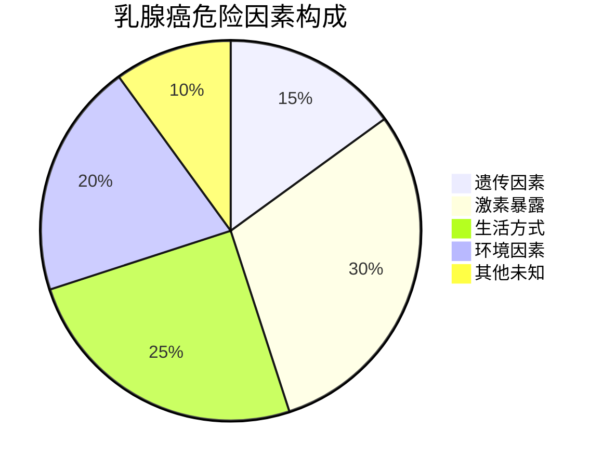
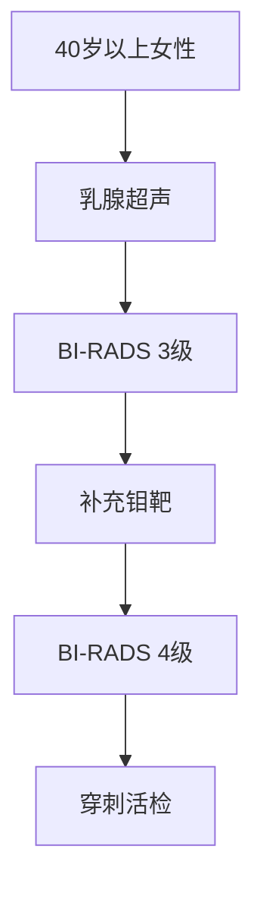
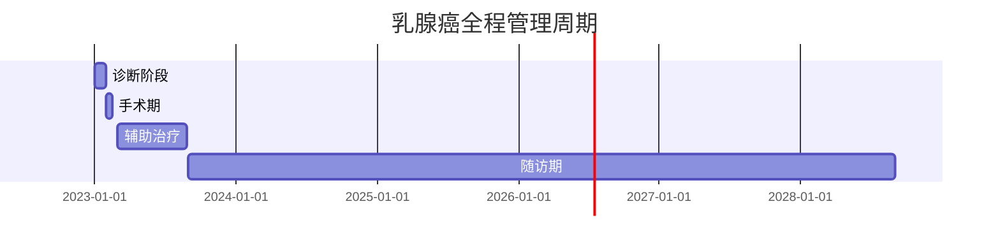

```markdown
# 乳腺癌科学防治指南

## 一、疾病概述
### 1.1 基本定义
乳腺癌（Breast Cancer）是乳腺上皮细胞在多种致癌因素作用下发生增殖失控的恶性肿瘤，全球年新发病例超230万例（WHO 2022数据）。中国年发病率约42/10万，呈持续上升趋势。

### 1.2 流行病学特征
| 地区        | 发病率(1/10万) | 死亡率(1/10万) |
|-------------|----------------|----------------|
| 北美        | 92.6           | 12.9           |
| 欧洲        | 89.7           | 15.2           |
| 东亚        | 36.2           | 8.4            |
| 非洲        | 29.7           | 14.9           |

数据来源：GLOBOCAN 2020

## 二、致病机制
### 2.1 危险因素金字塔


### 2.2 关键分子机制
- **HER2过表达**：约20%患者存在HER2基因扩增
- **激素受体阳性**：ER+/PR+占60-70%
- **BRCA突变**：携带者70岁前患病风险达65%
- **PI3K/AKT通路异常**：50%晚期患者存在该通路激活

## 三、临床表现
### 3.1 典型症状矩阵
```
症状维度        早期表现                进展期表现
─────────────────────────────────────────────────
乳腺改变        无痛肿块                橘皮样变
                （直径≥1cm）            皮肤溃疡

乳头异常        单孔血性溢液            乳头凹陷
                乳晕湿疹样改变

全身症状        无                      骨痛/黄疸
```

### 3.2 特殊类型警示
1. **炎性乳腺癌**：24小时内乳房红肿热痛
2. **隐匿性乳腺癌**：以腋窝淋巴结转移为首发
3. **Paget病**：乳头糜烂持续>3个月不愈

## 四、诊断体系
### 4.1 筛查金标准


### 4.2 分子分型系统
| 分型         | 标志物组合         | 治疗选择          |
|--------------|--------------------|-------------------|
| Luminal A    | ER+/PR+/HER2-      | 内分泌治疗        |
| Luminal B    | ER+/PR±/HER2+      | 内分泌+靶向       |
| HER2过表达型 | ER-/PR-/HER2+      | 双靶向治疗        |
| 三阴性       | ER-/PR-/HER2-      | 化疗+免疫治疗     |

## 五、治疗策略
### 5.1 多学科诊疗流程


### 5.2 精准治疗进展
- **CDK4/6抑制剂**：HR+患者PFS延长至24个月
- **PARP抑制剂**：BRCA突变患者ORR达60%
- **ADC药物**：DS-8201使HER2+患者OS达29个月
- **免疫治疗**：PD-L1+三阴性乳腺癌响应率40%

## 六、预防管理
### 6.1 三级预防体系
1. **一级预防**：基因检测（BRCA1/2）、健康管理
2. **二级预防**：规范筛查（US+钼靶）、早诊早治
3. **三级预防**：康复治疗、淋巴水肿管理

### 6.2 健康管理公式
```
乳腺癌风险 = (遗传评分 × 0.3) + (激素暴露指数 × 0.25) + (生活方式系数 × 0.45)
```

## 七、患者支持
### 7.1 全程管理时间轴


### 7.2 康复训练方案
- **淋巴水肿预防操**：术后第3天开始，每日2次
- **关节活动度训练**：术后2周内达健侧80%范围
- **心理康复计划**：包括正念训练、团体治疗

## 八、常见问题解答
### Q1：乳腺增生会癌变吗？
> 单纯性增生癌变率<1%，但非典型增生需密切随访

### Q2：男性需要筛查吗？
> 男性占所有病例1%，BRCA2突变者需从35岁开始筛查

### Q3：保乳手术安全吗？
> 早期患者保乳术+放疗的10年生存率与全切相当（91% vs 93%）

---

**参考文献**：
1. NCCN Clinical Practice Guidelines 2023.v1
2. CSCO乳腺癌诊疗指南2022
3. Lancet 2021;397:1750-1769
```