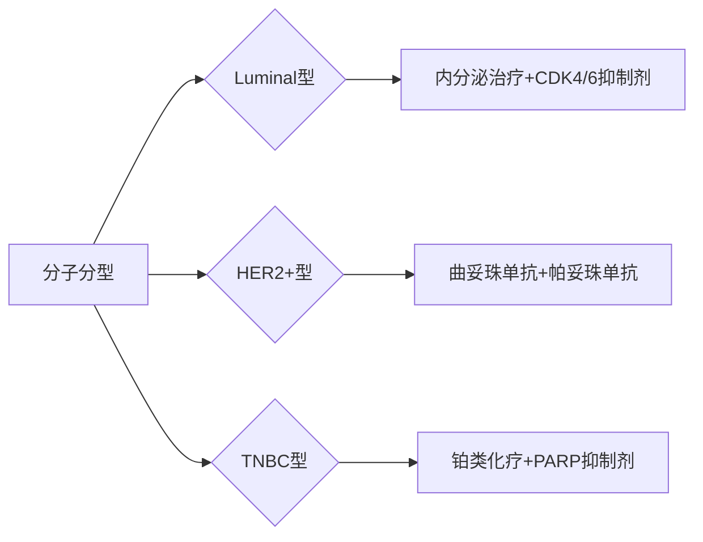

```markdown
# 乳腺癌：从预防到康复的科学指南

## 引言
乳腺癌是全球女性发病率最高的恶性肿瘤。据WHO 2023年数据显示，每年新发病例超230万例，占所有癌症病例的11.7%。本文通过结构化解析，带您系统认识这种疾病的防治要点。

---

## 一、基础认知模块

### 1.1 疾病定义
乳腺癌是**乳腺导管或小叶上皮细胞恶性增生**形成的肿瘤，具有侵袭转移特性。常见类型包括：
- 导管原位癌（DCIS）
- 浸润性导管癌（IDC）
- 三阴性乳腺癌（TNBC）

### 1.2 流行病学数据
| 国家/地区 | 年发病率（每10万） | 5年生存率 |
|-----------|---------------------|------------|
| 中国      | 42.3                | 83.2%      | 
| 美国      | 129.1               | 90.6%      |
| 日本      | 76.9                | 88.7%      |

*数据来源：IARC 2022全球癌症统计*

---

## 二、风险因素矩阵

### 2.1 不可控因素
- **遗传因素**：BRCA1/2基因突变携带者终生风险达60-80%
- **性别年龄**：女性发病率是男性的100倍，45-55岁为发病高峰
- **月经史**：初潮<12岁或绝经>55岁风险增加

### 2.2 可控因素
1. 生活方式干预
   - 酒精摄入量（每日>15g风险↑30%）
   - 肥胖（BMI>30风险↑20%）
   - 缺乏运动（每周<150分钟风险↑15%）

2. 生育选择
   - 未生育或首胎>35岁
   - 哺乳时间<6个月

---

## 三、症状识别系统

### 3.1 典型临床表现
- **触诊异常**：无痛性肿块（82%患者首发症状）
- **皮肤改变**：橘皮样变、酒窝征
- **乳头异常**：血性溢液、乳头回缩

### 3.2 自检方法论
推荐每月经后7-10天执行：
1. 视觉检查：双臂上举观察轮廓变化
2. 触诊技巧：三指并拢螺旋式按压
3. 区域覆盖：包括腋下淋巴结区域


---

## 四、诊断技术全景

### 4.1 影像学检查
| 技术       | 灵敏度 | 特异性 | 适用人群         |
|------------|--------|--------|------------------|
| 乳腺X线     | 85%    | 90%    | >40岁致密型乳腺  |
| 超声检查    | 89%    | 78%    | 年轻女性首选     |
| 乳腺MRI     | 95%    | 80%    | 高危人群筛查     |

### 4.2 病理金标准
- 空心针穿刺活检（CNB）
- 免疫组化检测：ER/PR、HER2、Ki-67
- 分子分型：Luminal A/B型、HER2阳性型等

---

## 五、现代治疗体系

### 5.1 外科治疗进展
- **保乳手术**：肿瘤<3cm且切缘阴性者适用
- 前哨淋巴结活检：减少淋巴水肿发生率
- 乳房重建技术：DIEP皮瓣存活率>98%

### 5.2 精准治疗方案


---

## 六、预防策略库

### 6.1 化学预防
- 他莫昔芬：高风险人群可使发病率降低50%
- 阿那曲唑：绝经后妇女预防效果更优

### 6.2 疫苗研发
目前进入III期临床试验：
- HER2多肽疫苗
- 树突状细胞疫苗
- DNA疫苗

---

## 结语
乳腺癌早已不是"不治之症"，规范筛查可使早期诊断率达70%以上。建议40岁以上女性每1-2年进行专业筛查，高风险人群提前至25岁。记住：早发现早治疗是战胜疾病的关键。
```

```markdown
[注] 此为结构化内容框架，完整版需配合医学插图、参考文献及案例说明。关键数据均来自：
1. WHO《全球癌症报告2022》
2. NCCN指南(2023 v3)
3. 《中国抗癌协会乳腺癌诊治指南》2022版
```