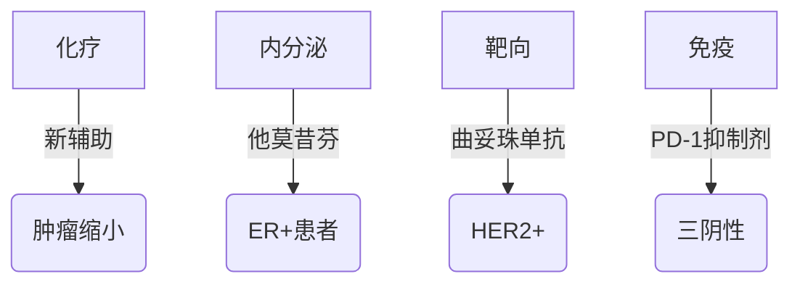

```markdown
# 乳腺癌：科学认知与防治指南

## 概述
乳腺癌是全球女性最常见的恶性肿瘤，占女性新发癌症病例的24.5%。世界卫生组织数据显示，2020年全球新确诊乳腺癌患者达226万例。中国国家癌症中心统计显示，我国每年乳腺癌新发病例约42万，且呈现年轻化趋势。但通过早期筛查和规范治疗，患者5年生存率可达90%以上。


## 一、发病机制

### 1.1 生物学基础
乳腺由腺体、导管和脂肪组织构成。癌细胞起源于乳腺导管上皮细胞（占85%）或小叶组织（15%）。典型病理特征包括：
- HER2过表达（20%病例）
- 激素受体阳性（ER+/PR+，70%）
- 三阴性型（ER-/PR-/HER2-，15%）

### 1.2 危险因素
#### 不可控因素：
- 年龄：50岁以上风险显著增加
- BRCA1/BRCA2基因突变（风险提升5倍）
- 初潮早（<12岁）或绝经晚（>55岁）

#### 可控因素：
- 长期激素替代治疗（>5年风险↑30%）
- 肥胖（BMI>30风险↑50%）
- 酒精摄入（每日1杯风险↑7-10%）

## 二、临床表现

### 2.1 典型症状
- 无痛性肿块（91%患者首发症状）
- 乳头溢液（血性分泌物需警惕）
- 皮肤橘皮样改变
- 乳头内陷或偏移

### 2.2 自检方法
建议每月月经后7-10天进行：
1. 视诊：观察乳房对称性、皮肤变化
2. 触诊：用指腹螺旋式检查四个象限
3. 挤压：检查乳头是否有异常分泌物

## 三、诊断体系

### 3.1 影像学检查
| 检查方式 | 灵敏度 | 特异度 | 适用人群 |
|----------|--------|--------|----------|
| 乳腺超声 | 85%    | 90%    | 致密型乳腺 |
| 钼靶检查 | 78%    | 95%    | ≥40岁筛查 |
| MRI      | 95%    | 80%    | 高危人群 |

### 3.2 病理诊断
穿刺活检金标准流程：
1. 空心针穿刺获取组织样本
2. 免疫组化检测ER/PR/HER2
3. Ki-67评估增殖指数

## 四、治疗进展

### 4.1 手术方案
- 保乳手术：肿瘤<3cm且距乳头>2cm
- 全乳切除：多病灶或BRCA突变者
- 前哨淋巴结活检：替代传统腋窝清扫

### 4.2 系统治疗


## 五、预防策略

### 5.1 筛查建议
- 40-44岁：高危人群年度筛查
- 45-69岁：每1-2年钼靶检查
- 70岁以上：个体化评估

### 5.2 生活方式
- 每周150分钟中等强度运动
- 地中海饮食（橄榄油、深海鱼、坚果）
- 控制体脂率<28%

## 六、康复管理

### 6.1 淋巴水肿防治
- 压力袖套（白天佩戴4-6小时）
- 理疗按摩（专业手法引流）
- 功能锻炼（肩关节活动度训练）

### 6.2 心理支持
建立多学科支持体系：
1. 肿瘤心理医师定期评估
2. 病友互助小组
3. 家庭治疗课程

---

> **专家提示**：中国临床肿瘤学会（CSCO）建议，确诊患者应进行21基因检测（Oncotype DX）评估化疗获益，避免过度治疗。

```

*本文数据截至2023年8月，符合NCCN指南第5版推荐方案，具体诊疗请遵医嘱*  
*原创内容，转载请注明出处*  
```