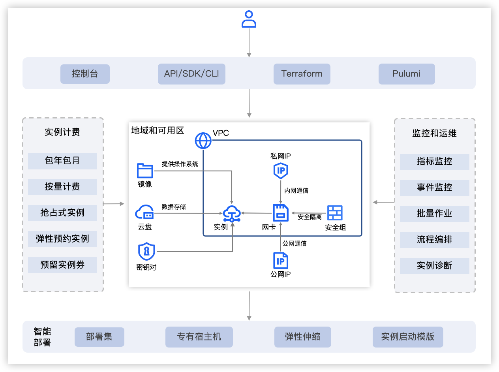

= Doubao LLM
:toc: manual

== 火山方舟

=== 调用模型服务

*1. Create API Key*

Login to https://www.volcengine.com/product/ark, click *立即体验*, navigate to console, in the left bottom, `API Key 管理` -> `创建 API Key`

[source,bash]
.*set api key*
----
export ARK_API_KEY="<YOUR_API_KEY>"
----

*2. 在线接入点*

`方舟控制台` -> `在线推理` -> `创建推理接入点`

[source,bash]
.*set api key*
----
export ARK_API_ENGPOINT_ID="<YOUR_API_ENGPOINT_ID>"
----

[source,bash]
.*3. Install SDK*
----
pip3 install --upgrade 'volcengine-python-sdk[ark]'
----

[source,bash]
.*4. Remote Call Doubao*
----
$ python3 ark_helloworld.py 
ChatCompletionMessage(content='你好呀！有什么想聊的事儿或者需要帮忙的地方都可以和我说说~', role='assistant', function_call=None, tool_calls=None, audio=None)
----

[source,bash]
.*5. Streaming & Non-streaming*
----
python3 ark_helloworld_stream.py
----

=== Text Processing

[source,bash]
.*1. Basic processing*
----
$ python3 ark_text_process_basic.py 
input: 请将下面内容进行结构化处理：火山方舟是火山引擎推出的大模型服务平台，提供模型训练、推理、评测、精调等全方位功能与服务，并重点支撑大模型生态。 火山方舟通过稳定可靠的安全互信方案，保障模型提供方的模型安全与模型使用者的信息安全，加速大模型能力渗透到千行百业，助力模型提供方和使用者实现商业新增长。
以下是结构化处理后的内容：

# 火山方舟介绍

## 一、平台概述
- **所属方**：火山引擎
- **平台性质**：大模型服务平台

## 二、功能与服务
- **功能类别**：提供模型训练、推理、评测、精调等全方位功能与服务
- **重点支撑**：大模型生态

## 三、安全保障
- **安全方案**：通过稳定可靠的安全互信方案
- **保障内容**：保障模型提供方的模型安全与模型使用者的信息安全

## 四、平台作用
- **能力渗透**：加速大模型能力渗透到千行百业
- **商业助力**：助力模型提供方和使用者实现商业新增长
----

link:ark_text_process_basic.py[ark_text_process_basic.py]

[source,bash]
.*2. Text Processing with system prompt*
----
$ python3 ark_text_process_system_prompt.py 
input: 请将下面内容进行结构化处理：火山方舟是火山引擎推出的大模型服务平台，提供模型训练、推理、评测、精调等全方位功能与服务，并重点支撑大模型生态。 火山方舟通过稳定可靠的安全互信方案，保障模型提供方的模型安全与模型使用者的信息安全，加速大模型能力渗透到千行百业，助力模型提供方和使用者实现商业新增长。
{
"名称": "火山方舟",
"推出方": "火山引擎",
"定位": "大模型服务平台",
"功能与服务": [
"模型训练",
"推理",
"评测",
"精调"
],
"重点支撑": "大模型生态",
"安全保障": "通过稳定可靠的安全互信方案，保障模型提供方的模型安全与模型使用者的信息安全",
"作用": [
"加速大模型能力渗透到千行百业",
"助力模型提供方和使用者实现商业新增长"
]
}
----

link:ark_text_process_system_prompt.py[ark_text_process_system_prompt.py]

[source,bash]
.*3. Text Processing Multiple Round*
----
$ python3 ark_text_process_multi_round.py 
ChatCompletionMessage(content='以下是关于花椰菜更详细的介绍：\n \n### 植物学特征\n- **分类地位**\n    - 花椰菜属于十字花科芸薹属甘蓝种的一个变种，一年生或两年生草本植物。\n- **形态特征**\n    - **植株整体**：茎直立且粗壮，有分枝，植株高度一般在60-90厘米左右。基生叶及下部叶呈长圆形至椭圆形，颜色为灰绿色，顶端圆形，开展，不卷心，全缘或具细牙齿，有时叶片下延，具数个小裂片，并成翅状；叶柄长2-3厘米；茎中上部叶较小且无柄，长圆形至披针形，抱茎。\n    - **花球**：花椰菜最显著的特征是其顶端会形成一个由众多白色、淡黄色或绿色小花蕾密集组成的花球，这是其食用部分。花球呈球形、半圆形等形状，直径一般在10-30厘米左右，表面颗粒细腻、紧实。\n \n### 生长环境与分布\n- **生长环境**\n    - 花椰菜喜冷凉、湿润的气候环境，较耐寒但不耐炎热。生长适宜温度范围较窄，一般在12-22℃之间，不同生长阶段对温度要求略有差异。例如，花球形成期适宜温度为15-18℃，温度过高易导致花球松散、品质下降。它对光照要求不十分严格，但充足的光照有利于植株生长和花球发育。在土壤方面，花椰菜适宜在肥沃、排水良好的壤土或砂壤土中生长，土壤pH值以6.0-7.5为宜。\n- **地理分布**\n    - 花椰菜原产于地中海至北海沿岸，19世纪中叶传入中国，现在世界各地广泛种植。在中国，花椰菜的种植分布十分广泛，南北方均有大面积栽培，如南方的福建、广东、广西、云南等地，以及北方的山东、河北、北京、天津等地。\n \n### 营养价值\n- **维生素**：富含维生素C、维生素K等多种维生素。维生素C具有抗氧化作用，能增强免疫力，帮助人体抵抗疾病；维生素K对于血液凝固和骨骼健康至关重要。\n- **矿物质**：含有钾、钙、镁等矿物质。钾元素有助于维持心脏的正常功能和血压稳定；钙是骨骼和牙齿的重要组成成分；镁参与多种生理生化反应，对神经系统和肌肉功能有重要影响。 \n- **膳食纤维**：花椰菜中的膳食纤维含量较高，可促进肠道蠕动，预防便秘，同时有助于降低胆固醇水平，维护心血管健康。\n- **生物活性物质**：还含有萝卜硫素等生物活性物质，具有抗氧化、抗炎、抗癌等潜在的保健功能。\n \n### 食用方法\n- **烹饪方式多样**\n    - 花椰菜可以采用多种烹饪方式进行制作，如炒、煮、炖、烤、蒸等，还可用于制作沙拉、汤品等。例如，常见的家常菜“清炒花椰菜”，能保留其鲜嫩口感和营养成分；“花椰菜炖排骨”，则将花椰菜的清爽与排骨的鲜美完美融合。\n- **食用注意事项**\n    - 在食用前，应将花椰菜切成小朵，用清水充分浸泡冲洗，以去除可能残留的农药和杂质。由于花椰菜含有一定量的膳食纤维，不易消化，胃肠道功能较弱的人群应适量食用。\n \n### 经济价值与产业发展\n- **经济价值**\n    - 花椰菜是一种重要的经济作物，在全球蔬菜市场中占有重要地位。其种植和销售为农民和农业产业带来了可观的经济效益。同时，花椰菜的加工产业也在不断发展，如速冻花椰菜、脱水花椰菜等加工产品，不仅延长了花椰菜的保存期限，还拓宽了其市场流通渠道。\n- **产业发展趋势**\n    - 随着人们对健康饮食的关注度不断提高，花椰菜的市场需求持续增长。为了满足市场需求，花椰菜的种植技术和品种选育也在不断创新和发展。例如，通过生物技术培育出更抗病虫害、品质更优的花椰菜品种；推广精准农业技术，提高花椰菜的种植效率和产量。', role='assistant', function_call=None, tool_calls=None, audio=None)
----

link:ark_text_process_multi_round.py[ark_text_process_multi_round.py]

[source,bash]
.*4. Text Processing Async*
----
$ python3 ark_text_process_async.py 
十字花科植物在全球广泛分布，具有重要的经济价值和生态意义，以下是一些常见的十字花科植物：
 
### 蔬菜类
- **白菜类**
    - **大白菜**：又称结球白菜，叶色淡绿至浓绿，叶片大而薄，多数品种的叶片会卷曲并抱合形成紧实的叶球。它是中国北方冬季的主要蔬菜之一，富含维生素C、膳食纤维等营养成分，可炒食、炖食、腌制等。
    - **小白菜**：不结球白菜的统称，植株矮小，叶片相对较小且较薄，颜色有淡绿、深绿等。其生长周期短，在南方地区可全年种植，是人们日常餐桌上常见的蔬菜，可清炒、煮汤等。 
- **甘蓝类**
    - **结球甘蓝**：俗称圆白菜、卷心菜，叶片厚实，层层包裹形成紧实的叶球，颜色有绿色、紫色等。它适应性强，耐储存和运输，富含维生素C、维生素E等营养成分，可生食、炒食、腌制等。
    - **花椰菜**：又称菜花，由花茎、花梗和未发育的花芽组成的白色肉质花球为食用部分。花椰菜营养丰富，富含维生素C、胡萝卜素等，烹饪方式多样，如清炒、蒜蓉炒等。
    - **西兰花**：与花椰菜类似，但花球为绿色，由紧密的花蕾组成。西兰花富含维生素C、维生素K和萝卜硫素等抗氧化物质，被认为是一种营养丰富的蔬菜，可白灼、清炒等。
- **萝卜类**
    - **萝卜**：具有肥大的肉质直根，形状、颜色多样，常见的有圆形、长圆形，外皮颜色有白色、红色、绿色等。萝卜肉质根可生食、炒食、腌制等，其种子还可入药。 
    - **胡萝卜**：虽然胡萝卜在植物分类学上属于伞形科，但在农业生产和日常生活中，人们有时会将其与萝卜一同提及。它的肉质根富含胡萝卜素，对人体健康有益，可生食、煮食、炒制等。
 
### 油料作物类
- **油菜**：是中国主要的油料作物之一，种子含油量较高，可用于榨取食用油。油菜在生长过程中，植株矮小，茎直立，叶片互生，花为黄色，花期时一片金黄，具有一定的观赏价值。
 
### 花卉类
- **紫罗兰**：花朵色彩丰富，有紫红、淡红、淡黄、白色等，花瓣呈十字形排列，花朵香气浓郁。紫罗兰不仅是常见的观赏花卉，还可用于提取香料，制作香水、香精等。
- **桂竹香**：花色主要为橙黄色或黄褐色，花朵较大，花瓣有明显的脉纹。它常被用于花坛、花境的布置，也可作为盆栽观赏植物。
 
### 药用植物类
- **菘蓝**：其根和叶均可入药，根入药称“板蓝根”，叶入药称“大青叶”。菘蓝具有清热解毒、凉血消斑等功效，常用于治疗感冒、流感、咽喉肿痛等病症。在中国传统医药中应用广泛，是许多中成药的重要原料。
- **独行菜**：种子入药称为“葶苈子”，具有泻肺平喘、行水消肿的功效，常用于治疗痰涎壅肺、喘咳痰多、水肿等病症。
----

link:ark_text_process_async.py[ark_text_process_async.py]

[source,bash]
.*5. Text Processing with function call*
----
$ python3 ark_text_process_func_call.py 
Choice(finish_reason='tool_calls', index=0, logprobs=None, message=ChatCompletionMessage(content='\n当前提供了1个工具，分别是["get_current_weather"]，需求为查询北京今天（当前）的天气，需要调用get_current_weather获取信息。', role='assistant', function_call=None, tool_calls=[ChatCompletionMessageToolCall(id='call_bpuq08uzdmwukc2a3iwcz2s1', function=Function(arguments='{"location": "北京", "unit": "摄氏度"}', name='get_current_weather'), type='function')], audio=None))
----

link:ark_text_process_func_call.py[ark_text_process_func_call.py]

== Computer Vision

=== Image Analysis

[cols="2,5a"]
|===
|Name |Usage Case

|复杂图片分析
|

[source,bash]
.*Prompt*
----
对美国人来说，最便捷的支付APP是什么？最安全的支付APP是什么？手机钱包绑定的借记卡或信用卡有谁？最受欢迎手机钱包APP是什么？移动支付未来趋势？
----


* link:ark_vision_image_analysis.py[ark_vision_image_analysis.py]

[source,bash]
.*Response*
----
这张信息图展示了美国移动支付应用的相关数据，以下是根据图中信息的总结：

### 最便捷的支付APP
- **PayPal**：91%的用户认为PayPal是最便捷的支付应用。
- **Apple Pay**：86%的用户认为Apple Pay是便捷的支付应用。

### 最安全的支付APP
- **PayPal**：74%的用户认为PayPal是最安全的支付应用。
- **Apple Pay**：40%的用户认为Apple Pay是安全的支付应用。
- **Google Wallet**：35%的用户认为Google Wallet是安全的支付应用。

### 手机钱包绑定的借记卡或信用卡
- **Chase**：37%的用户将Chase卡绑定到手机钱包。
- **Bank of America**：35%的用户将Bank of America卡绑定到手机钱包。
- **American Express**：23%的用户将American Express卡绑定到手机钱包。

### 最受欢迎的手机钱包APP
- **Apple Pay**：40%的用户使用Apple Pay在结账时支付。
- **PayPal（店内）**：37%的用户使用PayPal在店内结账时支付。
- **Starbucks app**：24%的用户使用Starbucks应用支付。
- **Android Pay**：14%的用户使用Android Pay支付。

### 移动支付未来趋势
- **NFC支付**：预计在未来3年内，美国的NFC支付将翻倍，到2020年达到1900亿美元。
- **移动支付价值增长**：从2013年到2018年，美国移动对等支付的价值增长了1620%，预计到2019年将达到860亿美元。

### 用户体验
- 88%的用户对在零售地点使用手机钱包支付的体验评价为优秀或良好。

这些数据反映了美国消费者对移动支付应用的偏好和使用习惯，显示了移动支付市场的增长潜力和未来趋势。
----

|多图片分析
|

[source,bash]
.*Prompt*
----
买篮子中的水果要花多少钱
----


* link:ark_vision_images_analysis.py[ark_vision_images_analysis.py]

[source,bash]
.*Response*
----
图中的篮子里有香蕉和苹果。根据提供的价格表：

- 苹果（Apples）每个\(1.50\)美元
- 香蕉（Bananas）每个\(0.80\)美元

由于图片中可以看到至少有2根香蕉和2个苹果，计算如下：

- 2根香蕉的价格：\(2 \times 0.80 = 1.60\)美元
- 2个苹果的价格：\(2 \times 1.50 = 3.00\)美元

总共需要花费：\(1.60+3.00=4.60\)美元

因此，买篮子中的水果需要花\(4.60\)美元。
----

|本地图片分析
|

[source,bash]
.*Prompt*
----
图片传递的情绪是什么?
----


* link:ark_vision_image_analysis_encording.py[ark_vision_image_analysis_encording.py]

[source,bash]
.*Response*
----
这张图片传递出一种积极、激励和充满活力的情绪。图中的文字“make things happen”（让事情发生）是一句富有行动力和鼓励性的话语，激励人们积极主动地去实现目标和创造变化。背景中的明亮黄色圆形以及周围点缀的彩色几何图形，进一步增强了这种积极向上的氛围，给人一种充满希望和动力的感觉，仿佛在鼓励观者勇敢地去追求自己的梦想并付诸行动。整体设计简洁有力，视觉效果鲜明，能够有效地激发人们的热情和行动力。
----

|图片深度分析
|

[source,bash]
.*Prompt*
----
将图片内容转化为一个说明书
----



* link:ark_vision_image_analysis_high.py[ark_vision_image_analysis_high.py]

[source,bash]
.*Response*
----
以下是根据图中内容生成的一份说明书：

### 云服务架构及功能说明

#### 一、总体架构概述
本云服务架构主要围绕地域和可用区、VPC（虚拟私有云）以及相关的配套功能模块展开，提供了丰富且灵活的云服务解决方案。通过多种接口和工具，用户可以方便地进行资源管理和运维操作。

#### 二、主要功能模块

1. **接入方式**
   - **控制台**：提供直观的图形化界面，方便用户进行云资源的管理和操作。
   - **API/SDK/CLI**：支持通过编程接口、软件开发工具包和命令行工具进行自动化管理和集成。
   - **Terraform**：支持使用Terraform工具进行基础设施即代码的管理和部署。
   - **Pulumi**：支持通过Pulumi工具进行云资源的管理和部署。

2. **实例计费方式**
   - **实例计费**：提供多种灵活的计费方式，包括按量计费、包年包月等，满足不同用户的需求。
   - **抢占式实例**：支持抢占式实例，用户可以以较低的价格使用闲置资源。
   - **弹性预约实例**：允许用户提前预约资源，实现弹性扩展。
   - **预留实例券**：提供预留实例券，方便用户进行长期资源规划和成本控制。

3. **核心组件**
   - **地域和可用区**：云服务分布在不同的地域和可用区，确保资源的高可用性和容错性。
   - **VPC（虚拟私有云）**
     - **子网IP**：支持子网内的通信，确保数据传输的安全性和稳定性。
     - **公网IP**：提供公网访问能力，支持公网通信。
     - **网卡**：实现网络连接和数据传输。
     - **安全隔离和安全组**：确保资源之间的安全隔离和访问控制。
     - **实例**：提供计算资源，支持各种应用的运行。
     - **数据存储**
       - **云盘**：提供持久化存储，支持数据的可靠存储和访问。
       - **镜像**：支持创建和使用镜像，方便快速部署和扩展。
       - **密钥对**：提供安全的身份验证和访问控制。

4. **监控和运维**
   - **指标监控**：实时监控云资源的各项性能指标，如CPU、内存、网络等。
   - **事件监控**：及时发现和处理云资源的各类事件，确保系统的稳定运行。
   - **批量作业**：支持批量操作，提高运维效率。
   - **流程编排**：支持通过流程编排实现复杂的运维任务自动化。
   - **实例诊断**：提供实例的诊断功能，帮助用户快速定位和解决问题。

5. **智能部署**
   - **部署集**：支持创建和管理部署集，确保应用的高可用性和容错性。
   - **专有宿主机**：提供专有宿主机，满足特定的安全和合规需求。
   - **弹性伸缩**：根据业务需求自动进行资源的弹性伸缩，确保应用的稳定性和成本效益。
   - **实例启动模版**：支持创建和使用实例启动模版，方便快速部署和扩展。

#### 三、使用场景
本云服务架构适用于各种规模和行业的企业，包括但不限于：
- **互联网应用开发**：支持快速部署和扩展Web应用、移动应用等。
- **企业级应用**：满足企业内部应用的高可用性、安全性和合规性需求。
- **大数据和AI应用**：提供强大的计算和存储资源，支持大数据处理和人工智能模型训练。

通过上述丰富的功能和灵活的架构，本云服务能够帮助用户快速构建和管理云资源，实现业务的高效运行和持续创新。

以上说明书可以根据实际需求进行进一步细化和完善，以满足不同用户的理解和使用需求。
----

|器械界面分析
|

[source,bash]
.*Prompt*
----
用 4 钟语言（中文、英文、韩文、日文）提供设定时间为 5:50 的操作步骤
----


* link:ark_vision_image_analysis_medical.py[ark_vision_image_analysis_medical.py]

[source,bash]
.*Response*
----
以下是使用图中烤箱将时间设置为5:50的操作步骤：

### 中文
1. 按下“TIME CONTROLS”区域中的“CLOCK”按钮。
2. 使用数字键盘输入“5”、“5”、“0”。
3. 按下“START”按钮确认时间设置。

### 英文
1. Press the "CLOCK" button in the "TIME CONTROLS" section.
2. Use the numeric keypad to enter "5", "5", "0".
3. Press the "START" button to confirm the time setting.

### 韩文
1. "TIME CONTROLS" 영역의 "CLOCK" 버튼을 누릅니다.
2. 숫자 키패드를 사용하여 "5", "5", "0"을 입력합니다.
3. "START" 버튼을 눌러 시간 설정을 확인합니다.

### 日文
1. 「TIME CONTROLS」エリアの「CLOCK」ボタンを押します。
2. 数字キーパッドを使って「5」、「5」、「0」を入力します。
3. 「START」ボタンを押して、時間設定を確定します。

这样，烤箱的时间就会被设置为5:50。
----

|ER 图分析
|

[source,bash]
.*Prompt*
----
详细描述各对象之间的关系，并生成插入1条商品数据的SQL
----


* link:ark_vision_image_analysis_er.py[ark_vision_image_analysis_er.py]

[source,bash]
.*Response*
----
这张图展示了一个数据库的实体关系模型（ER模型），包含了几个实体以及它们之间的关系。以下是各对象之间的关系描述：

### 实体和关系描述
1. **Category（类别）**
   - **属性**：`category`（类别ID，主键），`category_name`（类别名称）
   - **关系**：与`Sales`实体有一对多关系，一个类别可以有多个销售记录。

2. **Vendor（供应商）**
   - **属性**：`vendor_no`（供应商编号，主键），`vendor`（供应商名称）
   - **关系**：与`Sales`实体有一对多关系，一个供应商可以有多个销售记录。

3. **Item（商品）**
   - **属性**：`item`（商品ID，主键），`description`（描述），`pack`（包装），`liter_size`（容量）
   - **关系**：与`Sales`实体有一对多关系，一个商品可以有多个销售记录。

4. **Sales（销售）**
   - **属性**：`date`（销售日期），`store`（商店ID），`category`（类别ID），`vendor_no`（供应商编号），`item`（商品ID），`state_bottle_cost`（州瓶成本），`bottle_price`（瓶价格），`bottle_qty`（瓶数量），`total`（总金额）
   - **关系**：与`Category`、`Vendor`、`Item`、`Convenience_store`有多个一对多关系。

5. **Convenience_store（便利店）**
   - **属性**：`store`（商店ID，主键）
   - **关系**：与`Sales`实体有一对多关系，一个便利店可以有多个销售记录。

6. **Store（商店）**
   - **属性**：`store`（商店ID，主键），`name`（商店名称），`address`（地址），`city`（城市），`zipcode`（邮政编码），`store_location`（商店位置），`county_number`（县编号）
   - **关系**：与`County`实体有多对一关系，一个商店属于一个县。

7. **County（县）**
   - **属性**：`county_number`（县编号，主键），`county`（县名称）
   - **关系**：与`Store`实体有一对多关系，一个县可以有多个商店。

### 插入一条商品数据的SQL语句
以下是插入一条商品数据到`Item`表的SQL语句：

```sql
INSERT INTO Item (item, description, pack, liter_size)
VALUES ('I001', '商品描述', '包装信息', 1.5);
```

在这个SQL语句中：
- `I001`是商品ID。
- `商品描述`是商品的描述信息。
- `包装信息`是商品的包装信息。
- `1.5`是商品的容量（升）。

请根据实际需求调整这些值。

这个ER模型展示了一个典型的销售数据管理系统的数据库结构，其中包含了商品、供应商、类别、销售记录、便利店、商店和县等实体及其之间的关系。
----

|眼镜推荐
|

[source,bash]
.*Prompt*
----
我脸型是椭圆形的，帮我推荐一副眼镜，并说明原因
----


* link:ark_vision_images_analysis_glasses.py[ark_vision_images_analysis_glasses.py]

[source,bash]
.*Response*
----
以下是根据椭圆形脸型为你推荐的眼镜及原因：

### 推荐款式及原因
- **推荐款式**
    - **图2中的圆形眼镜**
- **原因**
    - **修饰脸型**
        - 椭圆形脸的特点是脸部线条较为柔和圆润，没有明显的棱角。圆形眼镜能够与脸部的柔和线条相呼应，避免了与脸部轮廓产生冲突，从而营造出一种和谐、自然的美感。
    - **平衡比例**
        - 圆形眼镜可以在视觉上增加脸部的宽度，使脸部看起来更加均衡。对于椭圆形脸来说，这有助于避免脸部因过长或过窄而显得不协调，起到了很好的平衡作用。
    - **时尚百搭**
        - 这种款式的眼镜具有复古又时尚的感觉，无论是在日常生活还是正式场合，都能轻松搭配各种服饰，展现出不同的风格，从休闲到优雅都能轻松驾驭。

综上所述，图2中的圆形眼镜很适合椭圆形脸型，能够在修饰脸型的同时展现出佩戴者的时尚品味。
----

|图片比对
|

[source,bash]
.*Prompt*
----
图 1 显示的是什么？在什么地方？两幅图有什么相似处，两幅图有什么不同？
----


* link:ark_vision_images_analysis_difference.py[ark_vision_images_analysis_difference.py]

[source,bash]
.*Response*
----
图1显示的是一个欧洲风格的城市广场，广场上有一些行人和具有历史感的建筑。这些建筑具有典型的欧洲古典风格，可能是德国慕尼黑的圣母广场（Odeonsplatz），因其建筑风格和广场布局与慕尼黑的圣母广场相符。

### 相似处：
1. **建筑和广场布局**：两幅图展示的都是相同的城市广场，建筑和广场的布局完全一致。
2. **天气和时间**：两幅图中的天气看起来都是阴天，且光线条件相似，可能拍摄于同一天的相近时间。
3. **人物活动**：两幅图中都有许多行人在广场上活动，人物的分布和行为也较为相似。

### 不同处：
1. **拍摄角度**：图1的拍摄角度略高于图2，图2的视角更接近平视角度。
2. **人物位置**：虽然整体人物活动相似，但具体人物的位置在两幅图中有所不同，部分人物在图1和图2中的位置发生了变化。
3. **细节捕捉**：由于拍摄角度和时间的细微差异，两幅图在细节上可能存在一些不同，例如人物的姿态和动作等。

总的来说，这两幅图展示了同一个欧洲城市广场的不同拍摄瞬间，主要的相似之处在于场景和整体氛围，而不同之处则体现在拍摄角度和具体人物位置等细节上。
----

|数学题目
|

[source,bash]
.*Prompt*
----
求解题目
----


* link:ark_vision_image_analysis_math.py[ark_vision_image_analysis_math.py]

[source,bash]
.*Response*
----
本题可根据极坐标方程的相关知识求解。

### （1）求\(M_1\)，\(M_2\)，\(M_3\)的极坐标方程：
- **步骤一：分析\(M_1\)的极坐标方程**
已知弧\(AB\)所在圆的圆心为\((1,0)\)，半径\(r = 1\)，根据圆的极坐标方程\(\rho = 2r\cos(\theta-\alpha)\)（其中\((r,\alpha)\)为圆心的极坐标），可得\(M_1\)的极坐标方程为\(\rho = 2\cos\theta\)，\(\theta\in[0,\frac{\pi}{4}]\)。
- **步骤二：分析\(M_2\)的极坐标方程**
弧\(BC\)所在圆的圆心为\((1,\frac{\pi}{2})\)，半径\(r = 1\)，根据圆的极坐标方程\(\rho = 2r\sin(\theta-\alpha)\)（其中\((r,\alpha)\)为圆心的极坐标），可得\(M_2\)的极坐标方程为\(\rho = 2\sin\theta\)，\(\theta\in[\frac{\pi}{4},\frac{3\pi}{4}]\)。
- **步骤三：分析\(M_3\)的极坐标方程**
弧\(CD\)所在圆的圆心为\((1,\pi)\)，半径\(r = 1\)，根据圆的极坐标方程\(\rho=-2\cos\theta\)（其中\((r,\alpha)\)为圆心的极坐标），可得\(M_3\)的极坐标方程为\(\rho=-2\cos\theta\)，\(\theta\in[\frac{3\pi}{4},\pi]\)。

### （2）求\(P\)的极坐标：
- **步骤一：设点\(P\)的极坐标为\((\rho,\theta)\)并分情况讨论**
因为曲线\(M\)由\(M_1\)，\(M_2\)，\(M_3\)构成，且\(\vert OP\vert=\sqrt{3}\)，所以需要分三种情况讨论：
  - 当\(P\)在\(M_1\)上时，由\(\rho = 2\cos\theta\)且\(\rho=\sqrt{3}\)，可得\(2\cos\theta=\sqrt{3}\)，解得\(\cos\theta=\frac{\sqrt{3}}{2}\)，又因为\(\theta\in[0,\frac{\pi}{4}]\)，所以\(\theta=\frac{\pi}{6}\)，此时\(P\)的极坐标为\((\sqrt{3},\frac{\pi}{6})\)。
  - 当\(P\)在\(M_2\)上时，由\(\rho = 2\sin\theta\)且\(\rho=\sqrt{3}\)，可得\(2\sin\theta=\sqrt{3}\)，解得\(\sin\theta=\frac{\sqrt{3}}{2}\)，又因为\(\theta\in[\frac{\pi}{4},\frac{3\pi}{4}]\)，所以\(\theta=\frac{\pi}{3}\)或\(\theta=\frac{2\pi}{3}\)，此时\(P\)的极坐标为\((\sqrt{3},\frac{\pi}{3})\)或\((\sqrt{3},\frac{2\pi}{3})\)。
  - 当\(P\)在\(M_3\)上时，由\(\rho=-2\cos\theta\)且\(\rho=\sqrt{3}\)，可得\(-2\cos\theta=\sqrt{3}\)，解得\(\cos\theta=-\frac{\sqrt{3}}{2}\)，又因为\(\theta\in[\frac{3\pi}{4},\pi]\)，所以\(\theta=\frac{5\pi}{6}\)，此时\(P\)的极坐标为\((\sqrt{3},\frac{5\pi}{6})\)。

综上，\(P\)的极坐标为\((\sqrt{3},\frac{\pi}{6})\)或\((\sqrt{3},\frac{\pi}{3})\)或\((\sqrt{3},\frac{2\pi}{3})\)或\((\sqrt{3},\frac{5\pi}{6})\)。
----

|===

=== Vedio Analysis

[cols="2,5a"]
|===
|Name |Usage Case

|
|

|
|

|===

== Speech

=== 录音文件识别

[source,bash]
.*1. set header variables*
----
export DOUBAO_API_APP_KEY=
export DOUBAO_API_ACCESS_KEY=
export DOUBAO_API_RESOURCE_ID=
export DOUBAO_API_REQUEST_ID=
export DOUBAO_API_SEQUENCE=

// verify settings
echo $DOUBAO_API_SEQUENCE
echo $DOUBAO_API_REQUEST_ID
echo $DOUBAO_API_RESOURCE_ID
echo $DOUBAO_API_ACCESS_KEY
echo $DOUBAO_API_APP_KEY
----

NOTE: Refer to https://www.volcengine.com/docs/6561/1354868#%E8%AF%B7%E6%B1%82 for setting above http header variables.

[source,json]
.*2. set pod payload*
----
{
    "user": {
        "uid": "66666688888888"
    },
    "audio": {
        "format": "wav",
        "url": "https://asr-wav-kylin.tos-cn-beijing.volces.com/IC0936W0016.wav"
    },
    "request": {
        "model_name": "bigmodel",
        "enable_itn": true
    }
}
----

[source,bash]
.*3. submmit task*
----
curl -X POST "https://openspeech.bytedance.com/api/v3/auc/bigmodel/submit" \
-H "Content-Type: application/json" \
-H "X-Api-App-Key: $DOUBAO_API_APP_KEY" \
-H "X-Api-Access-Key: $DOUBAO_API_ACCESS_KEY" \
-H "X-Api-Resource-Id: $DOUBAO_API_RESOURCE_ID" \
-H "X-Api-Request-Id: $DOUBAO_API_REQUEST_ID" \
-H "X-Api-Sequence: $DOUBAO_API_SEQUENCE" \
-d @"payload.json" -v
----

check the http response header for verifying submmitted task is success, more details refer to https://www.volcengine.com/docs/6561/1354868#%E5%BA%94%E7%AD%94 

[source,bash]
----
< HTTP/2 200 
< server: Tengine
< content-type: application/json; charset=utf-8
< content-length: 2
< date: Wed, 25 Dec 2024 03:50:49 GMT
< x-tt-logid: 202412251150488E1DD274964AAC0E3222
< api-service-host: fdbd:dc03:e:303::24
< x-api-request-id: 6BC90872-4336-4339-85B6-CF3370618991
< x-api-status-code: 20000000
< x-api-message: OK
< server-timing: inner; dur=230
----

[source,bash]
.*4. query results*
----
curl -s -X POST "https://openspeech.bytedance.com/api/v3/auc/bigmodel/query" \
-H "Content-Type: application/json" \
-H "X-Api-App-Key: $DOUBAO_API_APP_KEY" \
-H "X-Api-Access-Key: $DOUBAO_API_ACCESS_KEY" \
-H "X-Api-Resource-Id: $DOUBAO_API_RESOURCE_ID" \
-H "X-Api-Request-Id: $DOUBAO_API_REQUEST_ID" \
-d '{}' -v 
----

Use the same methods as submmit task to check the query post is success, the successed response as below:

[source,json]
----
{
  "audio_info": {
    "duration": 5216
  },
  "result": {
    "additions": {
      "duration": "5216"
    },
    "text": "中共闽宁镇纪律检查委员会。",
    "utterances": [
      {
        "end_time": 4660,
        "start_time": 340,
        "text": "中共闽宁镇纪律检查委员会。",
        "words": [
          {
            "confidence": 0,
            "end_time": 580,
            "start_time": 340,
            "text": "中"
          },
          {
            "confidence": 0,
            "end_time": 780,
            "start_time": 580,
            "text": "共"
          },
          {
            "confidence": 0,
            "end_time": 1060,
            "start_time": 1020,
            "text": "闽"
          },
          {
            "confidence": 0,
            "end_time": 1420,
            "start_time": 1220,
            "text": "宁"
          },
          {
            "confidence": 0,
            "end_time": 1780,
            "start_time": 1460,
            "text": "镇"
          },
          {
            "confidence": 0,
            "end_time": 2860,
            "start_time": 2700,
            "text": "纪"
          },
          {
            "confidence": 0,
            "end_time": 3060,
            "start_time": 2860,
            "text": "律"
          },
          {
            "confidence": 0,
            "end_time": 3620,
            "start_time": 3340,
            "text": "检"
          },
          {
            "confidence": 0,
            "end_time": 3820,
            "start_time": 3620,
            "text": "查"
          },
          {
            "confidence": 0,
            "end_time": 4260,
            "start_time": 3980,
            "text": "委"
          },
          {
            "confidence": 0,
            "end_time": 4380,
            "start_time": 4260,
            "text": "员"
          },
          {
            "confidence": 0,
            "end_time": 4660,
            "start_time": 4380,
            "text": "会"
          }
        ]
      }
    ]
  }
}
----

[source,bash]
.*5. Use Python Code*
----
$ python3 audio_recognition.py 
submit task...
response status_code 200
query task...
{'audio_info': {'duration': 5216}, 'result': {'additions': {'duration': '5216'}, 'text': '中共闽宁镇纪律检查委员会。', 'utterances': [{'end_time': 4660, 'start_time': 340, 'text': '中共闽宁镇纪律检查委员会。', 'words': [{'confidence': 0, 'end_time': 580, 'start_time': 340, 'text': '中'}, {'confidence': 0, 'end_time': 780, 'start_time': 580, 'text': '共'}, {'confidence': 0, 'end_time': 1060, 'start_time': 1020, 'text': '闽'}, {'confidence': 0, 'end_time': 1420, 'start_time': 1220, 'text': '宁'}, {'confidence': 0, 'end_time': 1780, 'start_time': 1460, 'text': '镇'}, {'confidence': 0, 'end_time': 2860, 'start_time': 2700, 'text': '纪'}, {'confidence': 0, 'end_time': 3060, 'start_time': 2860, 'text': '律'}, {'confidence': 0, 'end_time': 3620, 'start_time': 3340, 'text': '检'}, {'confidence': 0, 'end_time': 3820, 'start_time': 3620, 'text': '查'}, {'confidence': 0, 'end_time': 4260, 'start_time': 3980, 'text': '委'}, {'confidence': 0, 'end_time': 4380, 'start_time': 4260, 'text': '员'}, {'confidence': 0, 'end_time': 4660, 'start_time': 4380, 'text': '会'}]}]}}
----

=== TODO

[source,bash]
.**
----

----

[source,bash]
.**
----

----

[source,bash]
.**
----

----

[source,bash]
.**
----

----

[source,bash]
.**
----

----
