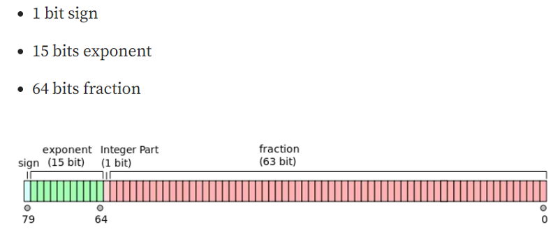

= AI
:toc: manual

= GPU 

== GPU 计算精度

在使用 GPU 进行深度学习训练或推理时，计算精度（Precision）是一个关键因素。常见的精度格式包括FP32（32 位浮点）、FP16（16 位浮点）、BF16（bfloat16）、INT8（8 位整型）、INT4（4位整型）等。

计算精度和资源开销基本原则：

1. 精度越高（如 FP32），数值表达能力更强，计算结果更准确，但同时也会带来更高的计算和存储成本，包括更大的模型体积、更高的内存占用和更慢的计算速度。
2. 精度越低（如 FP16 或 INT8），虽然可能略微影响模型的精度表现，但可以大幅减少模型尺寸和推理过程中的内存使用，有助于提升 GPU 的计算效率和整体性能。

 

[cols="2,5a"]
.*常见简称*
|===
|NAME |NOTES

|TFLOPS
|每秒执行1万亿次浮点运算次数。（F表示Float浮点）

|TOPS
|每秒执行1万亿次运算次数

|FP
|代表浮点运算数据格式，包括双精度（FP64）、单精度（FP32）、半精度（FP16）以及FP8 等

|INT
|代表整数格式，包括INT8、INT4等。后面的数字位数越高，意味着精度越高，能够支持的运算复杂程度就越高，适配场景越广

|FP32
|
* 也叫做 float32，两种叫法是完全一样，全称是Single-precision floating-point(单精度浮点数)
* 用于`训练`

|BF16
|
* 也叫做BFLOAT16 (这是最常叫法)，全称brain floating point，用16位二进制来表示的，Google Brain开发
* 用于`训练`、`推理`

|FP16
|
* 也叫float16，全称是Half-precision floating-point(半精度浮点数)
* 用于`训练`、`推理`。

|FP8
|8位精度, 用于`训练`、`推理`

|INT8
|量化精度，用于`推理`

|INT4
|不具备生产能力

|===

