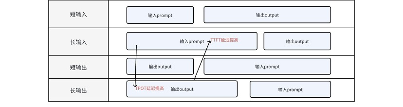

= AI
:toc: manual

= GPU 

== GPU 计算精度

在使用 GPU 进行深度学习训练或推理时，计算精度（Precision）是一个关键因素。常见的精度格式包括FP32（32 位浮点）、FP16（16 位浮点）、BF16（bfloat16）、INT8（8 位整型）、INT4（4位整型）等。

计算精度和资源开销基本原则：

1. 精度越高（如 FP32），数值表达能力更强，计算结果更准确，但同时也会带来更高的计算和存储成本，包括更大的模型体积、更高的内存占用和更慢的计算速度。
2. 精度越低（如 FP16 或 INT8），虽然可能略微影响模型的精度表现，但可以大幅减少模型尺寸和推理过程中的内存使用，有助于提升 GPU 的计算效率和整体性能。

[cols="2,5a"]
.*常见简称*
|===
|NAME |NOTES

|TFLOPS
|每秒执行1万亿次浮点运算次数。（F表示Float浮点）

|TOPS
|每秒执行1万亿次运算次数

|FP
|代表浮点运算数据格式，包括双精度（FP64）、单精度（FP32）、半精度（FP16）以及FP8 等

|INT
|代表整数格式，包括INT8、INT4等。后面的数字位数越高，意味着精度越高，能够支持的运算复杂程度就越高，适配场景越广

|FP32
|
* 也叫做 float32，两种叫法是完全一样，全称是Single-precision floating-point(单精度浮点数)
* 用于`训练`

|BF16
|
* 也叫做BFLOAT16 (这是最常叫法)，全称brain floating point，用16位二进制来表示的，Google Brain开发
* 用于`训练`、`推理`

|FP16
|
* 也叫float16，全称是Half-precision floating-point(半精度浮点数)
* 用于`训练`、`推理`。

|FP8
|8位精度, 用于`训练`、`推理`

|INT8
|量化精度，用于`推理`

|INT4
|不具备生产能力

|===

== 常见卡型参数

[cols="2,2,2,2,2,2,2,2,2,2,2"]
.*常见卡型参数*
|===
|参数|T4 |A100 |A800 |L20 |H20 96G |H20 141G |H200 |910B |910C(A+K) |910C(X+X)

|上市时间
|2018-09
|2020-09
|2022-11
|2023-11
|2023-11
|2025
|2024
|2023
|2025
|2025

|FP64(TFLOPS)
|-
|9.7
|9.7
|-
|-
|-
|34
|-
|-
|-

|FP64 Tensor Core(TFLOPS)
|-
|19.5
|19.5
|-
|-
|-
|67
|-
|-
|-

|FP32(TFLOPS)
|8.1
|19.5
|19.5
|59.6
|39.5
|39.5
|67
|96
|192
|192

|TF32 Tensor Core(TFLOPS)
|-
|156/312*
|156/312*
|59.8
|74
|74
|494/989*
|-
|-
|-

|FP16(TFLOPS)
|16.2
|-
|-
|-
|-
|-
|-
|376
|752
|752

|BFloat16 Tensor Core(TFLOPS)
|-
|312/624*
|312/624*
|119.5
|148
|148
|989/1979*
|-
|-
|-

|FP16 Tensor Core(TFLOPS)
|65
|312/624*
|312/624*
|119.5
|148
|148
|989/1979*
|-
|-
|-

|FP8 Tensor Core(TFLOPS)
|-
|-
|-
|238
|296
|296
|1979/3958*
|-
|-
|-

|INT8 Tensor Core(TOPS)
|130
|624/1248*
|624/1248*
|239
|296
|296
|1979/3958*
|-
|-
|-

|INT4(TOPS)
|260
|-
|-
|-
|-
|-
|-
|-
|-
|-

|GPU显存(GB)
|16
|80
|80
|48
|96
|141
|141
|96
|128
|128

|GPU显存类型
|GDDR6
|HBM2e
|HBM2e
|GDDR6
|HBM3
|HBM3e
|HBM3e
|HBM2e
|HBM2e
|HBM2e

|GPU显存带宽(GB/s)
|300
|2039
|2039
|864
|4000
|4800
|4800
|1600
|3200
|3200

|===

= 推理基础

== 推理发展趋势

[cols="2,5a"]
|===
|ID |趋势

|1
|*模型尺寸显著变大， 模型部署向分布式多角色演进*

* 超过100B 的模型，FP8 精度需要100G，需要多卡分布式推理。
* 大语言模型方向，分离出 Prefill/Decode 两个角色
* 多模态模型，除 Prefill/Decode 外，视觉模型还有 Vision Encoder 角色，语音生成模型还有 Audio Encoder 的角色

|2
|*模型多种并行方式调度对流量动态调度更加复杂*

除最基本的 TP(Tensor Parallelism) 外，PP(Pipeline Parallelism) / SP(Sequence Parallelism) / EP(Expert Parallelism) 等并行方式也开始在推理侧扩展。

*举例：DeepSeeK V3集群化部署方案：*

* 算力配置：H800集群，同时确保在线服务的服务水平目标（SLO）和高吞吐量
* Prefiling：预填充阶段的最小部署单位由4个节点组成，共32个GPU。注意力部分采用4路张量并行（TP4）和序列并行（SP），结合8路数据并行（DP8）
* Decoding：解码阶段的最小部署单位由40个节点组成，共320个GPU。注意力部分采用TP4和SP，结合80路数据并行（DP80），而MoE部分使用320路专家并行。对于MoE部分，每个GPU只托管一个专家，64个GPU负责托管冗余专家和共享专家。

|3
|*多模型协作对模型调度要求高*

以纳米搜索为例，它提供了多模型协作模式，可以指定模型作为规划者、反思者和总结者。这种模式需要多模型组合。这种反思型工作流并不能解决所有问题，但它通常能够显著提升结果的质量。

这种多模型协作场景，对于客户来说，需要多模型部署；对于云厂商来说，需要很好的支持多模型流量调度。

|4
|*推理的潮汐特点，模型弹性调度、冷启动的压力*

早晚高峰、节假日、职业淡旺季潮汐、营销活动突发潮汐。

DeepSeek R1 FP8 精度需要700G存储，模型冷启动拉文件需要30分钟；模型推理降低中间计算需要缓存kvcache、session cache、prefix cache。

需要有很好的推理工具链，能够简化推理的动态扩缩容、服务SLA、故障运维排障、性能优化工作，能够保障业务对于延迟、吞吐和推理成本的要求，让客户专注于模型效果提升

|5
|*理流量的并发时序特征、业务场景动态性，干扰TTFT、TTOT和吞吐*

|6
|*推理自建成本昂贵，随着流量成本上升*

*案例：* H20 8卡 部署DeepSeek R1/V3（输入/输出 1K tokens，首字延迟TTFT 2s以内）

* 服务端实际响应QPS 0.17
* 单机约 350 tokens/s（2.1万 TPM），单卡 43.64 tokens/s；
* 平均延迟TPOT 43ms
* 深度思考推理吞吐是主要瓶颈，用单机吞吐可以估算业务需求的机器规模。例如业务需要2000万TPM，那么就需要1000台H20。

|===

== 两类推理场景

[cols="2,2,2,2"]
|===
|场景 |定义 |特点 |关键指标

|低延迟服务
|面向消费者服务，需要保障用户体验，需要很低的延迟和较高的可靠性。
|低延迟的用户希望请求队列为空，这样可以处理每个出现的请求。
|latency

|高吞吐服务
|离线分析业务，更关注吞吐量而非可靠性。
|离线分析的用户更感兴趣的是系统的吞吐量，因此用户希望队列永远不为空。
|tps

|===

== 模型推理结构

从用户角度看，大语言模型是一个api，也就是先给模型输入一段提示(prompt)，然后模型给返回推理结果（response）。当用户将提示输入给模型时，模型需要将提示作为输入开始第一部分的计算，在这里被称之为context计算或者*prefiling预填充*。这一部分计算其实是在为后面的*decodding计算*也就是真正产生模型输出阶段的计算做准备。

https://poloclub.github.io/transformer-explainer/

通常大语言模型推理分为两个阶段：

* *prefiling阶段*：从输入提示词、分词，然后通过神经网络计算token，生成第一个token。这一单步骤阶段通常被称为“预填充阶段”。
* *decoding阶段*：将生成的token添加到输入token序列，然后将其用作新的输入，以生成完成的下一个token。然后，重复这一过程，直到生成停止序列（例如单个序列结束（EOS）token），或达到预先配置的最大序列长度。

训练和推理的预填充阶段通常是计算受限，而推理解码阶段通常在大多数硬件上是内存带宽受限。

== 模型推理Pipeline

[source, python]
----
# 客户端请求行为
客户端配置
  ├─ （Request Rate(reqs/s) = N reqs/s）#客户端请求并发
  ├─ 并发控制（max-concurrency = M） #客户端最大并发
  ├─ 输入处理（input_len = 1024 tokens）#客户端输入长度
  ├─ 输出处理（output_len = 1024 tokens）#客户端输出长度

#服务端响应行为
  ├─ 请求进入系统（Request throughput (req/s) ：0.02～1.05）#服务端真实响应并发
  ├─ 生成首Token（TTFT: 345 ms ~ 9000 ms）
  ├─ 持续生成输出Token（TPOT: 43.88 ms ~ 125 ms/token）
  └─ 完成请求（output_len = 1024 tokens）
       ↓
       E2E Latency ≈ TTFT + TPOT × 1024（45秒 ~ 137秒）
       Total Token Throughput = 2048 × Request Throughput（45.28 ~ 2390 tok/s）
       ↓
       单卡吞吐 = Total Throughput / GPU数量（如 16 卡 2.83 ~ 146 tok/s/卡）
----

衡量模型的推理效率可以参考Latency、QPS和TPS三个指标。Latency可以进一步拆解为首个token生成时间、平均token生成时间。

* *首字延迟TTFT*： Time To First Token，TTFT主要受输入长度影响，即：TTFT = 归一化TTFT*输入长度。一般来讲若输入大模型的长度太长(>5000Token)或者太短（<100Token) 都对TTFT不是很友好。优化TTFT一般可以稍微缩短输入长度（比如截断过长的输入，eg.10000token以上的输入）、优化Cache来实现。
* *均字延迟TPOT*：Time Per Output Token，均字延迟主要受模型架构、部署方式和流量是否高峰影响，一般来讲不是完全稳定的，存在波动较正常。但可以定个可以接受的范围举例：25ms～50ms。
* *端到端延迟*：TTFT+输出Token长度*TPOT，优化端到端延迟，可优化TTFT的、TPOT 和减少输出长度实现。
* *吞吐量TPS*：推理服务器在所有用户和请求中每秒可生成的输出token数。

== 推理显存消耗

对于大规模训练作业，需要通过模型参数、梯度和优化器状态计算需要多少GPU显存。

* FP16 精度，1 个参数占用 2 个字节，1B 训练需要 20G 显存，推理需要 2G 显存
* FP8 精度，1 个参数占用 1 个字节，1B 训练需要 10G 显存，推理需要 1G 显存

NOTE: 显存带宽越大越好，实时推理需要快速产生结果，通常用于实时或近实时的应用场景，如语音识别、图像分类或推荐系统。选择有高显存带宽的GPU。例如A30、L20 等。

== 开源大模型算力推荐

[cols="2,2,2,2,2"]
|===
|模型 |模型参数量 |浮点精度 |模型占用显存 |显卡推荐

|LLama2
|7B
|BF16
|14G
|4090 24GB * 1

|LLama2
|13B
|BF16
|26G
|A100 80GB * 1

|LLama2
|70B
|BF16
|140G
|A100 80GB * 2

|GPT-3
|175B
|BF16
|350G
|A100 80GB * 5

|DeepSeek-V3
|671B
|FP8
|700G
|H20 96G *8

|DeepSeek-R1
|671B
|FP8
|700G
|H20 96G *8

|DeepSeek-R1-Distill-Qwen-1.5B
|1.5B
|BF16
|3.55G
|H20 GPU 96GiB * 1 / L20 48GiB * 1

|DeepSeek-R1-Distill-Qwen-7B
|7B
|BF16
|15.23G
|H20 GPU 96GiB * 1 / L20 48GiB * 1

|DeepSeek-R1-Distill-Qwen-14B
|14B
|BF16
|29.54G
|H20 GPU 96GiB * 1 / L20 48GiB * 1

|DeepSeek-R1-Distill-Qwen-32B
|32B
|BF16
|65.53G
|H20 GPU 96GiB * 1 / L20 48GiB * 2

|===

== 推理性能计算

大模型推理的吞吐TPS，是模型大小（modelSize，MS）、输入Prompt长度（inputLength，IL）、输出response长度（outputLength，OL）、QPS[也可以视为批处理大小（batchSize，BS）]、延迟（Latency Bond，LB，秒/每tokens）、模型精度precision（precision，P）、GPU卡数（GPU Nums，GN）、推理优化算法（Turbo）变量的函数。

[source, bash]
----
TPS =f（MS,IL,OL,QPS，LB,P，GN,Turbo)
----

举例：给定一批数据tokens，使用175B参数的模型进行模型吞吐测试。在A800 * 4卡的算力下，使用Turbo推理性能加速引擎，输入长度PL为64 Tokens、输出RL为64 Tokens、QPS 48，int8 精度基础上，平均每tokens LB 0.097 s，平均每秒吞吐TPS 493 tokens/s，平均每卡每秒吞吐 TPS per GPU 123.29 tokens/s。具体数据见表：

[cols="2,2,2,2,2,2,2"]
.*输入变量*
|===
|模型大小 |推理加速引擎	|计算精度 |使用卡数 |输入长度PL	|输出长度RL |QPS

|175B
|Turbo
|INT8
|A800 * 4
|64
|64
|48
|===

[cols="2,2,2"]
.*输出变量*
|===
|平均延迟LB/tokens（秒）|TPS per GPU |TPS

|0.097
|123.29
|493
|===

